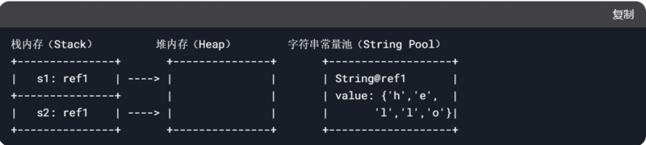
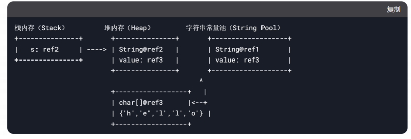

> 此篇有些来自于小林coding，有些是我自己的笔记

## 概念

### Python VS Java

- Java是一种已编译的编程语言，Java编译器将源代码编译为字节码，而字节码则由Java虚拟机执行

- python是一种解释语言，翻译时会在执行程序的同时进行翻译。

### 编译型语言和解释型语言的区别

编译型语言和解释型语言的区别在于：

- 编译型语言：在程序执行之前，整个源代码会被编译成机器码或者字节码，生成可执行文件。执行时直接运行编译后的代码，速度快，但跨平台性较差。
- 解释型语言：在程序执行时，逐行解释执行源代码，不生成独立的可执行文件。通常由解释器动态解释并执行代码，跨平台性好，但执行速度相对较慢。
典型的编译型语言如C、C++，典型的解释型语言如Python、JavaScript。

Java是编译和解释混合的语言，但主要是编译

### 在Java中，参数传递是值传递还是引用传递？

在 Java 中，参数传递只有值传递一种方式，不存在真正的 “引用传递”。但很多人会混淆这两个概念，核心区别在于传递的是 “值的副本” 还是 “引用的副本”。

值传递（Pass by Value）。传递的是实际值的副本，适用于基本数据类型（如 int、char 等），修改方法内的参数副本，不会影响原变量的值。例子：

```java
public static void main(String[] args) {
    int num = 10;
    changeValue(num);
    System.out.println(num); // 输出 10（原变量未被修改）
}

public static void changeValue(int a) {
    a = 20; // 仅修改副本
}
```

对于对象（引用类型），传递的是对象引用的副本（而非对象本身）。

两个引用（原引用和副本）指向同一个对象，因此通过副本修改对象内部数据，会影响原对象。但如果修改副本的指向（如重新赋值），不会影响原引用的指向。示例：

```java

public class Person {
    String name;
    Person(String name) { this.name = name; }
}

public static void main(String[] args) {
    Person p = new Person("Alice");
    changeName(p);
    System.out.println(p.name); // 输出 "Bob"（对象内部被修改）
    
    changeReference(p);
    System.out.println(p.name); // 仍输出 "Bob"（原引用指向未变）
}

// 修改对象内部数据
public static void changeName(Person obj) {
    obj.name = "Bob"; // 副本和原引用指向同一个对象
}

// 修改副本的指向（不影响原引用）
public static void changeReference(Person obj) {
    obj = new Person("Charlie"); // 副本指向新对象，原引用仍指向旧对象
}
```
### 基础数据类型

小写的都是基础数据类型，其余为引用数据类型


## 面向对象

### 面向对象的三大特性

- 封装：封装是指将对象的属性（数据）和行为（方法）结合在一起，对外隐藏对象的内部细节，仅通过对象提供的接口与外界交互。封装的目的是增强安全性和简化编程，使得对象更加独立。
- 继承：继承是一种可以使得子类自动共享父类数据结构和方法的机制。它是代码复用的重要手段，通过继承可以建立类与类之间的层次关系，使得结构更加清晰。
- 多态：多态是指允许不同类的对象对同一消息作出响应。即同一个接口，使用不同的实例而执行不同操作。多态性可以分为编译时多态（重载）和运行时多态（重写）。它使得程序具有良好的灵活性和扩展性。

### 抽象类和接口的区别

抽象类是is-a关系，定义了这个类和其他类有什么共通之处

接口是has-a关系，定义了某个类必须有哪些功能

### Objects类

#### ==与equals的区别

==对于基本类型和引用类型都可以判断，如果是基本类型，判断值，如果是引用类型，判断对象的引用，也就是判断是不是同个对象

equals是object中的一个方法，只能用来判断引用类型，默认判断的是地址是否相等，子类中往往重写该方法，用于判断内容是否相等，比如Interger,String

#### 为什么重写了重写equals方法要重写HashCode方法？

这里需要对HashMap的结构有深入的了解，HashMap是通过key的hashcode来计算索引位置的，当hashCode相同的时候，使用.equals方法来判断是否相等，如果equals相等，则认为两个对象是相同的，否则认为是不同的对象,加入那个位置的链表。如果重写了equals方法却没有重写HashCode方法，那么就会出现两个对象虽然内容相同，但是因为hashcode不同，导致HashMap中存储了两个相等的对象，也就不再是一个Map了。


### 类创建时的加载顺序

1. 父类静态代码块
2. 子类静态代码块
3. 父类普通代码块
4. 父类构造函数
5. 子类普通代码块
6. 子类构造函数

其中任一环节如果有多个的话，按照从上到下的顺序执行

## 常用类

### Integer底层创建机制

-128 - 127的时候是直接返回同一个对象的引用，类似String，超出这个范围是新建一个对象


## String

### 介绍


String对象用于保存字符串，也就是一组字符序列

字符串常量对象是用双引号括起的字符序列，比如“你好”

字符串的字符使用Unicode字符编码，一个字符（不区分字母还是汉字）占两个字节

String实现的接口
- Serializable(String 可以串行化：可以在网络传输)
- Compareable(String对象可以比较大小)

String 是final类，不能继承

String 有属性 private final char value[];用于存放字符串内容

一定要注意：value是一个final类型，不可以修改（不可以修改指针本身，可以修改指针所指向的值）
### 创建String对象的两种方式

String s = "a"（直接赋值）
- 先从常量池查看是否有a数据空间，如果有则直接指向a，如果没有则重新创建，然后指向，s最终指向的是常量池的空间地址



String s2 = new String("a")
- 先在堆中创建空间，里面维护了value属性，指向常量池的a空间，如果有，直接通过value指向，没有则重新创建然后指向。最后指向的是堆中的空间地址


### 底层+的优化

//此处为jdk8，jdk9之后优化方式不同，但逻辑上是差不多的

1. 先创建一个StringBuilder对象(sb)
2. sb.append(a)
3. sb.append(b)
4. return sb.toString

- 例题

`String a = "hello" + "abc";`//底层会直接拼好，只有一个对象

//如果是两个对象相加那么就是三个对象

### String VS StringBuilder VS StringBuffer

- String:不可变字符序列，效率低但是复用率高
- StringBuffer:可变字符序列，效率较高（增删），线程安全
- StringBuilder:可变字符序列，效率最高，线程不安全

## 反射

Java 反射机制是在运行状态中，对于任意一个类，都能够知道这个类中的所有属性和方法，对于任意一个对象，都能够调用它的任意一个方法和属性；这种动态获取的信息以及动态调用对象的方法的功能称为 Java 语言的反射机制。

反射主要的原理是类加载的时候会创建一个Class对象，这个Class对象包含了类的所有信息，包括类名、方法、属性、构造方法等。通过这个Class对象，我们就可以获取类的信息，并且可以创建这个类的对象，调用它的属性和方法。

### 类加载的时机

1. 当创建对象时加载//静态加载
2. 当子类被加载的时候，父类也加载 //静态加载
3. 调用类中的静态成员时 //静态加载
4. 通过反射 //   动态加载


