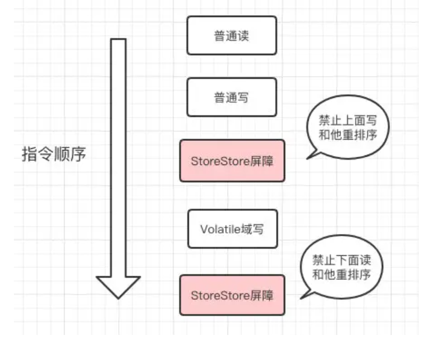
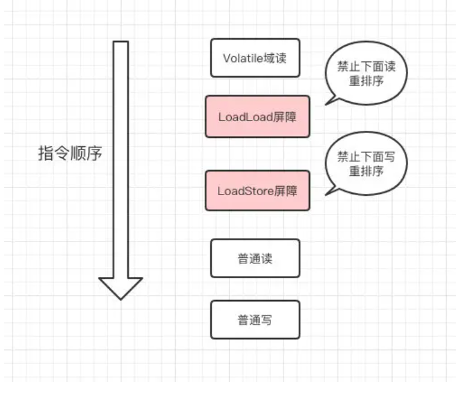

## java 实现多线程的四大方式

### 继承 Thread 类

Thread 创建线程方式：创建线程类，匿名内部类方式

* **start() 方法底层其实是给 CPU 注册当前线程，并且触发 run() 方法执行**
* 线程的启动必须调用 start() 方法，如果线程直接调用 run() 方法，相当于变成了普通类的执行，此时主线程将只有执行该线程
  
Thread 构造器：

* `public Thread()`
* `public Thread(String name)`

```java
public class ThreadDemo {
    public static void main(String[] args) {
        Thread t = new MyThread();
        t.start();
       	for(int i = 0 ; i < 100 ; i++ ){
            System.out.println("main线程" + i)
        }
    }
}
class MyThread extends Thread {
    @Override
    public void run() {
        for(int i = 0 ; i < 100 ; i++ ) {
            System.out.println("子线程输出："+i)
        }
    }
}
```

### 实现 Runnable 接口

* `public Thread(Runnable target)`
* `public Thread(Runnable target, String name)`

```java
public class ThreadDemo {
    public static void main(String[] args) {
        Runnable target = new MyRunnable();
        Thread t1 = new Thread(target,"1号线程");
		t1.start();
        Thread t2 = new Thread(target);//Thread-0
    }
}

public class MyRunnable implements Runnable{
    @Override
    public void run() {
        for(int i = 0 ; i < 10 ; i++ ){
            System.out.println(Thread.currentThread().getName() + "->" + i);
        }
    }
}
```

### 实现 Callable 接口

实现 Callable 接口：

1. 定义一个线程任务类实现 Callable 接口，申明线程执行的结果类型
2. 重写线程任务类的 call 方法，这个方法可以直接返回执行的结果
3. 创建一个 Callable 的线程任务对象
4. 把 Callable 的线程任务对象**包装成一个未来任务对象**
5. 把未来任务对象包装成线程对象
6. 调用线程的 start() 方法启动线程

`public FutureTask(Callable<V> callable)`：未来任务对象，在线程执行完后得到线程的执行结果

* FutureTask 就是 Runnable 对象，因为 **Thread 类只能执行 Runnable 实例的任务对象**，所以把 Callable 包装成未来任务对象
* 线程池部分详解了 FutureTask 的源码

`public V get()`：同步等待 task 执行完毕的结果，如果在线程中获取另一个线程执行结果，会阻塞等待，用于线程同步

* get() 线程会阻塞等待任务执行完成
* run() 执行完后会把结果设置到 FutureTask  的一个成员变量，get() 线程可以获取到该变量的值

优缺点：

* 能得到线程执行的结果
* 缺点：编码复杂

```java
public class ThreadDemo {
    public static void main(String[] args) {
        Callable call = new MyCallable();
        FutureTask<String> task = new FutureTask<>(call);
        Thread t = new Thread(task);
        t.start();
        try {
            String s = task.get(); // 获取call方法返回的结果（正常/异常结果）
            System.out.println(s);
        }  catch (Exception e) {
            e.printStackTrace();
        }
    }

public class MyCallable implements Callable<String> {
    @Override//重写线程任务类方法
    public String call() throws Exception {
        return Thread.currentThread().getName() + "->" + "Hello World";
    }
}
```

### 线程池

具体的实现不重要，知道线程池就是不用自己创建线程而是从池子里给你分配一个就可以了

## 线程池

### 线程池参数

线程池一共有以下几个参数：

```java
ThreadPoolExecutor(
int corePoolSize,
int maximumPoolSize,
long keepAliveTime,
TimeUnit unit,
BlockingQueue<Runnable> workQueue,
ThreadFactory threadFactory,
RejectedExecutionHandler handler)
```

其中主要关注以下几个参数:

corePoolSize（必需）：核心线程数。默认情况下，核心线程会一直存活，但是当将 `allowCoreThreadTimeout` 设置为 true 时，核心线程也会超时回收。

maximumPoolSize（必需）：线程池所能容纳的最大线程数。当活跃线程数达到该数值后，后续的新任务将会阻塞。

keepAliveTime（必需）：线程闲置超时时长。如果超过该时长，非核心线程就会被回收。如果将 `allowCoreThreadTimeout` 设置为 true 时，核心线程也会超时回收。

workQueue（必需）：任务队列。通过线程池的 `execute()` 方法提交的 `Runnable` 对象将存储在该参数中。其采用阻塞队列实现。

一个线程池 core 7； max 20 ，queue：50，100 并发进来怎么分配的?
先有 7 个能直接得到执行，接下来 50 个进入队列排队，在多开 13 个继续执行。现在 70 个 被安排上了。剩下 30 个默认拒绝策略。

#### 线程池种类

newCachedThreadPool 创建一个可缓存线程池，如果线程池长度超过处理需要，可灵活回收空闲线程，若 无可回收，则新建线程。

newFixedThreadPool 创建一个定长线程池，可控制线程最大并发数，超出的线程会在队列中等待。

newScheduledThreadPool 创建一个定长线程池，支持定时及周期性任务执行。

newSingleThreadExecutor 创建一个单线程化的线程池，它只会用唯一的工作线程来执行任务，保证所有任务按照指定顺序(FIFO, LIFO, 优先级)执行

#### 线程池的四大拒绝策略

1、直接丢弃（DiscardPolicy）

2、丢弃队列中最早的任务(DiscardOldestPolicy)。

3、抛异常(AbortPolicy)

4、将任务分给调用线程来执行(CallerRunsPolicy)。

#### @Async 注解

@Async 注解的使用非常简单，需要两个步骤：

在启动类上添加注解 @EnableAsync ，开启异步任务。

在需要异步执行的方法或类上添加注解 @Async

@Async 注解的底层是通过 Spring 的 TaskExecutor（通常是一个线程池）来执行异步任务的，不过这个线程池可能不大好用，很多人会选择自定义 @Async 注解的线程池

## 锁总结

### 介绍

首先， java 的锁分为两类：

1. 第一类是 synchronized 同步关键字，这个关键字属于隐式的锁，是 jvm 层面实现，使用的时候看不见；
2. 第二类是在 jdk5 后增加的 Lock 接口以及对应的各种实现类，这属于显式的锁，就是我们能在代码层面看到锁这个对象，而这些个对象的方法实现，大都是直接依赖 CPU 指令的，无关 jvm 的实现。

接下来就从 synchronized 和 Lock 两方面来讲。

### synchronized

具体实现原理比较复杂，这里需要知道

#### 使用

- 如果修饰的是具体对象：锁的是对象；
- 如果修饰的是成员方法：那锁的就是 this ；
- 如果修饰的是静态方法：锁的就是这个对象.class。

#### 锁的分类

一些别的角度的锁分类：

**按照锁的特性分类：**

1. **悲观锁：**独占锁，会导致其他所有需要所的线程都挂起，等待持有所的线程释放锁，就是说它的看法比较悲观，认为悲观锁认为对于同一个数据的并发操作，一定是会发生修改的。因此对于同一个数据的并发操作，悲观锁采取加锁的形式。比如前面讲过的，最传统的 synchronized 修饰的底层实现，或者重量级锁。（但是现在synchronized升级之后，已经不是单纯的悲观锁了）
2. **乐观锁：**每次不是加锁，而是假设没有冲突而去试探性的完成操作，如果因为冲突失败了就重试，直到成功。比如 CAS 自旋锁的操作，实际上并没有加锁。
   
**按照锁的顺序分类：**

1. **公平锁。**公平锁是指多个线程按照申请锁的顺序来获取锁。java 里面可以通过 ReentrantLock 这个锁对象，然后指定是否公平
2. **非公平锁。**非公平锁是指多个线程获取锁的顺序并不是按照申请锁的顺序，有可能后申请的线程比先申请的线程优先获取锁。使用 synchronized 是无法指定公平与否的，他是不公平的。
   
**独占锁（也叫排他锁）/共享锁：**

1. **独占锁也叫排他锁**，是指该锁一次只能被一个线程所持有。对 ReentrantLock 和 Sychronized 而言都是独占锁。
2. **共享锁：**是指该锁可被多个线程所持有。对 ReentrantReadWriteLock 而言，其读锁是共享锁，其写锁是独占锁。读锁的共享性可保证并发读是非常高效的，读写、写读、写写的过程都是互斥的。

独占锁/共享锁是一种广义的说法，互斥锁/读写锁是java里具体的实现。

### Java里的Lock

上面我们讲到了，synchronized 关键字下层的锁，是在 jvm 层面实现的，而后来在 jdk 5 之后，在 juc 包里有了显式的锁，Lock 完全用 Java 写成，在java这个层面是无关JVM实现的。虽然 Lock 缺少了 (通过 synchronized 块或者方法所提供的) 隐式获取释放锁的便捷性，但是却拥有了锁获取与释放的可操作性、可中断的获取锁以及超时获取锁等多种 synchronized 关键字所不具备的同步特性。

> synchronized 是加完锁自动释放的，Lock 里的锁要自己手动释放

Lock 是一个接口，实现类常见的有：

- 重入锁（`ReentrantLock`）
- 读锁（`ReadLock`）
- 写锁（`WriteLock`）

实现基本都是通过聚合了一个同步器（`AbstractQueuedSynchronizer` 缩写为 `AQS`）的子类来完成线程访问控制的。

AQS 通过内置的 FIFO 队列来完成资源获取线程的排队工作

- volatile 关键字常被称为轻量级的 synchronized，实际上这两个完全不是一个东西。我们知道了 synchronized 通过的是 jvm 层面的管程隐式的加了锁。而 volatile 关键字则是另一个角度，jvm 也采用相应的手段，保证：
    - 被它修饰的变量的可见性：线程对变量进行修改后，要立刻写回主内存；
    - 线程对变量读取的时候，要从主内存读，而不是缓存；
    - 在它修饰变量上的操作禁止指令重排序。
- CAS 是一种 CPU 的指令，也不属于加锁，它通过假设没有冲突而去试探性的完成操作，如果因为冲突失败了就重试，直到成功。那么实际上我们很少直接使用 CAS ，但是 java 里提供了一些原子变量类，就是 juc 包里面的各种Atomicxxx类，这些类的底层实现直接使用了 CAS 操作来保证使用这些类型的变量的时候，操作都是原子操作，当使用他们作为共享变量的时候，也就不存在线程安全问题了。

## 内存模型

Java 内存模型是 Java Memory Model（JMM），本身是一种**抽象的概念**，实际上并不存在，描述的是一组规则或规范，通过这组规范定义了程序中各个变量（包括实例字段，静态字段和构成数组对象的元素）的访问方式
> **重点**！变量特指这些共享变量，局部变量这些不在JMM范围内
JMM 作用：

* 屏蔽各种硬件和操作系统的内存访问差异，实现让 Java 程序在各种平台下都能达到一致的内存访问效果
* 规定了线程和内存之间的一些关系

根据 JMM 的设计，系统存在一个主内存（Main Memory），Java 中所有变量都存储在主存中，对于所有线程都是共享的；每条线程都有自己的工作内存（Working Memory），工作内存中保存的是主存中某些**变量的拷贝**，线程对所有变量的操作都是先对变量进行拷贝，然后在工作内存中进行，不能直接操作主内存中的变量；线程之间无法相互直接访问，线程间的通信（传递）必须通过主内存来完成


主内存和工作内存：

* 主内存：计算机的内存，也就是经常提到的 8G 内存，16G 内存，存储所有共享变量的值
* 工作内存：存储该线程使用到的共享变量在主内存的的值的副本拷贝

**JVM 和 JMM 之间的关系**：JMM 中的主内存、工作内存与 JVM 中的 Java 堆、栈、方法区等并不是同一个层次的内存划分，这两者基本上是没有关系的，如果两者一定要勉强对应起来：

* 主内存主要对应于 Java 堆中的对象实例数据部分，而工作内存则对应于虚拟机栈中的部分区域
* 从更低层次上说，主内存直接对应于物理硬件的内存，工作内存对应寄存器和高速缓存


### 可见性

可见性：是指当多个线程访问同一个变量时，一个线程修改了这个变量的值，其他线程能够立即看得到修改的值

存在不可见问题的根本原因是由于缓存的存在，线程持有的是共享变量的副本，无法感知其他线程对于共享变量的更改，导致读取的值不是最新的。但是 final 修饰的变量是**不可变**的，就算有缓存，也不会存在不可见的问题

main 线程对 run 变量的修改对于 t 线程不可见，导致了 t 线程无法停止：

```java
static boolean run = true;	//添加volatile
public static void main(String[] args) throws InterruptedException {
    Thread t = new Thread(()->{
        while(run){
        // ....
        }
	});
    t.start();
    sleep(1);
    run = false; // 线程t不会如预想的停下来
}
```

原因：

* 初始状态， t 线程刚开始从主内存读取了 run 的值到工作内存
* 因为 t 线程要频繁从主内存中读取 run 的值，JIT 编译器会将 run 的值缓存至自己工作内存中的高速缓存中，减少对主存中 run 的访问，提高效率
* 1 秒之后，main 线程修改了 run 的值，并同步至主存，而 t 是从自己工作内存中的高速缓存中读取这个变量的值，结果永远是旧值


解决方法

**volatile**

它可以用来修饰成员变量和静态成员变量，他可以避免线程从自己的工作缓存中查找变量的值，必须到主存中获取
它的值，线程操作 volatile 变量都是直接操作主存

### 原子性

原子性：不可分割，完整性，也就是说某个线程正在做某个具体业务时，中间不可以被分割，需要具体完成，要么同时成功，要么同时失败，保证指令不会受到线程上下文切换的影响 

> 其他不重要

### 有序性

有序性：在本线程内观察，所有操作都是有序的；在一个线程观察另一个线程，所有操作都是无序的，无序是因为发生了指令重排序

CPU 的基本工作是执行存储的指令序列，即程序，程序的执行过程实际上是不断地取出指令、分析指令、执行指令的过程，为了提高性能，编译器和处理器会对指令重排，一般分为以下三种：

```java
源代码 -> 编译器优化的重排 -> 指令并行的重排 -> 内存系统的重排 -> 最终执行指令
```

现代 CPU 支持多级指令流水线，几乎所有的冯•诺伊曼型计算机的 CPU，其工作都可以分为 5 个阶段：取指令、指令译码、执行指令、访存取数和结果写回，可以称之为**五级指令流水线**。CPU 可以在一个时钟周期内，同时运行五条指令的**不同阶段**（每个线程不同的阶段），本质上流水线技术并不能缩短单条指令的执行时间，但变相地提高了指令地吞吐率

处理器在进行重排序时，必须要考虑**指令之间的数据依赖性**

* 单线程环境也存在指令重排，由于存在依赖性，最终执行结果和代码顺序的结果一致
* 多线程环境中线程交替执行，由于编译器优化重排，会获取其他线程处在不同阶段的指令同时执行

补充知识：

* 指令周期是取出一条指令并执行这条指令的时间，一般由若干个机器周期组成
* 机器周期也称为 CPU 周期，一条指令的执行过程划分为若干个阶段（如取指、译码、执行等），每一阶段完成一个基本操作，完成一个基本操作所需要的时间称为机器周期
* 振荡周期指周期性信号作周期性重复变化的时间间隔


## volatile

volatile 是 Java 虚拟机提供的**轻量级**的同步机制（三大特性）

- 保证可见性
- 不保证原子性
- 保证有序性（禁止指令重排）


### 禁止指令重排

禁止指令重排主要是通过内存屏障来实现的

#### 内存屏障

java编译器会在生成指令系列时在适当的位置会插入内存屏障指令来禁止特定类型的处理器重排序。

为了实现volatile的内存语义，JMM会限制特定类型的编译器和处理器重排序，JMM会针对编译器制定volatile重排序规则表：

写：



读：



## CAS

CAS是英文单词Compare And Swap的缩写，翻译过来就是比较并替换。

CAS机制当中使用了3个基本操作数：内存地址V，旧的预期值A，要修改的新值B。

更新一个变量的时候，只有当变量的预期值A和内存地址V当中的实际值相同时，才会将内存地址V对应的值修改为B。

### ABA 问题

CAS 会出现 ABA 问题，简单来说就是内存 V 原来的值为 A 我们启动了一个线程 0 ,有一个线程把值改成了 B 另一个线程又改回了 A ，因为别的线程改动了，这个时候其实已经线程冲突了，但 CAS 是判断不出来已经冲突了

解决方法是加入一个字段 version ,每次改完都把 version + 1 
