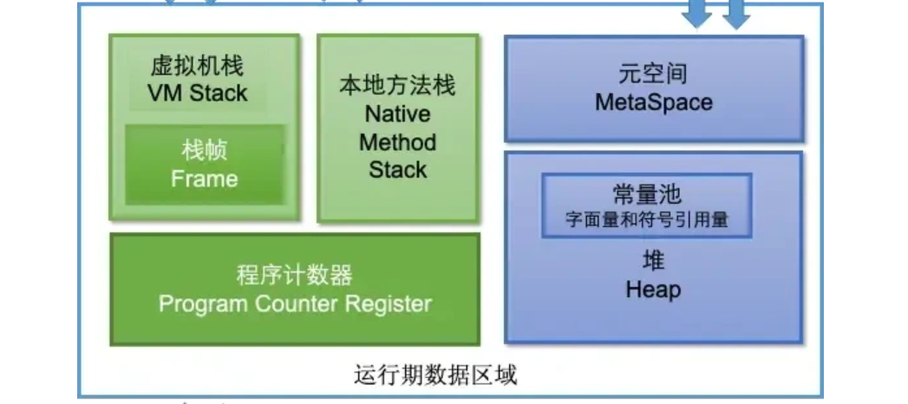
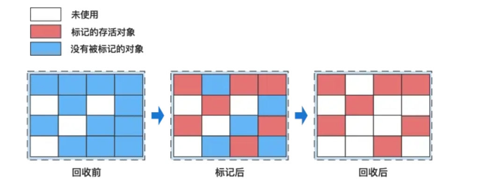
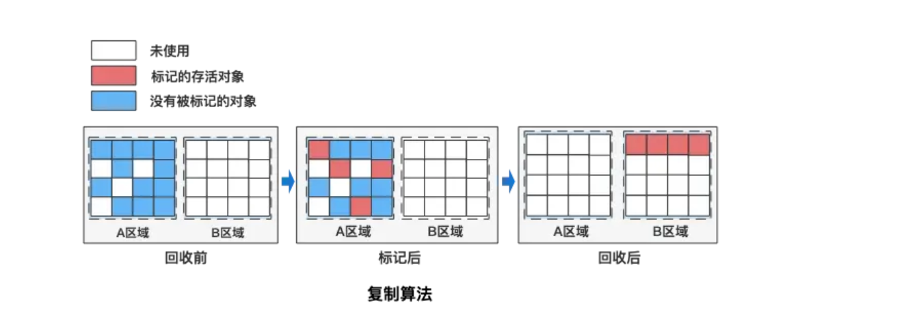
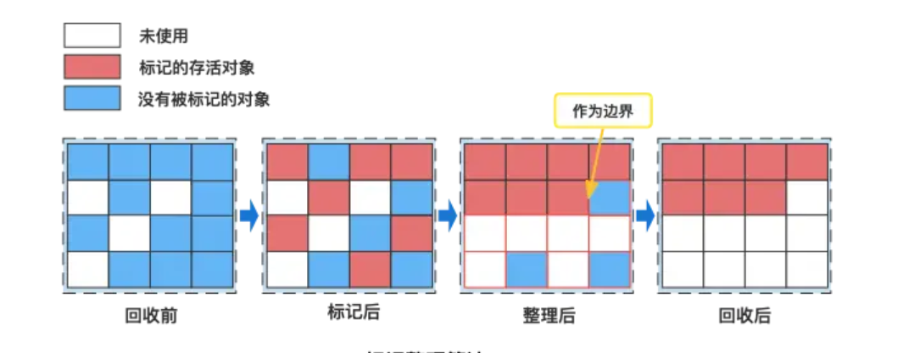
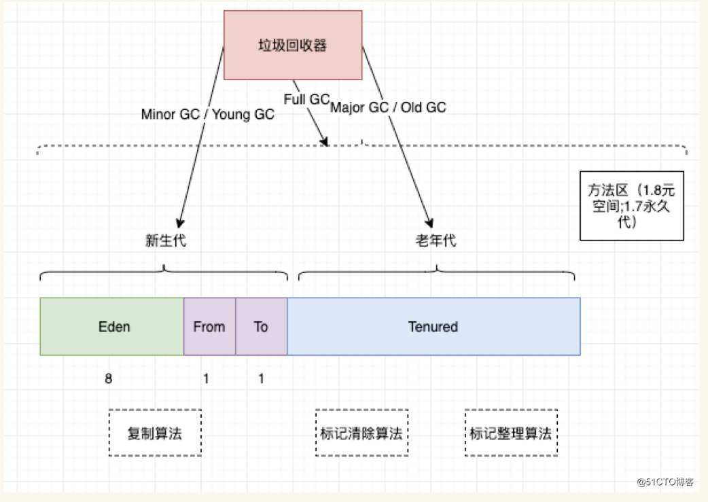
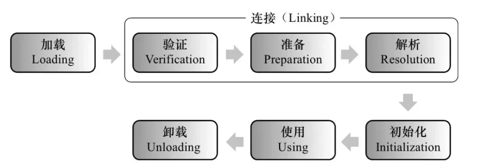
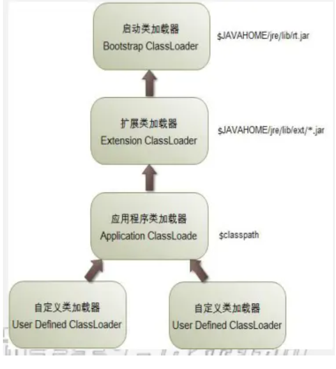

## 内存结构

> 这里的是1.8的，1.8和1.7的区别主要是1.8把方法区改为了元空间，并且放到了本地内存中，另外将常量池和静态变量放到Java堆里

> 注，这个堆里的常量池可以理解为字符串常量池

JVM的内存结构主要分为以下几个部分：

> 以下有个大致印象就可以了

- **程序计数器：** 可以看作是当前线程所执行的字节码的行号指示器，用于存储当前线程正在执行的 Java 方法的 JVM 指令地址。如果线程执行的是 Native 方法，计数器值为 null。是唯一一个在 Java 虚拟机规范中没有规定任何 OutOfMemoryError 情况的区域，生命周期与线程相同。
- **Java 虚拟机栈：** 每个线程都有自己独立的 Java 虚拟机栈，生命周期与线程相同。每个方法在执行时都会创建一个栈帧，用于存储局部变量表、操作数栈、动态链接、方法出口等信息。可能会抛出 StackOverflowError 和 OutOfMemoryError 异常。
- **本地方法栈：** 与 Java 虚拟机栈类似，主要为虚拟机使用到的 Native 方法服务，在 HotSpot 虚拟机中和 Java 虚拟机栈合二为一。本地方法执行时也会创建栈帧，同样可能出现 StackOverflowError 和 OutOfMemoryError 两种错误。
- **Java 堆：** 是 JVM 中最大的一块内存区域，被所有线程共享，在虚拟机启动时创建，用于存放对象实例。从内存回收角度，堆被划分为新生代和老年代，新生代又分为 Eden 区和两个 Survivor 区（From Survivor 和 To Survivor）。如果在堆中没有内存完成实例分配，并且堆也无法扩展时会抛出 OutOfMemoryError 异常。
- **方法区（元空间）：** 在 JDK 1.8 及以后的版本中，方法区被元空间取代，使用本地内存。用于存储已被虚拟机加载的类信息、常量、静态变量等数据。虽然方法区被描述为堆的逻辑部分，但有 “非堆” 的别名。方法区可以选择不实现垃圾收集，内存不足时会抛出 OutOfMemoryError 异常。
  - **运行时常量池：** 是方法区的一部分，用于存放编译期生成的各种字面量和符号引用，具有动态性，运行时也可将新的常量放入池中。当无法申请到足够内存时，会抛出 OutOfMemoryError 异常。

## 垃圾回收

### 判定垃圾的方法

在Java中，判断对象是否为垃圾（即不再被使用，可以被垃圾回收器回收）主要依据两种主流的垃圾回收算法来实现：引用计数法和可达性分析算法。

**引用计数法（Reference Counting）**

原理：为每个对象分配一个引用计数器，每当有一个地方引用它时，计数器加1；当引用失效时，计数器减1。当计数器为0时，表示对象不再被任何变量引用，可以被回收。

缺点：不能解决循环引用的问题，即两个对象相互引用，但不再被其他任何对象引用，这时引用计数器不会为0，导致对象无法被回收。

**可达性分析算法（Reachability Analysis）**

有一个根，从根下面不同的对象组成了图，如果图中这个对象是不可达的，那么就回收掉

### 垃圾回收算法

**标记-清除算法：** 标记-清除算法分为“标记”和“清除”两个阶段，首先通过可达性分析，标记出所有需要回收的对象，然后统一回收所有被标记的对象。标记-清除算法有两个缺陷，一个是效率问题，标记和清除的过程效率都不高，另外一个就是，清除结束后会造成大量的碎片空间。有可能会造成在申请大块内存的时候因为没有足够的连续空间导致再次 GC。

**复制算法：** 为了解决碎片空间的问题，出现了“复制算法”。复制算法的原理是，将内存分成两块，每次申请内存时都使用其中的一块，当内存不够时，将这一块内存中所有存活的复制到另一块上。然后将然后再把已使用的内存整个清理掉。复制算法解决了空间碎片的问题。但是也带来了新的问题。因为每次在申请内存时，都只能使用一半的内存空间。内存利用率严重不足。

**标记-整理算法：** 复制算法在 GC 之后存活对象较少的情况下效率比较高，但如果存活对象比较多时，会执行较多的复制操作，效率就会下降。而老年代的对象在 GC 之后的存活率就比较高，所以就有人提出了“标记-整理算法”。标记-整理算法的“标记”过程与“标记-清除算法”的标记过程一致，但标记之后不会直接清理。而是将所有存活对象都移动到内存的一端。移动结束后直接清理掉剩余部分。

### 分代垃圾回收

> https://www.cnblogs.com/donleo123/p/14567139.html

如下图所示：

垃圾回收器主要回收堆内存，堆内存分为：新生代和老年代。

对于回收新生代GC：Minor GC或者叫Young GC。回收老年代的GC叫：Major GC 或者 Old GC.

需要注意Full GC：它不止回收堆内存，还会回收方法区(在JDK1.8 方法区在元空间；在JDK1.7 方法区在永久代)

分代回收的理论：

把绝大多数(98%)的朝生夕死的对象放在新生代

把熬过多次垃圾回收的对象就越难回收放在老年代

对象分配的时候，大对象会直接去到老年代，此外的大部分小对象都会先分配到新生代的 Eden 区

#### 新生代

新生代中的回收叫Minor GC（也称为Young GC）

第一次回收

Eden 区中存活的对象复制到 From 区，其余区回收

第二次回收

Eden 区和 From 区中存活的对象复制到 to 区 ，其余区回收

第三次回收

Eden 区和 to 区中存活的对象复制到 From 区 ，其余区回收

每次回收后，这个对象的年龄 +1 ，当岁数太大的时候（默认是 15，可以通过参数 -XX:MaxTenuringThreshold 来设定）就会分配搭配到老年代

#### 老年代

老年代中的回收叫Major GC（有时也称为Old GC），触发的频率较低，为标记-清除算法或是标记-整理算法，会有不同的可能是因为有不同的垃圾回收器，垃圾回收器是这些算法的具体实现

## 类加载

### 类加载机制

> https://www.jianshu.com/p/dd39654231e0

1、加载

将class字节码文件加载到内存中，并将这些数据转换成方法区中的运行时数据（静态变量、静态代码块、常量池等），在堆中生成一个Class类对象代表这个类（反射原理），作为方法区类数据的访问入口。

2、链接

将Java类的二进制代码合并到JVM的运行状态之中。

- 验证

确保加载的类信息符合JVM规范，没有安全方面的问题。

- 准备

正式为类变量(static变量)分配内存并设置类变量初始值的阶段，这些内存都将在方法区中进行分配。注意此时的设置初始值为默认值，具体赋值在初始化阶段完成。

- 解析
虚拟机常量池内的符号引用替换为直接引用（地址引用）的过程。

3、初始化

初始化阶段是执行类构造器<clinit>()方法的过程。类构造器<clinit>()方法是由编译器自动收集类中的所有类变量的 **赋值** 动作和 **静态语句块(static块)** 中的语句合并产生的。

当初始化一个类的时候，如果发现其父类还没有进行过初始化、则需要先初始化其父类。
虚拟机会保证一个类的<clinit>()方法在多线程环境中被正确加锁和同步。

### 什么时候会加载类

- new一个类的对象。
- 调用类的静态成员(除了final常量)和静态方法。
- 使用java.lang.reflect包的方法对类进行反射调用。
- 当虚拟机启动，java Hello，则一定会初始化Hello类。说白了就是先启动main方法所在的类。
- 当初始化一个类，如果其父类没有被初始化，则先会初始化他的父类

### 类加载器

- 启动类加载器（Bootstrap Class Loader）：这是最顶层的类加载器，负责加载Java的核心库（如位于jre/lib/rt.jar中的类），它是用C++编写的，是JVM的一部分。启动类加载器无法被Java程序直接引用。

- 扩展类加载器（Extension Class Loader）：它是Java语言实现的，继承自ClassLoader类，负责加载Java扩展目录（jre/lib/ext或由系统变量Java.ext.dirs指定的目录）下的jar包和类库。扩展类加载器由启动类加载器加载，并且父加载器就是启动类加载器。

- 应用程序类加载器（Application Class Loader）：这也是Java语言实现的，负责加载用户类路径（ClassPath）上的指定类库，是我们平时编写Java程序时默认使用的类加载器。系统类加载器的父加载器是扩展类加载器。它可以通过ClassLoader.getSystemClassLoader()方法获取到。

- 自定义类加载器（Custom Class Loader）：开发者可以根据需求定制类的加载方式，比如从网络加载class文件、数据库、甚至是加密的文件中加载类等。自定义类加载器可以用来扩展Java应用程序的灵活性和安全性，是Java动态性的一个重要体现。

#### 双亲委派机制

java 中的 “双亲委派” 是类加载机制的核心原则，简单说就是 「一个类加载器要加载类时，先让父加载器去尝试加载，只有父加载器加载不了，自己才会去加载」。这里的 “双亲” 并不是指真正的继承关系，而是类加载器之间的一种层级委派关系。

具体来说，Java 的类加载器有一套默认的层级结构：最顶层是Bootstrap ClassLoader（启动类加载器，负责加载 JDK 核心类，如java.lang.String），往下是Extension ClassLoader（扩展类加载器，加载 JDK 扩展目录的类），再往下是AppClassLoader（应用类加载器，加载我们自己写的类和第三方 jar 包），我们也可以自定义类加载器，放在最下层。

当某个类加载器（比如自定义加载器）收到加载类的请求时，它不会先自己动手，而是把请求 “委派” 给父加载器；父加载器同样会继续委派给它的父加载器，直到传到最顶层的启动类加载器。如果父加载器能找到并加载这个类，就直接返回；如果所有父加载器都加载不了（比如不在它们的加载范围内），子加载器才会自己去尝试加载。

举个例子：我们自己写了一个java.lang.String类，当AppClassLoader要加载它时，会先委派给Extension ClassLoader，再委派给Bootstrap ClassLoader。而启动类加载器发现自己已经加载过 JDK 自带的String类了，就直接返回这个类，不会去加载我们自定义的String类。

这种机制的核心作用有两个：

- 保证类的唯一性和安全性：避免同一个类被不同加载器重复加载，确保核心类（如 JDK 的String、Integer）不会被篡改。比如上面的例子，防止我们自定义的String类替换掉 JDK 的核心类，否则可能引发安全问题（比如修改String的底层实现导致系统混乱）。
- 实现类的复用：核心类只需要被顶层加载器加载一次，所有子加载器都能共享这个类，减少内存消耗。

简单说，双亲委派就像 「孩子找东西先问家长，家长解决不了再自己找」，通过层级委派确保了 Java 核心类的安全和类加载的有序性，是 Java 运行时环境稳定的基础。

## JVM 调优和问题修复

### 问题修复

OOM(Out Of Memory) 

一般来说是代码问题，内存泄露了，一直大量分配新的对象，超出了堆的上限，出现了OOM，可以通过java提供的工具区看堆的信息，然后大概定位是哪里出现的问题

CPU 飙高：

使用 `top` 命令查询占用 CPU 的情况，看以下是哪一个进程占用的 CPU 较高，然后在查看进程中的线程是哪一个有问题，最后展开分析

栈溢出：

用 jstack 看 Java 进程内线程的堆栈信息

### jvm 调优

简单来说就是根据需要，去调整堆的大小，比方说把年轻代的比例设置为 10:1:1

- Xms 堆内存的最小大小，默认为物理内存的1/64

- Xmx 堆内存的最大大小，默认为物理内存的1/4

- Xmn 堆内新生代的大小。通过这个值也可以得到老生代的大小：-Xmx减去-Xmn

调优目标：

Java堆大小设置，Xms 和 Xmx设置为老年代存活对象的3-4倍，即FullGC之后的老年代内存占用的3-4倍

年轻代Xmn的设置为老年代存活对象的1-1.5倍。

老年代的内存大小设置为老年代存活对象的2-3倍。

