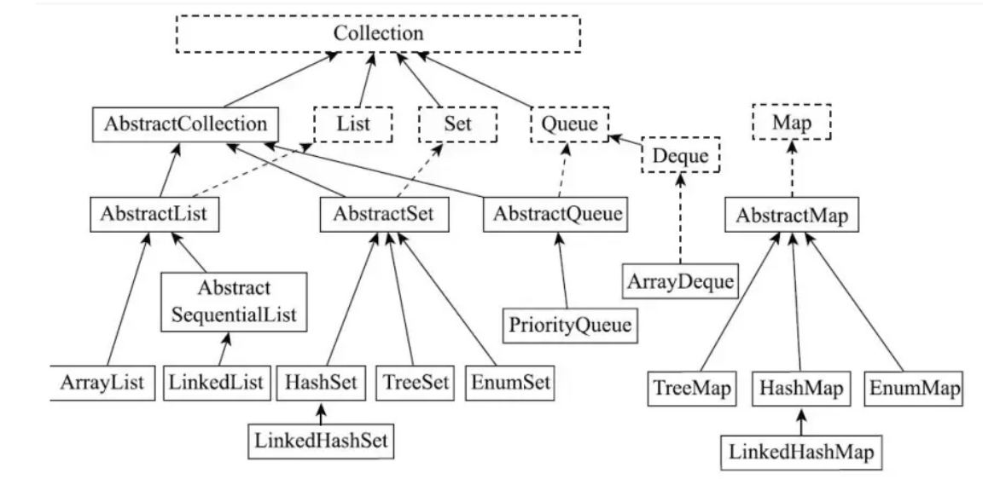
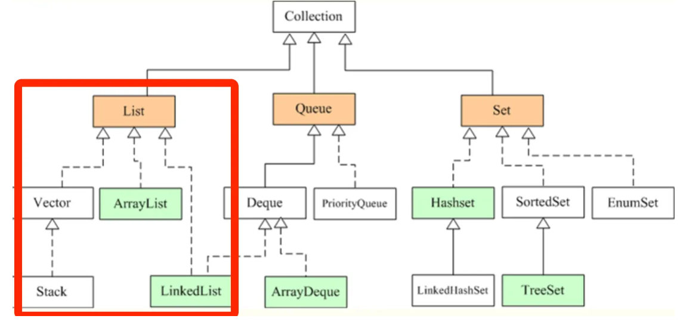
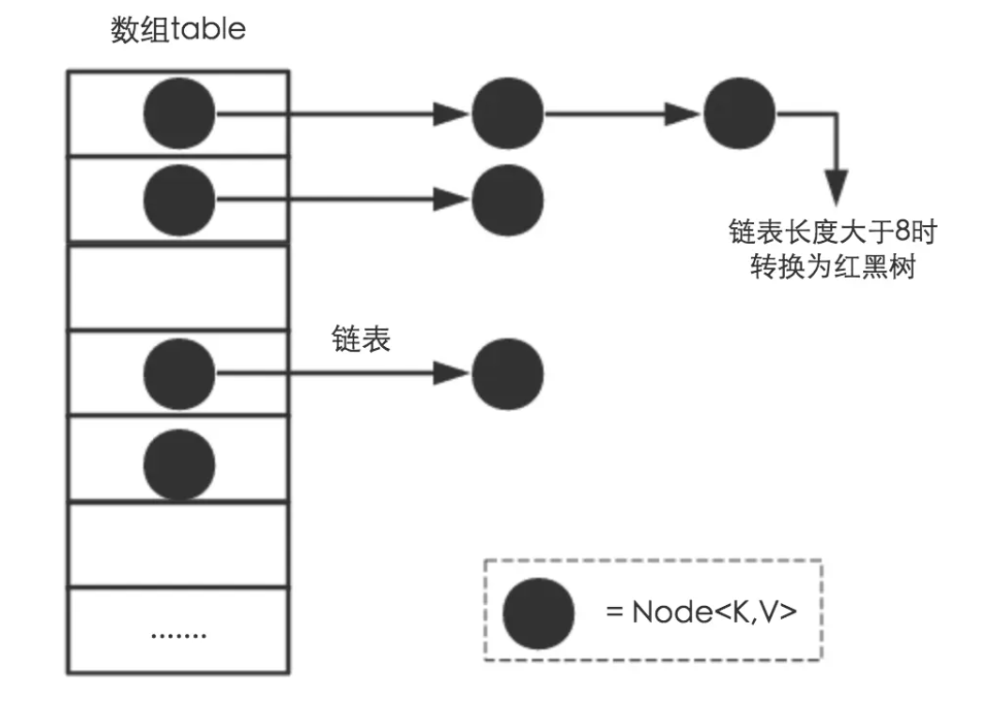
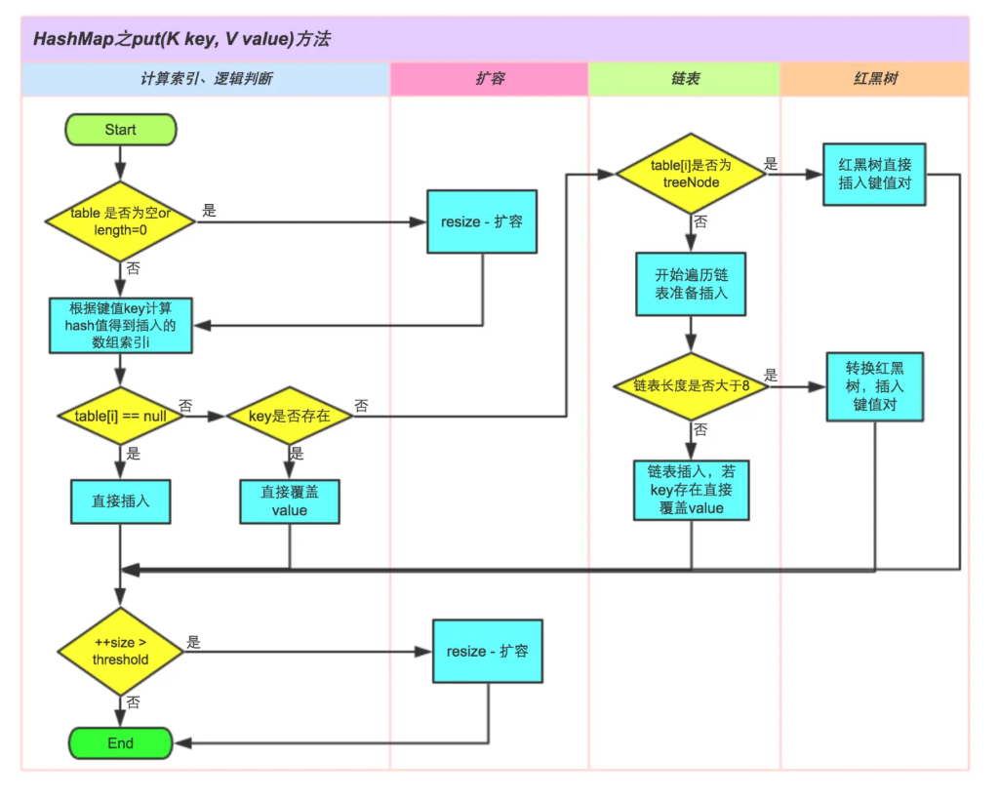
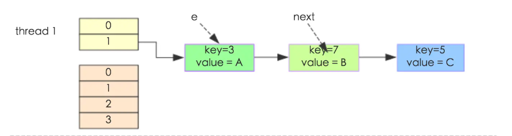
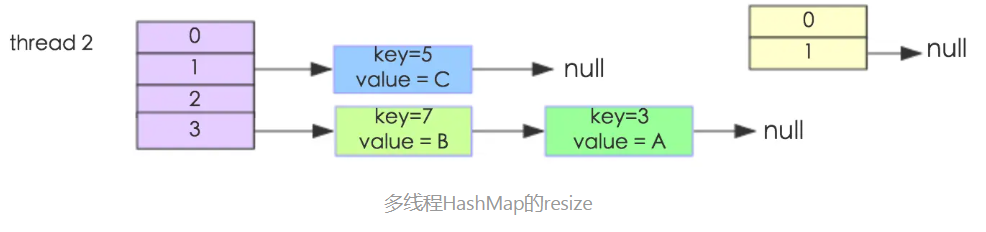
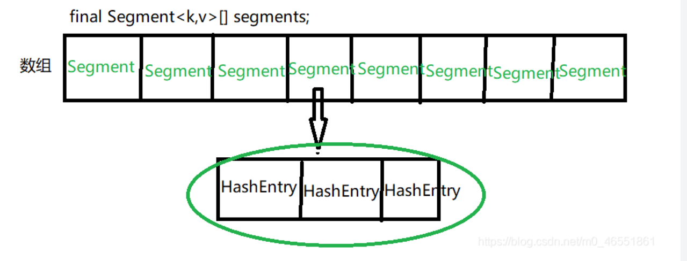
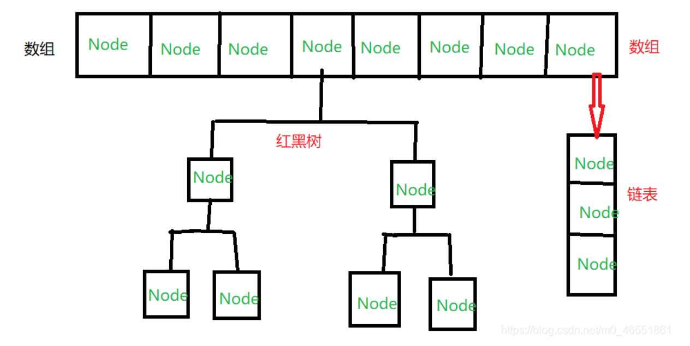

## 概念

### 数组与集合区别

- 数组是固定长度的数据结构，一旦创建长度就无法改变，而集合是动态长度的数据结构，可以根据需要动态增加或减少元素。
- 数组可以包含基本数据类型和对象，而集合只能包含对象。
- 数组可以直接访问元素，而集合需要通过迭代器或其他方法访问元素。

### 集合体系

集合主要分为两种，单列集合和双列集合

Collection接口有两个重要的子接口，一个是list，一个是set，他们的实现都是单列集合

Map接口的实现子类是双列集合，存放的K-V



List是有序的Collection,使用此接口能够精确的控制每个元素的插入位置，用户能根据索引访问List中元素。常用的实现List的类有LinkedList，ArrayList，Vector，Stack。

Set是无序的Collection，不允许重复的元素，常用的实现Set的类有HashSet，LinkedHashSet，TreeSet。

Map 是一个键值对集合，存储键、值和之间的映射。Key 无序，唯一；value 不要求有序，允许重复。Map 没有继承于 Collection 接口，从 Map 集合中检索元素时，只要给出键对象，就会返回对应的值对象。主要实现有TreeMap、HashMap、HashTable、LinkedHashMap、ConcurrentHashMap。

## Collection接口



### List接口

**ArrayList：**

- ArrayList是容量可变的非线程安全列表，其底层使用数组实现。
- 当几何扩容时，会创建更大的数组，并把原数组复制到新数组。
- ArrayList支持对元素的快速随机访问，但插入与删除速度很慢。
- 允许所有的元素，包括null，ArrayList可以加入null，而且可以多个null。
- 当创建ArrayList对象时，如果使用的是无参构造器，则初始elementData容量为0，第一次添加，则扩容elementData为10，如需要再次扩容，则扩容elementData为1.5倍
- 如果使用的是指定大小的构造器，则初始elementData容量为指定大小，如果需要扩容，则直接扩容elementData为1.5倍

**LinkedList：**

- LinkedList本质是一个双向链表，与ArrayList相比，其插入和删除速度更快，但随机访问速度更慢
- 可以添加任意元素（元素可以重复），包括null
- 线程不安全

**Vector：**

- Vector是ArrayList的线程安全版本，使用synchronized关键字保证线程安全。
- 如果是无参，默认10，满后，就按2倍扩容
- 如果是指定大小，则每次直接按2倍扩容

Vector不重要，现在不怎么用，因为其性能很差

### Set接口

**HashSet：**

- HashSet是无序的集合，不允许重复的元素，底层使用HashMap实现。
- 可以存放null,但是只能有一个null

**LinkedHashSet：**

- LinkedHashSet是HashSet的子类，底层使用 LinkedHashMap 实现。底层维护了一个数组+双向链表
- LinkedHashSet根据元素的hashCode值来决定元素的存储位置（数组中的位置），同时使用链表维护元素的次序（链表尾部插入元素存放的位置），这使得元素看起来是以插入顺序保存的（用遍历的方式是有次序的，即加入顺序和取出元素的顺序一致）

**TreeSet：**

当我们使用无参构造器创建TreeSet时，仍然是无序的

有参构造器：传入一个比较器，指定排序规则，构造器把传入的比较器对象，赋给了一个TreeSet底层的TreeMap的属性`this.comparator`

这个不重要

## Map接口

### HashMap(重点！)

底层的数据结构是数组+链表，数组里的每一个元素都是一个链表

java1.7中是数组+链表，java1.8中是数组+链表+红黑树



以下均为1.8(java8)的实现

put方法底层：



1. 先调用hashcode，然后根据hashcode计算出在数组中的位置
2. 如果数组位置为空，就放到该位置上
3. 如果数组位置不为空，在该位置的链表上一个个调用equals方法，相同的话覆盖，如果不相同，添加到最后
4. 判断是否需要扩容或是树化

扩容机制：
- 往里面加东西的时候，不管是加到数组或者链表，只要加入了一个新的结点，就算大小变大，就可能会触发扩容机制
- 第一次添加时，table数组初始大小为16，临界值(threshold)是16*加载因子(loadFactor)0.75 = 12
- 如果table数组使用到了临界值12，就会扩容到16 * 2 = 32,新的临界值就是32 * 0.75 =24，依次类推
- 在java8中，如果一条链表的元素个数到达TREEIFY_THRESHOLD(默认8)，并且table的大小>=MIN_TREEIFY_CAPACITY(默认64)，就会进行树化（红黑树），否则依然采用数组扩容机制（在扩容过程中会改变原来链表的存放位置）
> 如果红黑树中的节点过少（<6）时，红黑树会退化为链表

#### 为什么HashMap线程不安全？


问题1: put的时候导致的多线程数据不一致。

A和B要插入的位置是一致的，A先执行得到了位置，然后暂停了，这个时候B得到了一样的位置并且插入进去了，然后A恢复，A不知道B已经插入进去了，直接把B的插入覆盖了，导致了数据不一致

此问题1.7和1.8均存在

问题2:HashMap的get操作可能因为resize而引起死循环。（下为1.7版本的）

```java
void transfer(Entry[] newTable, boolean rehash) {  
    int newCapacity = newTable.length;  
    //遍历数组
    for (Entry<K,V> e : table) {  
        //遍历链表
        while(null != e) {  
            Entry<K,V> next = e.next;           
            if (rehash) {  
              // e.key为null,hash值为0，e.key有值则重新计算hash值
                e.hash = null == e.key ? 0 : hash(e.key);  
            }
            //计算新位置
            int i = indexFor(e.hash, newCapacity);  
            //头插进新位置 
            e.next = newTable[i]; 
            newTable[i] = e;  
            e = next;  
        } 
    }  
}  
```

resize的核心在于创建一个更大的数组，并且重新计算所有元素在数组+链表中的位置

假设有两个线程同时需要执行resize操作，我们原来的数组长度为2，记录数为3，需要resize数组到4，原来的记录分别为：[3,A],[7,B],[5,C]

假设线程thread1执行到了transfer方法的Entry next = e.next这一句，然后时间片用完了，此时的e = [3,A], next = [7,B]



线程thread2被调度执行并且顺利完成了resize操作，操作完成后如下图



这个时候thread1继续执行，执行到了e.next = newTable[i];这一句，此时e = [3,A], next = [7,B]，但是此时newTable[i]已经被thread2的resize操作修改了，newTable[i] = [7,B]，而[7,B]的next又是[3,A]，链表串起来了。因为e永远!=null，会一直循环下去，导致死循环。

1.8版本的HashMap已经解决了这个问题,并且1.8是尾插

### HashTable（不重要）

- hashtable的键和值都不能为null
- hashtable是线程安全的
- 因为是所有方法都加synchronized，效率低下

### ConcurrentHashMap（重点！）

- 线程安全版的HashMap
- 性能高
- 键和值都不能为null

同步机制：
- 1.7版本：基于segment分段锁机制，基于ReentrantLock实现；
- 1.8版本：基于CAS+synchronized实现，空节点插入使用CAS，有Node节点则使用synchronized加锁

**1.7版本的ConcurrentHashMap：**

1. 底层数据结构还是数组+链表。HashEntry为链表的节点
2. 采用了segment分段锁技术，在多线程并发更新操作时，对同一个segment进行同步加锁，保证数据安全，这样就可以基于不同的segment进行并发写操作
3. 继承ReentrantLock实现同步锁机制



**1.8版本的ConcurrentHashMap：**

1. 底层数据结构和HashMap 1.8版本一样，都是数组+链表+红黑树；
2. 支持多线程并发操作，实现原理：CAS+synchronized保证并发更新
3. put方法放元素的时候：通过key对象的hashcode计算出数组的索引，如果没有Node，则使用CAS尝试插入元素，失败则无条件自旋，直到插入成功为止，如果存在Node，则使用synchronized锁住该Node元素（链表/红黑树的头节点），再执行插入操作。



**1.7和1.8的共通之处：**

1. 读操作没有加锁，value是volatile修饰的，保证了可见性，所以是安全的；
2. 读写分离可以提高效率：多线程对不同的Node/Segment的插入/删除是可以并发、并行执行的，对同一个Node/Segment的写操作是互斥的。读操作是无锁状态，可以并发、并行执行。


> 原文链接：[为什么HashMap线程不安全](https://www.jianshu.com/p/e2f75c8cce0),[HashMap、HashTable和ConcurrentHashMap的区别](https://blog.csdn.net/m0_46551861/article/details/115054941)