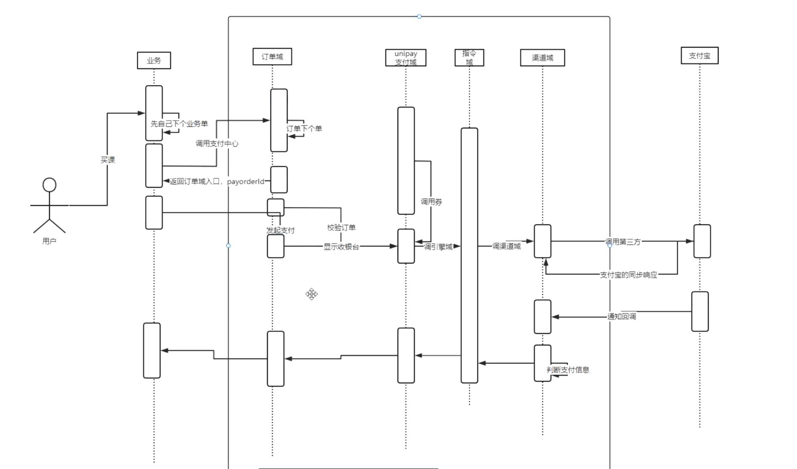
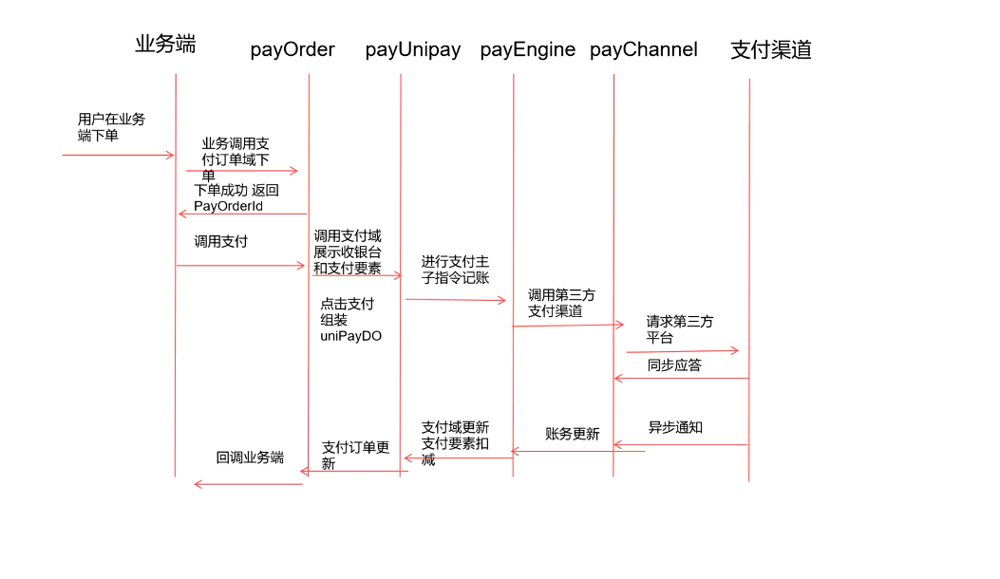
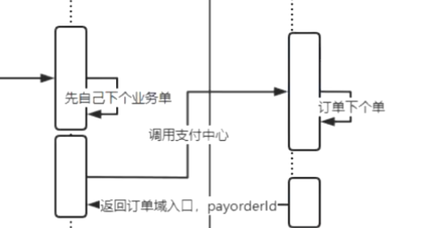

## 登录

### Jwt token vs Redis

#### token 

前端存储token,token中包含用户信息，后端拦截请求，验证并解析token得到用户信息

**缺点**
- 使用jwt等方案时，容易引入很多jar包，使得代码不干净
- 同时还封装了大量的加密，其实都用不上

#### redis

前端存储一个key，后端通过这个key在redis中获取value(用户信息)

大的项目，一定反向思考，登录没问题，推出有没有可能有问题？

**redis方案优点**
- 直接把redis中的kry-value删除就可以退出了


### 如何标记一个用户

使用userId作为用户的表示

在安全方面可以使用签名或加密两种方案

1. userId加密，然后后端解密，得到userId
2. 签名，形式为签名+ 原始数据，签名由原始数据计算得出，如果签名或者原始数据被篡改都无法通过校验，这些数据本身可以套一层加密


### SSO（单点登录）

#### 业务场景——多项目

假设每个项目100个服务器，而因为每个请求都需要校验登录，不可能都集中在一个用户中心去做校验

#### 前后端不分离模式

1. 使用cookie+session的方式
2. 登录的时候，走用户中心服务
3. 登录之后，每个业务都不需要走用户中心，直接用cookie和session获取用户信息
4. 退出之后，仅这个的服务器把seesion删了，别的服务器没删相当于没退出登录

如何解决退出的问题？

退出也交给用户中心管理，业务提供一个退出的api，然后用户中心把所有的api都轮询一遍

#### 前后端不分离模式

1. 前端直接删除cookie，相当于全部退出了
2. 对每个http的token都做校验

对2进行踢人，黑名单等操作是不可能的，这样就又相当于所有校验都要弄到用户中心里去了

但是如果使用redis，只要登录走用户中心就可以了，退出直接删除redis中的key即可

### TheradLocal

1. threadLocal存在着诸如内存泄露的问题
2. 大部分时候都可以直接使用Http-setAttribute的方式来解决


## 支付中心





### 第一轮：快速过流程

####  订单域

订单域的存在可以方便支付业务的拓展

**为什么下单要分为两步？**

两步的下单是对订单域来说的，第一步下单是创建订单，第二步下单是业务端发起支付

很重要的地方在于跨平台一致性，因为PC端有两个流程，一个页面流程和(创建订单)一个接口流程（发起支付），而APP端只有一个流程，接口流程

并且这样还可以解决同一个用户多次提交的问题，创建订单的时候接口幂等，这样后续根本不会执行具体的业务逻辑

以下代码对应着图的此部分



```java
public ResponseDO payOrder(BigDecimal amount, HttpServletRequest request) throws Exception {

    log.info("amount = :{}" ,amount);

    // 参数校验  + 接口幂等
    if(amount.compareTo(BigDecimal.ZERO) < 0){
        return ResponseDO.fail("参数不正确");
    }
    //登录
    int userId = UserUtils.dealuser(DOMAIN, request);
    if(userId == 0){
        return ResponseDO.fail(NOT_LOGIN);
    }
    // 业务下单
    // 业务订单记录用户要买什么东西
    VipOrder vipOrder = new VipOrder();
    vipOrder.setUserId(userId);
    vipOrder.setStatus(OrderStatusEnum.NotPay.getId());
    vipOrder.setAmount(amount);
    vipOrderService.insert(vipOrder);

    // 支付订单
    // 支付订单记录“用户要付多少钱、怎么付”，让支付中心保持通用且独立
    PayOrder order = new PayOrder();
    order.setUserId(userId);
    order.setAmount(vipOrder.getAmount());
    // 业务主键
    order.setBizId(BizEnum.VIP.getId());
    // 业务订单主键
    order.setBizOrderId(vipOrder.getId());
    order.setStatus(OrderStatusEnum.NotPay.getId());
    // 回调接口，PC和APP都用到
    order.setCallbackUrl("/vip/order/orderCallback");
    // 页面跳转，PC使用
    order.setReturnUrl("/vip/order/toPay");
    order.setPlatformId(PlatformEnum.PC.getId());
    order.setTitle("VIP订单" + vipOrder.getId());
    order.setMsg("发起支付");
    order.setUserIp(IPUtil.getRequestIP(request));


    String json = JsonUtils.toStr(order);
    Map<String ,String > map = JsonUtils.convert2Map(json);
    // 调用支付中心的接口（注：支付中心和业务端应该是分开的两个项目，在业务端调用支付中心的接口，方便讲课弄成了一体的）
    String ret = HttpClientUtils.executePostHttpClientUTF("http://127.0.0.1:8080/pay/order/create", map );

    log.info("to pay orde ,ret =:" + ret);

    //返回 payOrderId

    return  (ResponseDO) JsonUtils.convert(ret, ResponseDO.class);
}

```

订单下单的代码如下：

```java
@PostMapping("/create")
@ResponseBody
public ResponseDO payOrder(PayOrder order, HttpServletRequest request) throws Exception {

    log.info("to pay  order , order =: "  + order);

    //1 参数校验
    String ret = verifyParams(order);
    if(!StringUtils.equals(ret, SUCCESS)){
        return ResponseDO.fail(ret);
    }

    // 判断订单是否已经存在
    PayOrder tempOrder = payOrderService.loadByBizIdAndBizOrderId(BizEnum.getById(order.getBizId()), order.getBizOrderId());
    // 判断支付状态
    if(tempOrder != null){
        if(tempOrder.getStatus() == OrderStatusEnum.PaySuccess.getId()){
            // 已支付状态直接返回
            return ResponseDO.fail("订单已支付");
        }else {
            // 金额不同，更新订单状态
            if(tempOrder.getAmount().compareTo(order.getAmount()) !=0){
                tempOrder.setAmount(order.getAmount());
                payOrderService.update(tempOrder);
                return ResponseDO.success(tempOrder.getId());
            }
        }
    }
    // 新订单，直接insert 返回payOrderId
    payOrderService.insert(order);

    return ResponseDO.success(order.getId());
}
```

#### 统一支付域

支付域的存在方便支付要素的扩展

**支付要素**

支付要素指的是券，余额，白条等要素，这些支付要素不属于支付系统，而是属于账户系统或者是用户系统。这就产生了一个问题，比方说当我下单的时候，我是用了十块钱的余额，但是我还没有支付剩下的90块钱，但是用户并不一定会在第三方平台去支付那90块钱，他不付这个钱的话这十块相当于被冻结了，无法使用。因此应该让用户可以主动取消订单，并且比如30分钟不支付就自动取消订单并解冻余额。我们的指令域是用来记账的，这个记账就会记录解冻了十块余额，解冻完了要归还给用户余额，这个归还操作由统一支付域来完成，然后统一支付域还要调用账户中心，如果一个域一个项目的话就相当于是三个项目的分布式事务，导致性能非常的差。一般情况下这个场景是需要分布式事务的，但是C端的话技术上反而不用事务，因为C端对失败的容忍程度会比较高，并且可以通过定时任务等方式完成补单。而B端就不行，特别是类似支付宝这种基础业务平台，B端在技术上应该没什么漏洞

**PayWay支付通道**
一笔钱怎么出去的三要素
1. 支付渠道
2. 支付方式
3. Bank

例子：微信支付
1. 支付渠道：微信
2. 支付方式：扫码支付
3. Bank：微信内绑定的银行卡

**收银台**

收银台分为动态收银台和固定收银台

中小公司一般使用固定收银台，大公司一般使用动态收银台

收银台一般是跨平台的

动态收银台指的是布局是动态的，例如上次所选的支付方式会被提到前面去，目的是为了让用户尽快去付费


**uni统一指的是什么？**

统一的是对支付要素的操作，比如需要把统一把支付要素通过api传递给下一域指令域作记账

而调用api接口，肯定是传进去一个对象，但是支付要素是可能根据业务需要而变动的，而对象的格式肯定是不变的，因此使用JSONObject，因为JsonObject的字段是可变的

##### 代码部分

`GET ` `/pay/unipay/pay` : 这个接口代码不需要看，只是用来展示收银台页面的

`GET ` `/pay/order/{orderId}`： 也不需要看，只是用来跳转到收银台页面的

`POST` `/pay/unipay/ajax/toPay`：目前没什么好看的，只是由参数校验并insert了，inser成功返回一个网址

##### 重复支付

**首先，重复支付指的是什么？**

重复指的是同个订单id重复付款，也就是payOrderId重复

**如何实现payOrderId的严格非重复支付**

insert unipay之前，查询表有没有同一个payOrderId未支付的订单，如果由订单正在支付中，要么就取消订单，要么去支付之前的单。这样子虽然做到了严格非重复，但是对C端用户的体验不友好

在多线程的情况下，这是一个并发问题，如果不加锁，有可能出现两个insert。

解决方案：

只允许unipay里有一个为0的订单（只能存在一个处于未支付状态的订单），在单机的情况下，使用代码锁就可以了

#### 渠道域

渠道域的存在可以方便支付渠道和支付方式的扩展

##### 代码

`Post` `/pay/unipay/ajax/toPay` ：统一支付域支付，新增了调用渠道域
`Post` `/pay/channel/ajax/toPay` ：渠道域支付，使用策略模式，关于策略模式是什么此处不展开，简单来说就是使用一个接口多种实现来取代许多个if-else

`PayStrategy` 就是这个接口，接口中定义了一个方法 `pay`,传递的参数是 `channelDo`

`PaySyrategrFactory` 获取具体的实现类，使用的是工厂模式，在Spring中，工厂模式和策略模式往往是成对出现的

```java
public PayStrategy getStrategy(PayChannelEnum payChannelEnum, PayMethodEnum payMethodEnum){

    if(payChannelEnum == PayChannelEnum.Alipay && payMethodEnum == PayMethodEnum.PagePay){
        return (AlipayPagePayStrategy) beanFactory.getBean("alipayPagePayStrategy");
    }

    if(payChannelEnum == PayChannelEnum.WeiXin && payMethodEnum == PayMethodEnum.AccountPay){
        return (WeixinAppPayStrategy) beanFactory.getBean("weixinAppPayStrategy");
    }

    return null;

}
```
根据条件自动选择返回什么样的实现类，目前微信的实现类中没东西，来看 `AlipayPagePayStrategy` （支付宝网页支付）的 `pay` 方法

```java
// 1. 具体的属性设置不重要，重要是生成流水号并插入数据库
String tradeNO = dateFormat.format(new Date()) + PayChannelEnum.Alipay.getId() + channelDO.getOrderId() + channelDO.getAmount();

payChannelService.insert(channelAudit);

// 2. 根据具体的支付渠道和支付方式的报文要求，组装和签名

Map<String,String> params = generateParams(tradeNO, channelAudit.getOrderId(), channelAudit.getPayAmount(), "https://www.naoffer.com" + "/pay/alipay/notify", "https://www.naoffer.com/pay/order/success/"+channelAudit.getOrderId());
// 3. 调用第三方支付
try{
    String paramsStr = ParameterUtil.mapToUrl(params, false);
    log.info("alipay info =:" + paramsStr);
    return "https://mapi.alipay.com/gateway.do?" + paramsStr;
}catch (Exception e){
    log.error("fail to gen request params", e);
    return null;
}
```

其中的 `generateParams` 方法有几点需要注意

```java
// 签名使用MD5
params.put("sign_type","MD5");
// 对支付宝来说，我们内部的流水号才是外部流水号
params.put("out_trade_no",tradeNo);
// 支付的回调地址，支付完成（注意只是完成）后支付宝会对这个地址发起POST请求，告知你这次支付的结果
params.put("notify_url",notifyURL);
// 跳转网页，支付完成（注意只是完成）后会跳转的地址
params.put("return_url",returnURL);

```
##### 概念

**不可变流水号和可变流水号**

不可变流水号和可变流水号的区别是一个订单号的流水号是否可变，不可变流水号一个订单内的流水号都不变，可变流水号请求渠道域一次就生成一个新的流水号

不可变流水号的好处：
- 固定的流水号，对于同一个渠道来说，自动就有接口幂等的效果

不可变流水号的坏处：
- 和订单号对应，一个订单号可能会有多条记录，因为和第三方是使用流水号去沟通的，如果出了问题不知道具体哪条出了问题

可变流水号的坏处
- 在渠道域可能会出现重复支付

这个问题通过从支付域控制严格的非重复支付解决

##### 支付回调

###### 概念

支付回调指的是支付成功的回调，支付失败的回调这里暂时不搞

**保底策略**

1. 支付宝重发请求：如果支付宝没有成功收到应答，那么就会重新发回调，时间是4m,10m,10m,1h,2h,6h,15h
2. 手动补单：如果发现确实成功了但是订单状态没有更新，那么手动发起一个请求，模拟回调请求

**回调消息设计**

回调消息设计采用了非严格幂等

- 什么是非严格幂等

举一个具体的例子

1. 第一次调用：创建支付记录，更新订单状态为“已支付”。
2. 第二次调用（相同订单号）：发现订单已是“已支付”，直接返回成功，不重复扣款。

在业务上幂等（用户不会被多扣钱），但是在技术上可能每次都会写一条日志、更新 update_time，或生成新流水 ID。

- 为什么用非严格幂等

先看具体的场景，比如通知回调的接口量级很大，会不会有并发问题

首先先看具体涉及的表，涉及到一张流水表和一张订单表，流水表需要记录每次请求，而订单表需要更新状态为支付成功

这个是不会的，首先是流水表，流水表因为有流水号作为主键，对于一个流水号来说消息只有一条两条，那为什么会有两条呢，因为公网的通知系统是由冗余的，并且基本上是定时任务，可能会导致多个定时任务撞在一起，通知两次？然后是订单表不加锁在最巧的情况下也就是两个通知撞在一起，一条把订单的状态从 0 （未支付）变成 1 （支付成功）,另一条把订单的状态从1变成1,并没有影响

简历不讲非严格幂等，只讲接口幂等就可以了

###### 代码

`POST` `/pay/notify/alipay` ：支付成功回调接口
`POST` `/vip/order/orderCallback` ： 业务域回调接口 

`/pay/notify/alipay`主要做了几件事

第一步是接受参数，这个不重要

第二步是验证签名，这个现在只是内部模拟补单，可以不做

第三步是接口幂等，只接受支付成功的回调，在这一步中如果流水表中已经有状态为异步返回的数据了，那么直接返回一个成功。如果流水表中都没有出去的请求，没有向第三方支付发起过请求，那么也直接返回一个成功。

第四步是插入数据库，设置状态为异步返回并插入数据库

第五步是调用请求回调上一层，这个时候请求回调的支付域

支付域中的回调

看一下这个支付单是不是已经是支付成功了，是支付成功了那日志打印一个异常，直接返回。然后将支付单的状态更新为支付成功，并请求回调上一层：订单域

订单域中的回调

看一下是不是重复支付（已经是支付成功的状态了），如果是退款新的这一笔。然后将订单状态更新为支付成功状态，然后通知业务端

业务端

即`/vip/order/orderCallback`，就是把业务单更新为已支付状态

这里为什么其他时候都是用Service里的方法，而业务端却用 HTTP 请求呢，因为支付中心是一个独立的项目，项目自己内部当然可以直接用 @Resource 注入用 service ，但是业务端应该是在外部的，内部请求外部要用 HTTP 请求，写在一起只是为了方便

##### 概念

**流水表中没有回调数据**

第一种是请求没有收到，可能是网络阻塞或者机房有问题，对于这种是不知道有问题的，只能靠用户的人工反馈和支付宝的多次回调保底

第二种请求到了，但是我们有这出现故障了。主动查在故障时间范围内所有出去的订单，然后手动进行补单，不需要依赖支付宝的保底，因为时间间隔太长了

第三种是比较快的对到达到 notify 的回调，快速的补单，这个第三轮讲

**支付中心内部有系统消息失败**

这个主要第三轮讲

**支付中心回调业务端有问题**

订单表（payOrder）中增加一个回调字段 `callbackStatus` 回调成功了就把值设置为 1 ，借鉴 alipay 回调的保底方案，每隔一段时间发起一次回调，如果回调一直不成功则认为业务端有问题，发起报警

### 第二轮：增加支付域，指令域

#### 订单域

订单域是支付业务的扩展，要从目前的单笔支付扩展到组合支付，分单支付

##### 组合支付

对应的业务的购物车，比如说购物车里有 10 个商品，一次性全部支付，退款的时候支持只推其中的一笔

引申出的问题

**是不是只提供单笔支付就可以了**

很显然应该支持子订单的退款，应当支持组合支付

**购物车调用支付接口怎么掉**

把所有的子订单信息通过接口的方式发送给支付中心

**是在原有的单笔支付的接口上扩展，还是新增一个多单支付的接口**

首先是对于业务端来说，当然是一个统一的接口更好，比较省事。现在的架构支付和订单是分开的，在渠道域上，比如支付宝网页支付，还是只付款一次，和单笔支付一样是那些必须有的参数和可选参数，是同一个业务模型。如果认为总订单的支付是一笔订单的话，那么和单笔支付就是一样的，因此只需要在原来的单笔支付接口上做拓展

**实现**

业务端传递总金额的单笔支付 + 所有的子订单，也就是总订单 + 子订单。其中子订单需要传递的数据主要包括 title , amount , 和 subOrderId ,根据需要还可以有一些可选参数。支付中心中订单主表（payOrder）表中新加入一个字段 type ，单笔支付为 1 ，组合支付为 2 

在下单的时候是不是要用事务

尽管存在插入一条主表数据和多条字表数据，但是不需要使用事务，因为不是必须要回滚，事务更多是在需要回滚的地方使用的，所有的数据都是资产，失败了就失败了，让用户重新下单就好了

支付成功的回调

支付成功后的回调需要更新两张表，从子表到主表，这个场景下是事务

##### 分单支付

理解一下即可，不是重点

分单支付的意思就是一次支付分好几次支付，先说设计，在当前设计上，业务端的单笔支付的时候， payOrder 表数据是没有任何变化的，因此我们需要添加一种新的类型的订单：分单支付 type 为 3 ，b并且新加入一个字段 remainAmount ，每次支付的时候都会扣减老订单上这个字段的值，只有当 remainAmount = 0  的时候才算支付成功，才回调业务端。这个分单的选项是用户在收银台的页面选择的，也就是 unipay 领域，付成功一次就在把主表的 type 改为 3 ,并且把具体的数据插入子表，然后把 payOrderId 传给下一个域

业务端那里重新发起支付的时候，订单中心的老订单再次发起，业务端是不知道已经付了 1k 还是 1w ,如果发现老订单的 type = 3 ，如果 remainAmount = 0 的话那么就直接跳转到收银台继续支付

##### 特殊优惠

> 这块没有深讲
先看具体的业务，某一个业务单要求如果使用中行信用卡，满 100 块减 5 块。这不是支付中心的业务，因为订单详情页就已经把支付优惠给算进去了

假设我们的项目没有优惠系统，这种特殊情况要单独处理，单独分配一个可选参数 discountinfo ,字段值如下

```json
{
    "biz":,
    "name":,
    "bank":,
    "stra":,
}
```

不改变 payOrder 的表模型，对内网关还是从这里下单发起，并且这些优惠信息也要传递给下一域 unipay ，unipay 解析 discountinfo 然后展示收银台，后面正常走

新的项目会有一个优惠系统，这个系统可能属于支付中心，页可能属于是用户中心。去配置一个 bizId ，最后由 unipay 去解析，这样不需要在 payOrder 那里去传参，而是直接在 unipay 域去读一下有没有优惠信息

#### 支付域扩展

##### 余额在哪个项目

余额是不再支付中心的新项目，一般在用户的账户中心

##### 收银台，多次点击并发问题

一个人自己的多次操作，操作 insert , update 的情况下要做接口幂等

如果一个东西的状态多于两个状态，那么可能会出现并发问题

后面没听懂，大概在 1.6 的 0:50 - 1:00

##### 点击支付时用户的余额

点击支付的时候，用户的余额应该进入冻结态（余额系统提供冻结接口），点击支付的时候肯定还不能直接扣减，因为用户可能会放弃支付。如果不冻结，但是不扣减，等到回调再扣，那么用户可能在另一笔支付的时候已经把余额用掉了，并且另一笔支付成功了，余额全没了

##### 支付成功的回调

##### 回调的并发可能性问题

首先，用户的余额不能够一直冻结，半个小时不支付后应该自动解冻

解冻如何实现，解冻应该在指令域加入定时任务，每两分钟执行一次，看看有没有超过 30 分钟未支付的订单，也就是大概在 30-32 分钟的时候执行，有就把订单的状态改为支付失败，并且解冻余额

这时候有一个场景，比如说我在 30 分钟的时候，订单支付成功了，但是定时任务又把状态变成支付失败了

这时候可以把定时任务往后移动一些就可以解决了，但是还有一个场景，就是回调可能出现问题，支付已经支付成功了但是没有成功回调，过了几分钟后自动补单，这个补单的线程和支付失败的定时任务撞在一起了，一个解冻一个扣减这时候就产生了并发问题

解决方案就是通过加锁来解决并发问题

锁分为几种
1. 数据库锁
- 最为方便，因为数据库是只有一个的，但对性能影响较大
2. 代码锁
- 单机环境下解决并发问题
3. 中间件
- 常见的多项目的并发

#### 指令域

指令域是用来记账的域

在指令域中，第一笔来自unipay的请求，也就是总体的请求会作为一个主指令，而支付要素 + 第三方作为一个子指令

##### 代码部分

`POST` `/ajax/toPay/pay/unipay` ：统一支付域的支付方法，主要是不直接调用渠道域了而是走指令域了

`POST` `/pay/notify/alipay`：渠道域的支付回调方法，改为了不调用统一支付域而是渠道域

接下来是指令域新增的接口，统一前缀是`/pay/engine`，之后就不加了

`POST` `/ajax/toPay`

支付时走到的指令域方法，具体的业务逻辑大致就是先插入一条主指令，然后根据支付要素插入多条子指令，最后调用渠道域方法

然后应该看一下`PayEngineServiceImpl`的`orderCallback`，这个就是支付成功后的回调，主要先更新子指令的状态，然后更新主指令的状态


### 第三轮：增加量级,mq,redis，幂等

#### 概念

##### 量级变大之后的中间件转换

> 大厂面试，遇到场景题怎么办

首先按正常的量级，把整个流程梳理清楚，然后再考虑量级变大后，哪些环节要优化

> 读的量级和写的量级哪个更大

读的量级更大

> 为什么一般不使用 restful API

因为常常需要写多个 get 方法，如果采用 restful 风格的话会很不方便

> 为什么接口的量级太大会出现问题

会给数据库带来过高的压力

> 如何让读的接口量级变大

首先解决数据库的压力过大的问题（3应该不会问到，答1或者1,2就足够了）

1. 可以加入缓存，并且缓存的命中率要高，

2. 修改数据库的结构为一主多从的结构，主负责写，从负责读

3. 数据库集群 + 分库分表

然后是针对服务器的，项目的优化

使用分布式服务，用多台机器+nginx

> 写的量级变大怎么办

写肯定是主库，并且并发场景下要加锁，只能多加实例

##### 接口幂等

接口幂等是一个和业务无关的功能，一般是针对 insert,update的这些功能，

在单机环境下，可以使用 static map，其缺点主要是没有过期时间

可以使用中间件 redis ，可以设置为两秒只能有一个请求访问，如果要求严格幂等的话因为redis的查询和插入是两个分开的操作，不是原子化的，因此需要使用lua脚本或者redission，用lua脚本会多一些，更加的方便