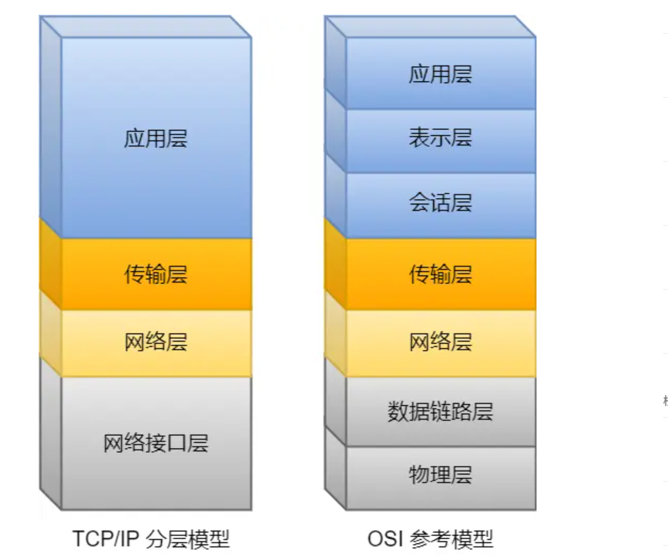

> 主要来源：[小林coding](https://xiaolincoding.com/network/3_tcp/tcp_feature.html#%E6%BB%91%E5%8A%A8%E7%AA%97%E5%8F%A3)

## 网络模型

### OSI 七层网络模型

物理层，数据链路层，网络层（包Packet），传输层（段Segment），会话层，表示层，应用层

### TCP 四层模型

网络接口层，网络层，传输层，应用层

## 应用层

### 从键入网址到网页显示发生了什么

第一步：DNS 解析，将网址转换为实际的 IP 地址。DNS 中可能有多级缓存，第一个是本地的 Host 的文件，第二个是浏览器的缓存

第二步：浏览器向服务器发起请求，请求建立 TCP 连接

第三步：连接成功建立后，浏览器向服务器发起 HTTP 请求

第四步：服务器接受到请求，进行处理后将处理后的结果以及对应的视图返回给浏览器

第五步：浏览器解析并渲染视图，如果需要使用静态资源，就重复以上步骤获取

第六步：浏览器根据其请求到的资源，数据来渲染页面，最后呈现给用户一个完整的页面

### HTTP 和 HTTPS 的区别

- HTTP 是超文本传输协议，信息是明文传输，存在安全风险的问题。HTTPS 则解决 HTTP 不安全的缺陷，在 TCP 和 HTTP 网络层之间加入了 SSL/TLS 安全协议，使得报文能够加密传输。

- HTTP 连接建立相对简单， TCP 三次握手之后便可进行 HTTP 的报文传输。而 HTTPS 在 TCP 三次握手之后，还需进行 SSL/TLS 的握手过程，才可进入加密报文传输。

- 两者的默认端口不一样，HTTP 默认端口号是 80，HTTPS 默认端口号是 443。

- HTTPS 协议需要向 CA（证书权威机构）申请数字证书，来保证服务器的身份是可信的。

### GET 与 POST 的区别

这个应该不会问

### 常见状态码以及原因短语

同上

## 传输层

### TCP协议的格式

**序列号**：在建立连接时由计算机生成的随机数作为其初始值，通过 SYN 包传给接收端主机，每发送一次数据，就「累加」一次该「数据字节数」的大小。**用来解决网络包乱序问题。**

**确认应答号**：指下一次「期望」收到的数据的序列号，发送端收到这个确认应答以后可以认为在这个序号以前的数据都已经被正常接收。**用来解决丢包的问题。**

**控制位：**

- *ACK*：该位为 `1` 时，「确认应答」的字段变为有效，TCP 规定除了最初建立连接时的 `SYN` 包之外该位必须设置为 `1` 。
- *RST*：该位为 `1` 时，表示 TCP 连接中出现异常必须强制断开连接。
- *SYN*：该位为 `1` 时，表示希望建立连接，并在其「序列号」的字段进行序列号初始值的设定。
- *FIN*：该位为 `1` 时，表示今后不会再有数据发送，希望断开连接。当通信结束希望断开连接时，通信双方的主机之间就可以相互交换 `FIN` 位为 1 的 TCP 段。

### 三次握手

TCP 是面向连接的协议，所以使用 TCP 前必须先建立连接，而**建立连接是通过三次握手来进行的**。三次握手的过程如下图：

- 一开始，客户端和服务端都处于 `CLOSE` 状态。先是服务端主动监听某个端口，处于 `LISTEN` 状态

- 客户端会随机初始化序号（`client_isn`），将此序号置于 TCP 首部的「序号」字段中，同时把 `SYN` 标志位置为 `1`，表示 `SYN` 报文。接着把第一个 SYN 报文发送给服务端，表示向服务端发起连接，该报文不包含应用层数据，之后客户端处于 `SYN-SENT` 状态。 

- 服务端收到客户端的 `SYN` 报文后，首先服务端也随机初始化自己的序号（`server_isn`），将此序号填入 TCP 首部的「序号」字段中，其次把 TCP 首部的「确认应答号」字段填入 `client_isn + 1`, 接着把 `SYN` 和 `ACK` 标志位置为 `1`。最后把该报文发给客户端，该报文也不包含应用层数据，之后服务端处于 `SYN-RCVD` 状态。

- 客户端收到服务端报文后，还要向服务端回应最后一个应答报文，首先该应答报文 TCP 首部 `ACK` 标志位置为 `1` ，其次「确认应答号」字段填入 `server_isn + 1` ，最后把报文发送给服务端，这次报文可以携带客户到服务端的数据，之后客户端处于 `ESTABLISHED` 状态。

- 服务端收到客户端的应答报文后，也进入 `ESTABLISHED` 状态。

从上面的过程可以发现**第三次握手是可以携带数据的，前两次握手是不可以携带数据的**，这也是面试常问的题。

一旦完成三次握手，双方都处于 `ESTABLISHED` 状态，此时连接就已建立完成，客户端和服务端就可以相互发送数据了。

### 四次挥手

天下没有不散的宴席，对于 TCP 连接也是这样，TCP 断开连接是通过**四次挥手**方式。

双方都可以主动断开连接，断开连接后主机中的「资源」将被释放，四次挥手的过程如下图：

- 客户端打算关闭连接，此时会发送一个 TCP 首部 `FIN` 标志位被置为 `1` 的报文，也即 `FIN` 报文，之后客户端进入 `FIN_WAIT_1` 状态。
- 服务端收到该报文后，就向客户端发送 `ACK` 应答报文，接着服务端进入 `CLOSE_WAIT` 状态。
- 客户端收到服务端的 `ACK` 应答报文后，之后进入 `FIN_WAIT_2` 状态。
- 等待服务端处理完数据后，也向客户端发送 `FIN` 报文，之后服务端进入 `LAST_ACK` 状态。
- 客户端收到服务端的 `FIN` 报文后，回一个 `ACK` 应答报文，之后进入 `TIME_WAIT` 状态
- 服务端收到了 `ACK` 应答报文后，就进入了 `CLOSE` 状态，至此服务端已经完成连接的关闭。
- 客户端在经过 `2MSL` 一段时间后，自动进入 `CLOSE` 状态，至此客户端也完成连接的关闭。

你可以看到，每个方向都需要**一个 FIN 和一个 ACK**，因此通常被称为**四次挥手**。

这里一点需要注意是：**主动关闭连接的，才有 TIME_WAIT 状态。**

### 滑动窗口

> 引入窗口概念的原因

我们都知道 TCP 是每发送一个数据，都要进行一次确认应答。当上一个数据包收到了应答了，再发送下一个。

这个模式就有点像我和你面对面聊天，你一句我一句。但这种方式的缺点是效率比较低的。

如果你说完一句话，我在处理其他事情，没有及时回复你，那你不是要干等着我做完其他事情后，我回复你，你才能说下一句话，很显然这不现实。

所以，这样的传输方式有一个缺点：数据包的**往返时间越长，通信的效率就越低**。

为解决这个问题，TCP 引入了**窗口**这个概念。即使在往返时间较长的情况下，它也不会降低网络通信的效率。

那么有了窗口，就可以指定窗口大小，窗口大小就是指**无需等待确认应答，而可以继续发送数据的最大值**。

窗口的实现实际上是操作系统开辟的一个缓存空间，发送方主机在等到确认应答返回之前，必须在缓冲区中保留已发送的数据。如果按期收到确认应答，此时数据就可以从缓存区清除。

假设窗口大小为 `3` 个 TCP 段，那么发送方就可以「连续发送」 `3` 个 TCP 段，并且中途若有 ACK 丢失，可以通过「下一个确认应答进行确认」。如下图：

图中的 ACK 600 确认应答报文丢失，也没关系，因为可以通过下一个确认应答进行确认，只要发送方收到了 ACK 700 确认应答，就意味着 700 之前的所有数据「接收方」都收到了。这个模式就叫**累计确认**或者**累计应答**。

> 窗口大小由哪一方决定？

TCP 头里有一个字段叫 `Window`，也就是窗口大小。

**这个字段是接收端告诉发送端自己还有多少缓冲区可以接收数据。于是发送端就可以根据这个接收端的处理能力来发送数据，而不会导致接收端处理不过来。**

所以，通常窗口的大小是由接收方的窗口大小来决定的。

发送方发送的数据大小不能超过接收方的窗口大小，否则接收方就无法正常接收到数据。

> 发送方的滑动窗口

我们先来看看发送方的窗口，下图就是发送方缓存的数据，根据处理的情况分成四个部分，其中深蓝色方框是发送窗口，紫色方框是可用窗口：

- #1 是已发送并收到 ACK 确认的数据：1~31 字节
- #2 是已发送但未收到 ACK 确认的数据：32~45 字节
- #3 是未发送但总大小在接收方处理范围内（接收方还有空间）：46~51 字节
- #4 是未发送但总大小超过接收方处理范围（接收方没有空间）：52 字节以后

在下图，当发送方把数据「全部」都一下发送出去后，可用窗口的大小就为 0 了，表明可用窗口耗尽，在没收到 ACK 确认之前是无法继续发送数据了。

在下图，当收到之前发送的数据 `32~36` 字节的 ACK 确认应答后，如果发送窗口的大小没有变化，则**滑动窗口往右边移动 5 个字节，因为有 5 个字节的数据被应答确认**，接下来 `52~56` 字节又变成了可用窗口，那么后续也就可以发送 `52~56` 这 5 个字节的数据了。

> 程序是如何表示发送方的四个部分的呢？

TCP 滑动窗口方案使用三个指针来跟踪在四个传输类别中的每一个类别中的字节。其中两个指针是绝对指针（指特定的序列号），一个是相对指针（需要做偏移）。

- `SND.WND`：表示发送窗口的大小（大小是由接收方指定的）；
- `SND.UNA`（*Send Unacknoleged*）：是一个绝对指针，它指向的是已发送但未收到确认的第一个字节的序列号，也就是 #2 的第一个字节。
- `SND.NXT`：也是一个绝对指针，它指向未发送但可发送范围的第一个字节的序列号，也就是 #3 的第一个字节。

- 指向 #4 的第一个字节是个相对指针，它需要 `SND.UNA` 指针加上 `SND.WND` 大小的偏移量，就可以指向 #4 的第一个字节了。

那么可用窗口大小的计算就可以是：

**可用窗口大小 = SND.WND -（SND.NXT - SND.UNA）**

> 接收方的滑动窗口

接下来我们看看接收方的窗口，接收窗口相对简单一些，根据处理的情况划分成三个部分：

- #1 + #2 是已成功接收并确认的数据（等待应用进程读取）；
- #3 是未收到数据但可以接收的数据；
- #4 未收到数据并不可以接收的数据；

其中三个接收部分，使用两个指针进行划分：

- `RCV.WND`：表示接收窗口的大小，它会通告给发送方。
- `RCV.NXT`：是一个指针，它指向期望从发送方发送来的下一个数据字节的序列号，也就是 #3 的第一个字节。
- 指向 #4 的第一个字节是个相对指针，它需要 `RCV.NXT` 指针加上 `RCV.WND` 大小的偏移量，就可以指向 #4 的第一个字节了。

> 接收窗口和发送窗口的大小是相等的吗？

并不是完全相等，接收窗口的大小是**约等于**发送窗口的大小的。

因为滑动窗口并不是一成不变的。比如，当接收方的应用进程读取数据的速度非常快的话，这样的话接收窗口可以很快的就空缺出来。那么新的接收窗口大小，是通过 TCP 报文中的 Windows 字段来告诉发送方。那么这个传输过程是存在时延的，所以接收窗口和发送窗口是约等于的关系。

---

#### 流量控制

发送方不能无脑的发数据给接收方，要考虑接收方处理能力。

如果一直无脑的发数据给对方，但对方处理不过来，那么就会导致触发重发机制，从而导致网络流量的无端的浪费。

为了解决这种现象发生，**TCP 提供一种机制可以让「发送方」根据「接收方」的实际接收能力控制发送的数据量，这就是所谓的流量控制。**

下面举个栗子，为了简单起见，假设以下场景：

- 客户端是接收方，服务端是发送方
- 假设接收窗口和发送窗口相同，都为 `200` 
- 假设两个设备在整个传输过程中都保持相同的窗口大小，不受外界影响

根据上图的流量控制，说明下每个过程：

1. 客户端向服务端发送请求数据报文。这里要说明下，本次例子是把服务端作为发送方，所以没有画出服务端的接收窗口。
2. 服务端收到请求报文后，发送确认报文和 80 字节的数据，于是可用窗口 `Usable` 减少为 120 字节，同时 `SND.NXT` 指针也向右偏移 80 字节后，指向 321，**这意味着下次发送数据的时候，序列号是 321。**
3. 客户端收到 80 字节数据后，于是接收窗口往右移动 80 字节，`RCV.NXT` 也就指向 321，**这意味着客户端期望的下一个报文的序列号是 321**，接着发送确认报文给服务端。
4. 服务端再次发送了 120 字节数据，于是可用窗口耗尽为 0，服务端无法再继续发送数据。
5. 客户端收到 120 字节的数据后，于是接收窗口往右移动 120 字节，`RCV.NXT` 也就指向 441，接着发送确认报文给服务端。
6. 服务端收到对 80 字节数据的确认报文后，`SND.UNA` 指针往右偏移后指向 321，于是可用窗口 `Usable` 增大到 80。
7. 服务端收到对 120 字节数据的确认报文后，`SND.UNA` 指针往右偏移后指向 441，于是可用窗口 `Usable` 增大到 200。
8. 服务端可以继续发送了，于是发送了 160 字节的数据后，`SND.NXT` 指向 601，于是可用窗口  `Usable` 减少到 40。
9. 客户端收到 160 字节后，接收窗口往右移动了 160 字节，`RCV.NXT` 也就是指向了 601，接着发送确认报文给服务端。
10. 服务端收到对 160 字节数据的确认报文后，发送窗口往右移动了 160 字节，于是 `SND.UNA` 指针偏移了 160 后指向 601，可用窗口 `Usable` 也就增大至了 200。

---

#### 拥塞控制

> 为什么要有拥塞控制呀，不是有流量控制了吗？

前面的流量控制是避免「发送方」的数据填满「接收方」的缓存，但是并不知道网络的中发生了什么。

一般来说，计算机网络都处在一个共享的环境。因此也有可能会因为其他主机之间的通信使得网络拥堵。

**在网络出现拥堵时，如果继续发送大量数据包，可能会导致数据包时延、丢失等，这时 TCP 就会重传数据，但是一重传就会导致网络的负担更重，于是会导致更大的延迟以及更多的丢包，这个情况就会进入恶性循环被不断地放大……**

所以，TCP 不能忽略网络上发生的事，它被设计成一个无私的协议，当网络发生拥塞时，TCP 会自我牺牲，降低发送的数据量。

于是，就有了**拥塞控制**，控制的目的就是**避免「发送方」的数据填满整个网络。**

为了在「发送方」调节所要发送数据的量，定义了一个叫做「**拥塞窗口**」的概念。

> 什么是拥塞窗口？和发送窗口有什么关系呢？

**拥塞窗口 cwnd**是发送方维护的一个的状态变量，它会根据**网络的拥塞程度动态变化的**。

我们在前面提到过发送窗口 `swnd` 和接收窗口 `rwnd` 是约等于的关系，那么由于加入了拥塞窗口的概念后，此时发送窗口的值是 swnd = min(cwnd, rwnd)，也就是拥塞窗口和接收窗口中的最小值。

拥塞窗口 `cwnd` 变化的规则：

- 只要网络中没有出现拥塞，`cwnd` 就会增大；
- 但网络中出现了拥塞，`cwnd` 就减少；

> 那么怎么知道当前网络是否出现了拥塞呢？

其实只要「发送方」没有在规定时间内接收到 ACK 应答报文，也就是**发生了超时重传，就会认为网络出现了拥塞。**

> 拥塞控制有哪些控制算法？

拥塞控制主要是四个算法：

- 慢启动
- 拥塞避免
- 拥塞发生
- 快速恢复

##### 慢启动

TCP 在刚建立连接完成后，首先是有个慢启动的过程，这个慢启动的意思就是一点一点的提高发送数据包的数量，如果一上来就发大量的数据，这不是给网络添堵吗？

慢启动的算法记住一个规则就行：**当发送方每收到一个 ACK，拥塞窗口 cwnd 的大小就会加 1。**

这里假定拥塞窗口 `cwnd` 和发送窗口 `swnd` 相等，下面举个栗子：

- 连接建立完成后，一开始初始化 `cwnd = 1`，表示可以传一个 `MSS` 大小的数据。
- 当收到一个 ACK 确认应答后，cwnd 增加 1，于是一次能够发送 2 个 
- 当收到 2 个的 ACK 确认应答后，cwnd 增加 2，于是就可以比之前多发 2 个，所以这一次能够发送 4 个
- 当这 4 个的 ACK 确认到来的时候，每个确认 cwnd 增加 1，4 个确认 cwnd 增加 4，于是就可以比之前多发 4 个，所以这一次能够发送 8 个。

慢启动算法的变化过程如下图：

可以看出慢启动算法，发包的个数是**指数性的增长**。

> 那慢启动涨到什么时候是个头呢？

有一个叫慢启动门限  `ssthresh` （slow start threshold）状态变量。

- 当 `cwnd` <  `ssthresh` 时，使用慢启动算法。
- 当 `cwnd` >= `ssthresh` 时，就会使用「拥塞避免算法」。

##### 拥塞避免算法

前面说道，当拥塞窗口 `cwnd` 「超过」慢启动门限 `ssthresh` 就会进入拥塞避免算法。

一般来说 `ssthresh` 的大小是 `65535` 字节。

那么进入拥塞避免算法后，它的规则是：**每当收到一个 ACK 时，cwnd 增加 1/cwnd。**

接上前面的慢启动的栗子，现假定 `ssthresh` 为 `8`：

- 当 8 个 ACK 应答确认到来时，每个确认增加 1/8，8 个 ACK 确认 cwnd 一共增加 1，于是这一次能够发送 9 个 `MSS` 大小的数据，变成了**线性增长。**

拥塞避免算法的变化过程如下图：

所以，我们可以发现，拥塞避免算法就是将原本慢启动算法的指数增长变成了线性增长，还是增长阶段，但是增长速度缓慢了一些。

就这么一直增长着后，网络就会慢慢进入了拥塞的状况了，于是就会出现丢包现象，这时就需要对丢失的数据包进行重传。

当触发了重传机制，也就进入了「拥塞发生算法」。

##### 拥塞发生

当网络出现拥塞，也就是会发生数据包重传，重传机制主要有两种：

- 超时重传
- 快速重传

这两种使用的拥塞发生算法是不同的，接下来分别来说说。

> 发生超时重传的拥塞发生算法

当发生了「超时重传」，则就会使用拥塞发生算法。

这个时候，ssthresh 和 cwnd 的值会发生变化：

- `ssthresh` 设为 `cwnd/2`，
- `cwnd` 重置为 `1` （是恢复为 cwnd 初始化值，我这里假定 cwnd 初始化值 1）

> 怎么查看系统的  cwnd  初始化值？

Linux 针对每一个 TCP 连接的 cwnd 初始化值是 10，也就是 10 个 MSS，我们可以用 ss -nli 命令查看每一个 TCP 连接的 cwnd 初始化值，如下图

拥塞发生算法的变化如下图：

接着，就重新开始慢启动，慢启动是会突然减少数据流的。这真是一旦「超时重传」，马上回到解放前。但是这种方式太激进了，反应也很强烈，会造成网络卡顿。

就好像本来在秋名山高速漂移着，突然来个紧急刹车，轮胎受得了吗。。。

> 发生快速重传的拥塞发生算法

还有更好的方式，前面我们讲过「快速重传算法」。当接收方发现丢了一个中间包的时候，发送三次前一个包的 ACK，于是发送端就会快速地重传，不必等待超时再重传。

TCP 认为这种情况不严重，因为大部分没丢，只丢了一小部分，则 `ssthresh` 和 `cwnd` 变化如下：

- `cwnd = cwnd/2` ，也就是设置为原来的一半;
- `ssthresh = cwnd`;
- 进入快速恢复算法

##### 快速恢复

快速重传和快速恢复算法一般同时使用，快速恢复算法是认为，你还能收到 3 个重复 ACK 说明网络也不那么糟糕，所以没有必要像 `RTO` 超时那么强烈。

正如前面所说，进入快速恢复之前，`cwnd` 和 `ssthresh` 已被更新了：

- `cwnd = cwnd/2` ，也就是设置为原来的一半;
- `ssthresh = cwnd`;

然后，进入快速恢复算法如下：

- 拥塞窗口 `cwnd = ssthresh + 3` （3 的意思是确认有 3 个数据包被收到了）；
- 重传丢失的数据包；
- 如果再收到重复的 ACK，那么 cwnd 增加 1；
- 如果收到新数据的 ACK 后，把 cwnd 设置为第一步中的 ssthresh 的值，原因是该 ACK 确认了新的数据，说明从 duplicated  ACK 时的数据都已收到，该恢复过程已经结束，可以回到恢复之前的状态了，也即再次进入拥塞避免状态；

快速恢复算法的变化过程如下图：

也就是没有像「超时重传」一夜回到解放前，而是还在比较高的值，后续呈线性增长。

::: tip

很多人问题，快速恢复算法过程中，为什么收到新的数据后，cwnd 设置回了 ssthresh？

我在评论区看到@[muum641651](https://github.com/muum641651)回答的不错，这里贴出来给大家。

我的理解是：

1. 在快速恢复的过程中，首先 ssthresh = cwnd/2，然后 cwnd = ssthresh + 3，表示网络可能出现了阻塞，所以需要减小 cwnd 以避免，加 3 代表快速重传时已经确认接收到了 3 个重复的数据包；
2. 随后继续重传丢失的数据包，如果再收到重复的 ACK，那么 cwnd 增加 1。加 1 代表每个收到的重复的 ACK 包，都已经离开了网络。这个过程的目的是尽快将丢失的数据包发给目标。
3. 如果收到新数据的 ACK 后，把 cwnd 设置为第一步中的 ssthresh 的值，恢复过程结束。

**首先，快速恢复是拥塞发生后慢启动的优化，其首要目的仍然是降低 cwnd 来减缓拥塞，所以必然会出现 cwnd 从大到小的改变。**

**其次，过程 2（cwnd 逐渐加 1）的存在是为了尽快将丢失的数据包发给目标，从而解决拥塞的根本问题（三次相同的 ACK 导致的快速重传），所以这一过程中 cwnd 反而是逐渐增大的。**

:::

---

### TCP 协议如何来保证传输的可靠性

三次握手和四次挥手

确认-应答机制

重传

滑动窗口来实现流量控制

拥塞控制

## 网络层