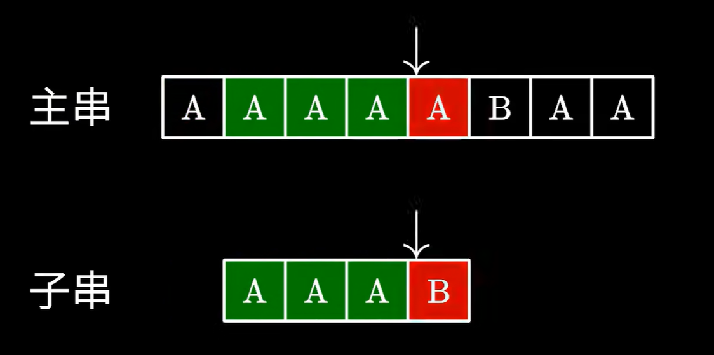
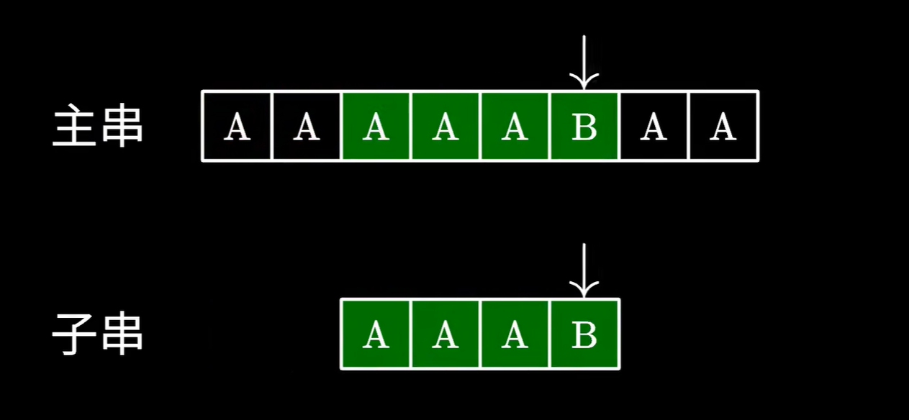
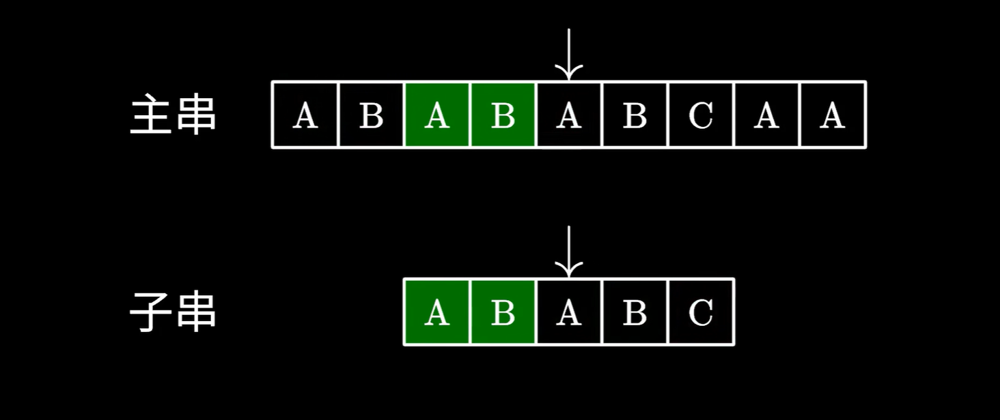
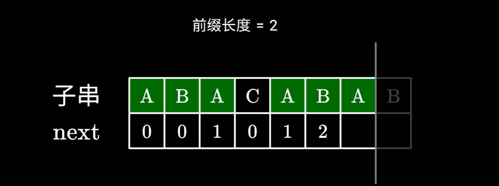

## 字符串转为整数(PraseInt的实现)

感觉不重要，懒得写了

## 字符串反转
> 不太重要，不大会考查但是一定要知道

最容易想到的应该是把 `String` 对象转换成一个 `char[]` 然后一点点反转

代码如下
```java
public static String reverseString(String str) {
    if (str == null) {
        return null;
    }
    char[] chars = str.toCharArray();
    int left = 0;
    int right = chars.length - 1;
    
    while (left < right) {
        // 交换字符
        char temp = chars[left];
        chars[left] = chars[right];
        chars[right] = temp;
        left++;
        right--;
    }
    return new String(chars);
}
```

其实有更简单的方法，直接用 `StringBuilder` 就可以了

```java
public static String reverseString(String str) {
    if (str == null) {
        return null;
    }
    return new StringBuilder(str).reverse().toString();
}
```

也可以使用递归的方法，但有些过于复杂了

```java
public static String reverseString(String str) {
    if (str == null || str.length() <= 1) {
        return str;
    }
    return reverseString(str.substring(1)) + str.charAt(0);
}
```

知道方法1,2就可以了，如果考查的话用方法1，笔试可以直接用方法2

## 字符串匹配

> [字符串匹配来源](https://www.bilibili.com/video/BV1AY4y157yL/?spm_id_from=333.337.search-card.all.click&vd_source=fce20a7980943cad5911621e5a40e01a)

字符串匹配的场景非常好理解，就是在一个字符串中找匹配的字串，也就是常见的搜索功能，

最容易想到的解法就是暴力匹配算法，也就是一个字一个字的与字串进行比对，一旦匹配失败，就跳回主串中的下一个字符重新开始匹配



匹配失败后，从第三个开始匹配



具体的代码实现如下：

```java
public class BruteForceStringMatch {

    /**
     * 暴力字符串匹配算法
     * @param text 主串（被搜索的字符串）
     * @param pattern 模式串（要查找的子串）
     * @return 第一次匹配成功的起始下标，若未找到则返回 -1
     */
    public static int bruteForce(String text, String pattern) {
        if (text == null || pattern == null || pattern.length() == 0) {
            return -1;
        }
        int n = text.length();
        int m = pattern.length();

        for (int i = 0; i <= n - m; i++) {
            int j = 0;
            while (j < m && text.charAt(i + j) == pattern.charAt(j)) {
                j++;
            }
            if (j == m) {
                return i; // 找到匹配
            }
        }
        return -1; // 未找到
    }

    // 测试示例
    public static void main(String[] args) {
        String text = "hello world";
        String pattern = "world";
        int index = bruteForce(text, pattern);
        System.out.println("Pattern found at index: " + index); // 输出: 6
    }
}
```

暴力匹配算法的时间复杂度是 O(mn) 

那有没有线性的时间复杂度的字符串匹配算法呢，有的，这个算法就是KMP算法

### KMP 算法

KMP 算法的基本思路是：主串的指针一直一个个向前，不会回退，而子串的指针会根据已有的信息智能地跳转到应该的位置

例如：主串 ABABABC 子串是 ABABC 遍历到主串的 ABABA 的时候，A和C不符合，那子串自动移动到第二个A的位置，然后继续进行匹配



那么，我们如何知道要跳转到哪里呢，这就要用到 next 数组了，next 数组就是标记子串前面应该跳过多少个字符,先暂时不要管这个 next 数组是如何来的

例如，ABABC 的 next 数组就是：[0,0,1,2,0]

在前面的例子里，C 不匹配，找 next 数组之前的值，也就是 2 ，跳过 2 个字符，直接从 ABABC 的第二个A开始

看一下 KMP 的具体实现，当然先不管 next 数组

```java
public int kmpSearch(String text, String pattern) {
    if (pattern == null || pattern.isEmpty()) return 0;
    if (text == null || text.length() < pattern.length()) return -1;

    int[] next = buildNext(pattern);
    int n = text.length();
    int m = pattern.length();

    int j = 0; // 模式串指针
    for (int i = 0; i < n; i++) {
        while (j > 0 && text.charAt(i) != pattern.charAt(j)) {
            // 如果不匹配，就找 next 上一个的值，找到为止，找不到就是 j = 0 ，也就是模式串指向第一个的时候
            j = next[j - 1];
        }
        if (text.charAt(i) == pattern.charAt(j)) {
            // 匹配，模式串指针前移
            j++;
        }
        if (j == m) {
            return i - m + 1; // 匹配成功，返回起始位置
        }
    }
    return -1;
}

```

接下来就是 next 数组，next 数组的本质就是一个字符串的最长公共前后缀，比如 ABAB 的共同的前后缀 AB ，所以 next 数组为 [0,0,1,2]

知道了 next 数组怎么得出，那么怎么通过代码来求解呢

第一种方式比较简单，通过 for 循环来暴力求解，但这种解法时间复杂度又变高了，这里只看一下就好

```java
public static int[] buildNextBrute(String pattern) {
    if (pattern == null || pattern.isEmpty()) {
        return new int[0];
    }
    int m = pattern.length();
    int[] next = new int[m];
    next[0] = 0; // 单个字符没有真前后缀

    for (int i = 1; i < m; i++) {
        // 尝试所有可能的长度 len：从大到小找，找到第一个匹配的就是最长的
        int maxLen = 0;
        // 真前后缀长度最大为 i（因为不能等于整个子串长度 i+1）
        for (int len = 1; len <= i; len++) {
            // 前缀: pattern[0 ... len-1]
            // 后缀: pattern[i - len + 1 ... i]
            boolean match = true;
            for (int k = 0; k < len; k++) {
                if (pattern.charAt(k) != pattern.charAt(i - len + 1 + k)) {
                    match = false;
                    break;
                }
            }
            if (match) {
                maxLen = len; // 因为 len 从小到大，最后 match 的就是最大的
            }
        }
        next[i] = maxLen;
    }
    return next;
    }
```

第二种是更加常用也必须掌握的解法，递推的解法，假设一个子串是 A'BA''CA'''BA''''B ， 为了方便标记我按照次序给 A 打上了记号，假设我们已经求好了 ABACAB 的next数组了，也就是[0,0,1,0,1,2]，现在要求 A'''' 的 next 数组值，那我们可以通过之前已经求好的 next 数组值，已经求好了 A'''B 的 next 值为 1,2 那直接看 A'''' 是否等于 A'' 就好了



之后就很复杂了，最后的那个 B 可不等于那个 C 啊，难道只能暴力求解吗？

其实不然，根据之前的信息，我们得到了 ABACABA 的 next 数组，其中 ABA ABA 这两个前后缀是完全一样的，这个时候正像根据 next 匹配子串，直接根据 A'''' 这个 B 前面的找到之前对应的 A'' ,而 A'' 的 next 值为1,也就是跳过一个字符开始匹配

根据这些，就可以得出如何求 next 数组
```java
public static int[] buildNext(String pattern) {
    int m = pattern.length();
    int[] next = new int[m];
    next[0] = 0; // 第一个字符没有真前后缀

    int j = 0; // j 表示当前已匹配的前缀长度
    for (int i = 1; i < m; i++) {
        while (j > 0 && pattern.charAt(i) != pattern.charAt(j)) {
            j = next[j - 1]; // 回退
        }
        if (pattern.charAt(i) == pattern.charAt(j)) {
            j++;
        }
        next[i] = j;
    }
    return next;
}
```

## 两个字符串的最大公共字符串

在动态规划篇章