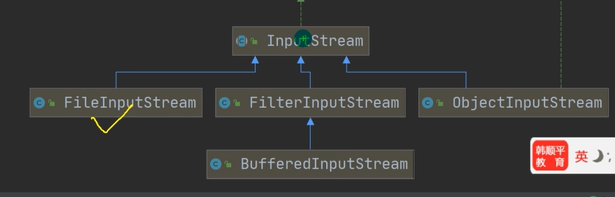

## 文件

### 概念

文件流：文件在程序中是以流的形式来操作的

### 常用操作

在java中，目录本身也算文件

创建文件对象相关构造器和方法

- new File(String pathname)//根据路径构建一个File对象
- new File(File parent,String child)//根据父目录文件+子路径构建
- new File(String parent,String child)//根据父目录 +子路径构建
- createNewFile创建新文件
	- 在createNewFile之前，只是存在java内存中的一个表示，只有用了createNewFile才能真的创建文件

获取文件的相关信息

- getName//文件名字
- theAbsolutePath//文件绝对路径
- getParent//获取父目录
- length//长度（按字节）
- exists//是否存在
- isFile//是不是一个文件
- isDirectory//是不是一个目录

目录操作和文件删除

- mkdir创建一级目录
- mkdirs创建多级目录
- delete删除空目录或文件

## IO流原理以及分类

### IO流原理

I/O是Input/Output 的缩写，I/o是非常实用的技术，用于处理数据传输，如读写文件，网络通讯等

java程序中，对于数据的输入/输出操作以“流(stream)”的方式进行

java.io包下提供了各种“流”类和接口，用以获取不同种类的数据，并通过方法输入或输出数据

输入input:读取外部数据到程序中(内存)中

输出output:将程序(内存)数据输出到存储设备中

### 流的分类

按操作数据单位不同分为字节流，字符流

按数据流的流向不同分为输入流，输出流

按流的角色的不同分为节点流，处理流/包装流

### 流的介绍

#### 节点流和处理流的基本介绍

节点流可以从一个特定的数据源读写数据，如FileReader,FileWriter

处理流（也叫包装流）是"连接"在已存在的流（节点流或处理流）之上，为程序提供更为强大的读写功能，如`BuffererReader`,`BufferedWriter`

#### 节点流和处理流的区别和联系

节点流是低级流，直接跟数据源相接

处理流包装节点流，既可以消除不同节点流的实现差异，也可以提供更方便的方法来完成输入输出

处理流对节点流进行包装，使用了修饰器设计模式，不会直接与数据源相连(模拟修饰器设计模式)

处理流的性能更高，操作更加便携

### 对象流

能将基本数据类型或者对象进行序列化和反序列化操作

**序列化和反序列化**：序列化就是在保存数据时，保存数据的值和数据类型，反序列化就是在恢复数据时，恢复数据的值和数据类型，如果需要让某个对象支持序列化机制，则必须让棋类是可序列化的，需要让该类继承Serializable

#### 注意事项

- 读写顺序要一直
- 要求序列化或反序列化对象，需要实现Serializable
- 序列化的类中建议添加SerializableUID,为了提高版本的兼容性
- 序列化对象时，默认将里面所有属性都进行序列化，但除了static或transient修饰的成员
- 序列化对象时，要求里面属性的类型也需要实现序列化接口
- 序列化具备可继承性，也就是如果某类已经实现了序列化，则它的所有子类也已经默认实现了序列化

## 输入流

### 介绍

输入流可以分为**字节输入流**和**字符输入流**，流用完之后要记得关闭流

字节输入流是InputStream，下面的关系为

字符输入流是Reader，下面有

- FileReader
 
- BufferedImputStream
 
- ObjectInputStream

### FiileInputStream

#### 常用方法

- read()读取文件，返回读取的文件内容，读完返回-1 
- read(byte[] buf)读取文件，一次读取buf个字节，正常返回读取的字节数，读完返回-1，buf存储读取的内容
- close()关闭流

### BufferedInputStream

### ObjectInputStream

### FilrReader

#### 常用方法

- new FileReader（File/String）
- read每次读取单个字符，返回该字符，到文件末尾返回-1
- read(char[])批量读取多个字符到数组，返回读取到的字符数，如果到文件末尾返回-1

### BufferedReader

### InputStreamReader

转换流，可以将字节流包装成字符流

InputStreamReader(InputStream,Charset);//Charset就是"gbk"这样

## 输出流

### 介绍

输出流可以分为字节输出流（OutputStream）和字符输出流（Writer），还有打印流

### FileOutputStream

#### 构造器

- new FileOutputStream(filePath)用这种方法创建会清空原内容
- new FileOutputStream(filePath,true)不清空内容，而是在原内容上追加

#### 常用方法

- close()关闭流
- write(int b)将制定的字节写入此文件输出流
- write(byte[] b, int off,int len)将从off开始len个字节写入此文件输出流//可以用str.getBytes()来把字符串变成字节数组
- write(byte[] b)

### BufferedOutputStream

### ObjectOutputStream

### FileWriter

#### 常用方法

- new FileWriter(File/String):覆盖模式
- new FileWriter(File/String,true):追加模式，相当于流的指针在尾端
- write(int)写入单个字符
- write(char[])写入指定数组
- write(char[],off,len)写入指定数组的指定部分
- write(String)写入整个字符串
- write(String,off,len)写入字符串的指定部分

### BufferedWriter

### OutputStreamWriter

转换流，可以将字节流转换为字符流

OutputStreamWriter(OutputStream,Charset);//Charset就是"gbk"这样

### System.in

标准输入流，编译类型InputStream，运行类型BufferedInputStream

### System.out

标准输出流，编译类型PrintStream，运行类型PrintStream

### 打印流

PrintStream是字节流，PrintWriter是字符流，默认情况向显示器输出，我们可以去修改打印流输出的位置/设备