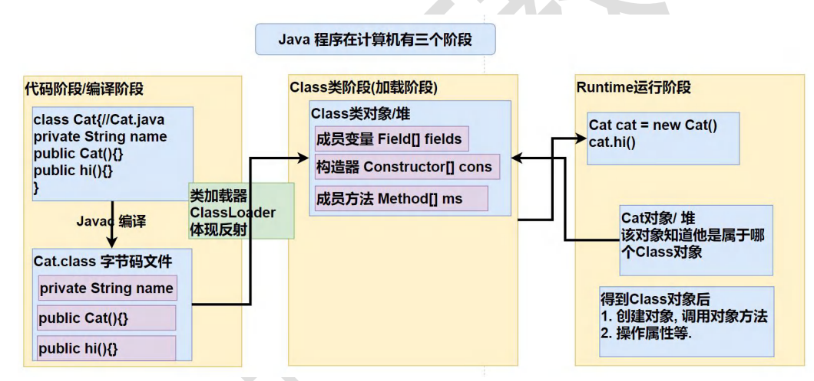
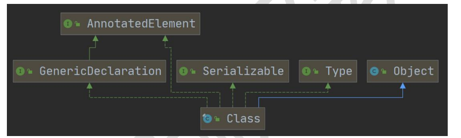
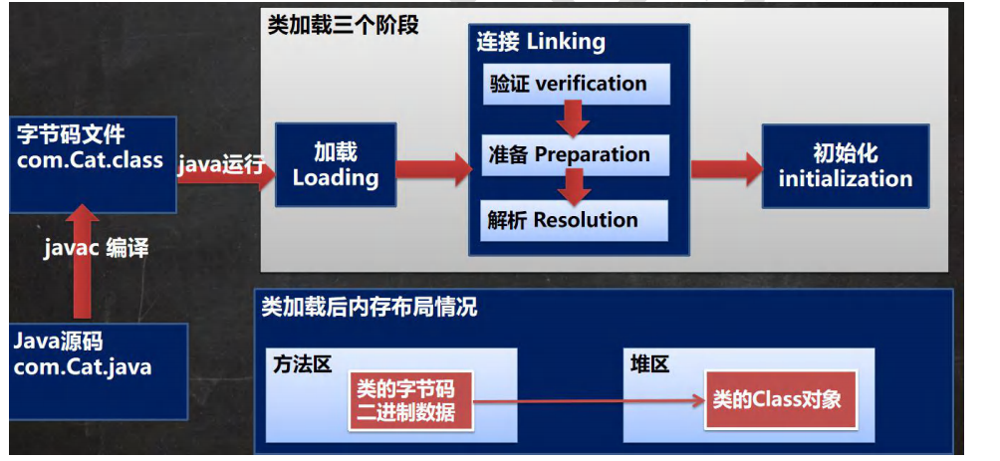
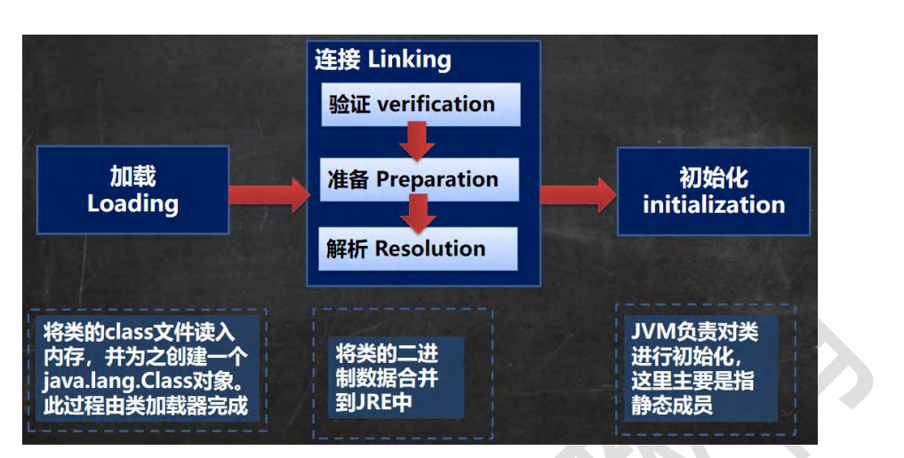

## 反射入门

### 为什么需要反射？

需要根据外部文件配置，在不修改源码的情况下来控制程序，传统方法是无法实现的。

### 示例

```java
//使用properties读取配置文件

//3. 使用反射机制解决
//(1) 加载类, 返回 Class 类型的对象 cls
Class cls = Class.forName(classfullpath);
//(2) 通过 cls 得到你加载的类 com.hspedu.Cat 的对象实例
Object o = cls.newInstance();
System.out.println("o 的运行类型=" + o.getClass()); //运行类型
//(3) 通过 cls 得到你加载的类 com.hspedu.Cat 的 methodName"hi" 的方法对象
// 即：在反射中，可以把方法视为对象（万物皆对象）
Method method1 = cls.getMethod(methodName);
//(4) 通过 method1 调用方法: 即通过方法对象来实现调用方法
System.out.println("=============================");
method1.invoke(o); //传统方法 对象.方法() , 反射机制 方法.invoke(对象)
//java.lang.reflect.Field: 代表类的成员变量, Field 对象表示某个类的成员变量
//得到 name 字段
//getField 不能得到私有的属性
Field nameField = cls.getField("age"); //
System.out.println(nameField.get(o)); // 传统写法 对象.成员变量 , 反射 : 成员变量对象.get(对象)
//java.lang.reflect.Constructor: 代表类的构造方法, Constructor 对象表示构造器
Constructor constructor = cls.getConstructor(); //()中可以指定构造器参数类型, 返回无参构造器
System.out.println(constructor);//Cat()
Constructor constructor2 = cls.getConstructor(String.class); //这里老师传入的 String.class 就是 String 类的
Class 对象
System.out.println(constructor2);//Cat(String name)
```

## 反射机制

### 介绍

1. 反射机制允许程序在执行期借助于Reflection API取得任何类的内部信息（比如成员变量，构造器，成员方法等），并能操作对象的属性及反复噶，反射在设计模式和框架底层中都很重要
2. 加载完类之后，在堆中就产生了一个Class对象（一个类只有一个class对象），该对象包含了类的所有信息，包括类名，包名，父类，接口，方法，成员变量等。通过这个对象得到类的结构。
3. 这个class对象就像一面镜子，透过这个镜子看到类的结构，所以，形象的称之为反射

### Java反射机制原理示意图



### 反射机制的作用

1. 在运行时判断任意一个对象所属的类
2. 在运行时构造任意一个类的对象
3. 在运行时得到任意一个类所具有的成员变量和方法
4. 在运行时调用任意一个对象的成员变量和方法
5. 生成动态代理

### 反射机制的优点和缺点

优点：可以动态的创建和使用对象，使用灵活，没有反射机制，框架技术就失去底层支撑

缺点：使用反射基本是解释执行，对执行速度有影响

### 反射调用优化-关闭访问检查

1. Method和Filed,Constructor对象都有setAccessible方法，
2. setAccessible作用时启动和禁用访问安全检查的开关
3. 参数为true表示反射的对象在使用时取消安全检查，提高反射的效率，参数值为false表示开启安全检查，默认开启安全检查

## class类

### 基本介绍


1. Class对象不是new出来的，而是系统创建的
2. 对于某个类的Class对象，在内存中只有一份，因为类只加载一次
3. 每个类的实例都会记得自己是由哪个Class实例所生成
4. Class对象时存放在堆中的
5. 通过Class对象可以完整地得到一个类的完整结构，通过一系列API
6. 类的字节码二进制数据是存放在方法去的，有的地称为类的元数据（包括方法代码，变量名，方法名，访问权限等）

### Class类常用方法

static Class forName(String className)：根据类名获取Class对象

Object newInstance()：根据Class对象创建类的实例

getName()：获取类的全名

Class[] getInterfaces()：获取类的接口

Class getSuperclass()：获取类的父类

ClassLoader getClassLoader()：获取类的类加载器

Method getMethod(String name, Class... parameterTypes)：根据方法名和参数类型获取方法对象

Field getField(String name)：根据成员变量名获取成员变量对象

Field[] getDeclaredFields()：返回Field对象的一个数组

Constructor getConstructor(Class... parameterTypes)：根据参数类型获取构造器对象

### 获取Class对象

1. 通过类名获取Class对象
- Class cls = Class.forName("com.hspedu.Cat");
2. 已知具体的类，通过类的class获取，该方式最为安全可靠，程序性能好
- Class cls2 = Cat.class;
3. 已知某个类的实例，调用该实例的getClass()方法获取Class对象
- Class clazz = 对象.getClass();
4. 其他方式
- ClassLoader cl = 对象.getClass().getClassLoader();
- Class cls3 = cl.loadClass("类的全类名");
5. 基本数据类型
- Class cls5 = int.class;
6. 包装类
- Class cls4 = Integer.TYPE;

### 哪些类型有Class对象

1. 所有类
2. 接口
3. 数组
4. 基本数据类型
5. 注解
6. 枚举
7. void

## 类加载

### 基本说明

反射机制是java实现动态语言的关键，通过反射实现类动态加载
1. 静态加载：编译时加载相关的类，如果没有则报错，依赖性太强
2. 动态加载：运行时加载相关的类，如果运行时不用该类，即使不存在该类，也不报错，依赖性小，灵活性强

### 类加载时机

1. 当创建对象时加载//静态加载
2. 当子类被加载的时候，父类也加载 //静态加载
3. 调用类中的静态成员时 //静态加载
4. 通过反射 //   动态加载

### 类加载过程图



### 类加载各阶段完成任务



#### 加载阶段

JVM在该阶段的主要目的是将字节码从不同的数据源(可能是class文件，也可能是jar包，甚至网络)转化为二进制字节流加载到内存中，并生成一个代表该类的java.lang.Class对象。

#### 连接阶段

##### 验证阶段

1. 目的是为了确保Class文件的字节流中包含的信息符合当前虚拟机的要求，并且不会危害虚拟机自身的安全
2. 包括：文件格式验证、元数据验证、字节码验证、符号引用验证
3. 可以考虑使用-Xverify:none参数关闭该阶段的验证，缩短虚拟机类加载的时间

##### 准备阶段

1. JVM会在该阶段堆静态变量分配内存，并设置默认初始值(对应数据类型的默认初始值，如0,0L,null,false等)。这些变量所使用的内存都将在方方法区中进行分配

```
//1. n1 是实例属性, 不是静态变量，因此在准备阶段，是不会分配内存
//2. n2 是静态变量，分配内存 n2 是默认初始化 0 ,而不是 20
//3. n3 是 static final 是常量, 他和静态变量不一样, 因为一旦赋值就不变 n3 = 30
public int n1 = 10;
public static int n2 = 20;
public static final int n3 = 30;
```

##### 解析阶段

1. 虚拟机将常量池内的符号引用替换为直接引用，符号引用就是一组符号来描述所引用的目标，直接引用就是直接指向目标的指针、偏移量或相对偏移量。(因为之前还没分配内存，只能拿符号代表一下)

#### 初始化阶段

1. 到初始化阶段，才真正开始执行类中定义的Java程序代按摩，此阶段是执行<clinit>()方法的过程
2. <clinit>方法是由编译器按语句在源文件中出现的顺序，依次自动收集类中的静态变量的赋值动作和静态代码块中的语句，并进行合并
3. 虚拟机会保证一个类的<clinit>()方法在多线程环境中被正确地加锁和同步，确保在多线程环境中，该方法只被执行一次(synchronized关键字)

## 反射获取类的结构信息

##### 第一组：java.lang.Class类中的方法
1. getName:获取全类名
2. getSimpleName:获取简单类名
3. getFields:获取所有public修饰的属性，包含本类以及父类的 
4. getDeclaredFields:获取本类中所有属性
5. getMethods:获取所有public修饰的方法，包含本类以及父类的 
6. getDeclaredMethods:获取本类中所有方法
7. getConstructors:获取本类所有public修饰的构造器 
8. getDeclaredConstructors:获取本类中所有构造器
9. getPackage以Package形式返回包信息 
10. getSuperClass:以Class形式返回父类信息 
11. getInterfaces以class[]形式返回接口信息
12. getAnnotations:以Annotation[]形式返回注解信息

##### 第二组：java.lang.reflect.Field类中的方法
1. getName:获取属性名
2. getType:获取属性类型
3. getModifiers:获取属性修饰符

##### 第三组：java.lang.reflect.Method类中的方法
1. getName:获取方法名
2. getReturnType:获取返回类型
3. getParameterTypes:获取参数类型
4. getModifiers:获取方法修饰符

#### 第四组 ：java.lang.reflect.Constructor类中的方法
1. getParameterTypes:获取构造器参数类型
2. getModifiers:获取构造器修饰符
3. getname:获取构造器名(全类名)

## 通过反射创建对象

1. 方式一：调用类中的public修饰的无参构造器
2. 方式二：调用类中的指定构造器 
3. class类相关方法
- newInstance：调用类中的无参构造器，获取对应类的对象
- getConstructor(Class...clazz)：根据参数列表，获取对应的public构造器对象
- getDecalaredConstructor（Class...clazz）：根据参数列表，获取对应的所有构造器对象
4. Constructor类相关方法 
- setAccessible:暴力破解,访问私有构造器/方法/属性
- newlnstance(Object...obj):调用构造器

### 示例

```java
//1. 先获取到 User 类的 Class 对象
Class<?> userClass = Class.forName("com.hspedu.reflection.User");
//2. 通过 public 的无参构造器创建实例
Object o = userClass.newInstance();
System.out.println(o);
//3. 通过 public 的有参构造器创建实例
/*
constructor 对象就是
public User(String name) {//public 的有参构造器
this.name = name;
}
*/
//3.1 先得到对应构造器
Constructor<?> constructor = userClass.getConstructor(String.class);
//3.2 创建实例，并传入实参
Object hsp = constructor.newInstance("hsp");
System.out.println("hsp=" + hsp);
//4. 通过非 public 的有参构造器创建实例
//4.1 得到 private 的构造器对象
Constructor<?> constructor1 = userClass.getDeclaredConstructor(int.class, String.class);
//4.2 创建实例
//暴破【暴力破解】 , 使用反射可以访问 private 构造器/方法/属性, 反射面前，都是纸老虎
constructor1.setAccessible(true);
Object user2 = constructor1.newInstance(100, "张三丰");
System.out.println("user2=" + user2);
```

```java
class User { //User 类
private int age = 10;
private String name = "韩顺平教育";
public User() {//无参 public
}
public User(String name) {//public 的有参构造器
this.name = name;
}
private User(int age, String name) {//private 有参构造器
this.age = age;
this.name = name;
}
public String toString() {
return "User [age=" + age + ", name=" + name + "]";
}
}
```

## 通过反射访问类中的成员

1. 根据属性名获取Field对象   
- `Fieldf=clazz对象.getDeclaredField（属性名）`
2. 暴破：`f.setAccessible(true);//f是Field `
3. 访问
- f.set(o,值)：// o表示对象
- f.get(o)://o表示对象
1. 注意：如果是静态属性，则set和get中的参数o，可以写成null


### 示例

```java
public class ReflecAccessProperty {
    public static void main(String[] args) throws ClassNotFoundException, IllegalAccessException, InstantiationException, NoSuchFieldException {
        //1. 得到 Student 类对应的 Class 对象
        Class<?> stuClass = Class.forName("com.hspedu.reflection.Student");
        //2. 创建对象
        Object o = stuClass.newInstance();//o 的运行类型就是 Student
        System.out.println(o.getClass());//Student
        //3. 使用反射得到 age 属性对象
        Field age = stuClass.getField("age");
        age.set(o, 88);//通过反射来操作属性
        System.out.println(o);//
        System.out.println(age.get(o));//返回 age 属性的值
        //4. 使用反射操作 name 属性
        Field name = stuClass.getDeclaredField("name");
        //对 name 进行暴破, 可以操作 private 属性
        name.setAccessible(true);
        //name.set(o, "老韩");
        name.set(null, "老韩~");//因为 name 是 static 属性，因此 o 也可以写出 null
        System.out.println(o);
        System.out.println(name.get(o)); //获取属性值
        System.out.println(name.get(null));//获取属性值, 要求 name 是 static
    }
}
class Student {//类
    public int age;
    private static String name;
    public Student() {//构造器
    }
    public String toString() {
        return "Student [age=" + age + ", name=" + name + "]";
    }
}
```

## 通过反射调用类中的方法

1. 根据方法名和参数列表获取Method方法对象：`Method m=clazz.getDeclaredMethod（方法名，XX.class）：//得到本类的所有方法`
2. 获取对象：`Object o=clazz.newlnstance();`
3. 暴破：`m.setAccessible(true);`
4. 访问：`Object returnValue=m.invoke(o,实参列表);//o就是对象` 
5. 注意：如果是静态方法，则invoke的参数o，可以写成null！

### 示例

```java
public class ReflecAccessMethod {
    public static void main(String[] args) throws ClassNotFoundException, NoSuchMethodException, IllegalAccessException, InstantiationException, InvocationTargetException {

        //1. 得到 Boss 类对应的 Class 对象
        Class<?> bossCls = Class.forName("com.hspedu.reflection.Boss");
        //2. 创建对象
        Object o = bossCls.newInstance();
        //3. 调用 public 的 hi 方法
        //Method hi = bossCls.getMethod("hi", String.class);//OK
        //3.1 得到 hi 方法对象
        Method hi = bossCls.getDeclaredMethod("hi", String.class);//OK
        //3.2 调用
        hi.invoke(o, "韩顺平教育~");
        //4. 调用 private static 方法
        //4.1 得到 say 方法对象
        Method say = bossCls.getDeclaredMethod("say", int.class, String.class, char.class);
        //4.2 因为 say 方法是 private, 所以需要暴破，原理和前面讲的构造器和属性一样
        say.setAccessible(true);
        System.out.println(say.invoke(o, 100, "张三", '男'));
        //4.3 因为 say 方法是 static 的，还可以这样调用 ，可以传入 null
        System.out.println(say.invoke(null, 200, "李四", '女'));
        //5. 在反射中，如果方法有返回值，统一返回 Object , 但是他运行类型和方法定义的返回类型一致
        Object reVal = say.invoke(null, 300, "王五", '男');
        System.out.println("reVal 的运行类型=" + reVal.getClass());//String

        //在演示一个返回的案例
        Method m1 = bossCls.getDeclaredMethod("m1");
        Object reVal2 = m1.invoke(o);
        System.out.println("reVal2 的运行类型=" + reVal2.getClass());//Monster
    }
}
class Monster {}
class Boss {//类
        public int age;
        private static String name;
        public Boss() {//构造器
        }
        public Monster m1() {
            return new Monster();
        }
        private static String say(int n, String s, char c) {//静态方法
            return n + " " + s + " " + c;
        }
        public void hi(String s) {//普通 public 方法

        System.out.println("hi " + s);
    }
}
```