## 线程介绍

### 程序（program）

是为了完成特定任务，用某种语言编写的一组指令的集合

### 进程

进程是指运行中的程序，比如我们使用qq，就启动了一个进程，操作系统就会为该进程分配内存空间，当我们使用迅雷，又启动了一个进程，操作系统将为迅雷分配新的内存空间

进程是程序的一次执行过程，或是正在运行的一个程序。是动态过程：又它自身的产生，存在和消亡的过程

### 线程

线程由进程创建的，是进程的一个实体

一个进程可以使用多个线程

### 线程相关概念

单线程：同一个时刻，只允许执行一个线程

多线程：同一个时刻，可以执行多个线程，比如：一个qq进程，可以同时打开多个聊天窗口，一个迅雷进程，可以同时下载多个文件

并发：同一个时刻，多个任务交替执行，造成一种"貌似同时"的错觉，简单的说，单核cpu实现的多任务就是并发

并行：同一个时刻，多个任务同时执行，多核CPu可以实现并行和并发

## 线程使用

### 创建线程的两种方式

继承Thread类，重写run方法

实现Runnable接口，重写run方法

### 继承thread类

#### 基本语法

当一个类继承了Thread类，该类就可以当做线程使用

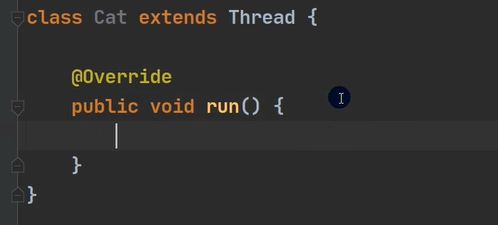

main方法里需要cat.start();

我们会重写run方法，写上自己的业务代码

run Thread类实现了Runnable接口的run方法

#### 案例演示

该代码将会每隔一秒输出一次"喵喵，我是小猫咪"
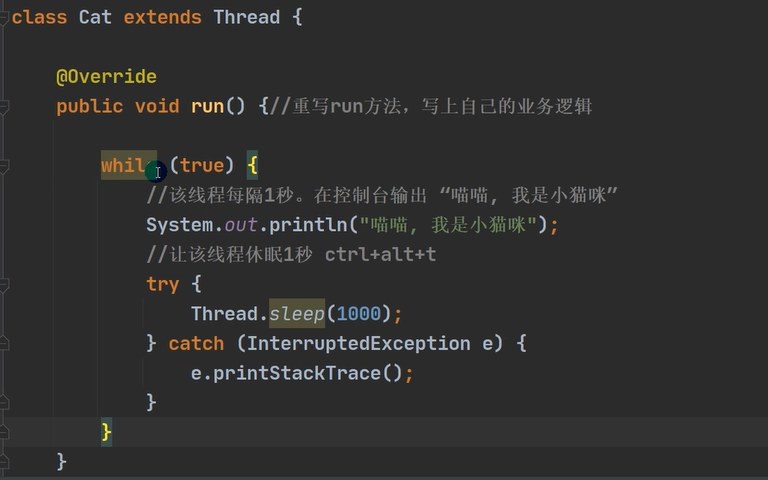
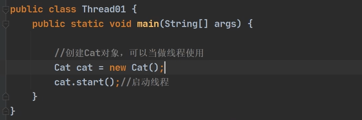
线程执行情况
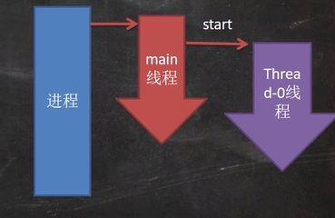

#### 细节

当main线程启动一个子线程的时候，主线程不会阻塞，会继续执行

不用run()而是用start()是因为不用start不会启动一个新的线程
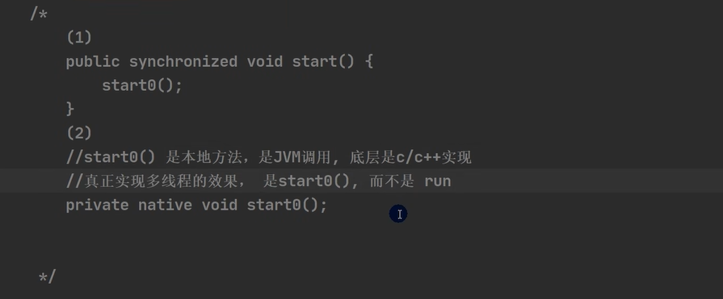
### 实现Runnable接口

#### 基本语法

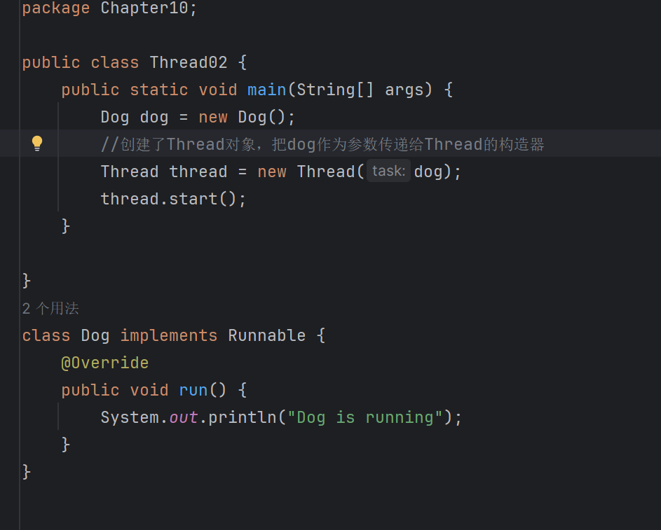

#### 模拟极简Thread

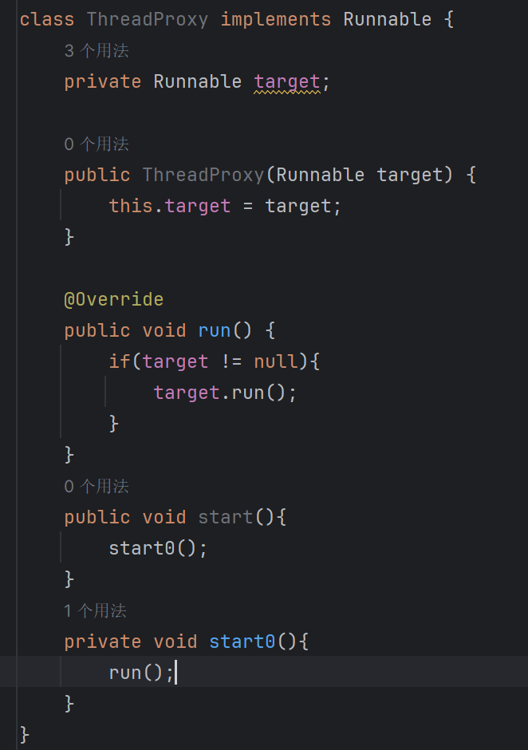

#### 继承Thread Vs 实现Runnable的区别

从java的设计来看，通过继承Thread或者实现Runnable接口来创建线程本质上没有区别，从jdk帮助文档我们可以看到Thread类本身就实现了Runnable接口

实现Runnable接口方式更加适合多个线程共享一个资源的情况，并且避免了单继承的限制

### 多线程执行

#### 案例
售票系统：编程模拟三个售票窗口售票100，分别使用继承Thread和实现Runnable方式，并分析有什么问题

会出现两个问题，一个是输出多个同个数值，一个是会输出负数

0586_韩顺平Java_多线程售票问题_哔哩哔哩_bilibili

### 线程终止

#### 基本说明

当线程完成任务后，会自动退出

还可以通过使用变量来控制run方法退出的方式停止线程，即通知方式

在run里面写while(loop),所有代码放loop里，再写一个方法setloop可以手动把loop设置为false

## 线程方法
### 第一组
setName设置线程名称，使之与参数name相同

getName返回该线程的名称

start使该线程开始执行；Java虚拟机底层调用该线程的start0方法

run调用线程对象run方法

setPriority更改线程的优先级
- MAX_PRIORITY :10;
- MIN_PRIORITY:1;
- NORM_PRIORITY:5

getPriority获取线程的优先级

sleep在指定的毫秒数内让当前正在执行的线程休眠（暂停执行）

interrupt中断线程

#### 注意事项和细节
start底层会创建新的线程，调用run，run就是一个简单的方法调用，不会启动新线程

interrupt，中断线程，但没有真正的结束线程，所以一般用于终端正在休眠线程

sleep，线程的静态方法，是当前线程休眠

### 第二组

yield:线程的礼让，让出cpu，让其他线程执行，但礼让的时间不确定，所以也不一定礼让成功

join：线程的插队，插队的线程一旦插队成功，则肯定先执行完插入的线程所有的任务

### 用户线程和守护线程

用户线程：也叫工作线程，当线程的任务执行完或通知方式已结束

守护线程：一般是为工作线程服务的，当所有的用户线程结束，守护线程自动结束

- setDaemon()用来设置守护线程

常见的守护线程：垃圾回收机制

## 线程生命周期

### 线程状态
NEW

尚未启动的线程处于此状态

RUNNABLE

- 在java虚拟机中执行的线程处于此状态

BLOCKED

- 被阻塞等待监视器锁定的线程处于此状态

WAITING

- 正在等待另一个线程执行特定动作的线程处于此状态

TIMED_WAITING

- 正在等待另一个线程执行动作达到指定等待时间的线程处于此状态

TERMINATED

- 已退出的线程处于此状态

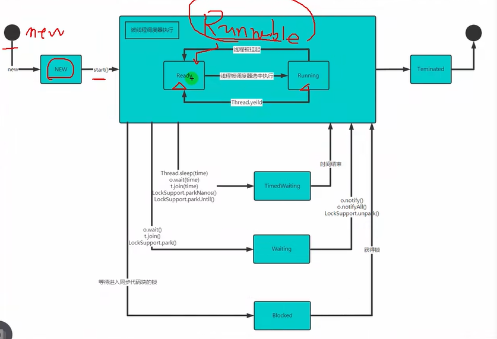

## Synchronized

### 线程同步机制

在多线程基础，一些敏感数据不允许被多个线程同时访问，此时就使用同步访问技术，保证数据在任何时刻，最多有一个线程访问，以保证数据的完整性

也可以这么理解：线程同步，即当有一个线程在对内存进行操作时，其他线程都不可以对这个内存地址进行操作，直到该线程完成操作，其他线程才能对该内存地址进行操作

### 同步具体方法-Synchronized

synchronized(对象){//需要被同步代码}得到对象的锁，才能操作同步代码

synchronized还可以放在方法声明中，表示整个方法为同步方法

public synchronized void m(String name){//需要被同步代码}

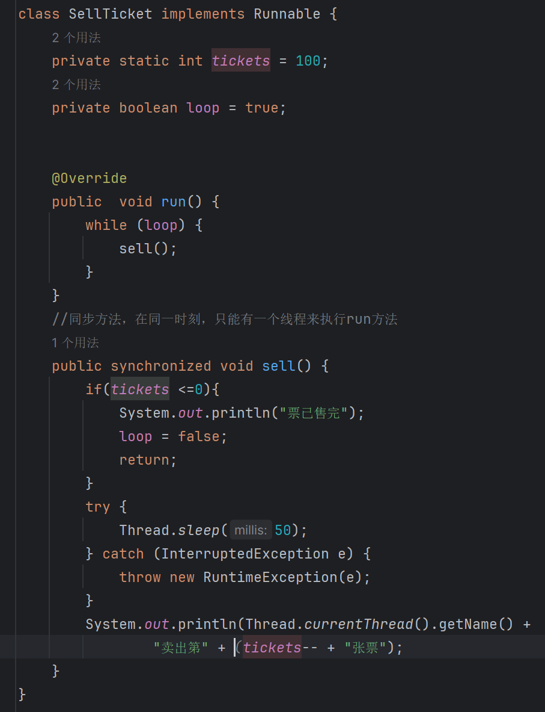

### 同步原理

线程抢到对象锁进去执行，进去后锁锁上别的线程不能进来，执行完后再把锁打开
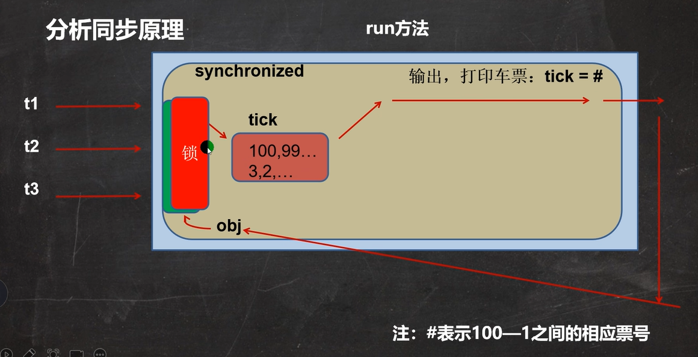

## 互斥锁

### 说明

Java语言中，引入了对象互斥锁的概念，来保证共享数据操作的完整性

每个对象都对应于一个可称为"互斥锁"的标记，这个标记用来保证在任一时刻，
只能有一个线程访问该对象

关键字synchronized来与对象的互斥锁联系，当某个对象用synchronized修饰
时，表明该对象在任一时刻只能有一个线程访问

同步的局限性：导致程序的执行效率要变低

同步方法（非静态的）的锁可以是this，可以是其他对象（要求是同一个对象）

同步方法（静态的）锁为当前类本身

### 注意事项和细节

同步方法如果没有使用static修饰，默认锁当前对象为this

如果方法使用static修饰，默认锁对象：当前类.class

实现的落地步骤
1. 需要先分析上锁的代码
2. 选择同步代码块或同步方法
3. 要求多个线程的锁对象为同一个即可

## 死锁

### 基本介绍

多个线程都占用了对方的锁资源，但互不想让，导致了死锁，在变成一定要避免死锁的发生

### 案例

妈妈：你先完成作业，才让你玩手机

小明：你先让我玩手机，我才完成作业

## 释放锁

### 下面操作会释放锁

当前线程的同步方法，同步代码块执行结束

当前在同步代码块，同步方法中遇到break，return

当前线程在同步代码块，同步方法中出现了未处理的Error或EXception，导致异
常结束

当前线程在同步代码块，同步方法中执行了线程对象的wait（）方法，当前线程
暂停，并释放锁

### 下面操作不会释放锁

线程执行同步代码块或同步方法时，程序调用Thread.sleep(),Thread.yield
()方法暂停当前线程的执行，不会释放锁

线程执行同步代码块时，其他线程调用了该线程的suspend()方法将该线程
挂起，该线程不会释放锁

- 应该尽量避免使用suspend（）和resume（）来控制线程，方法不在推荐使用

## 作业

### 要求

### 实现

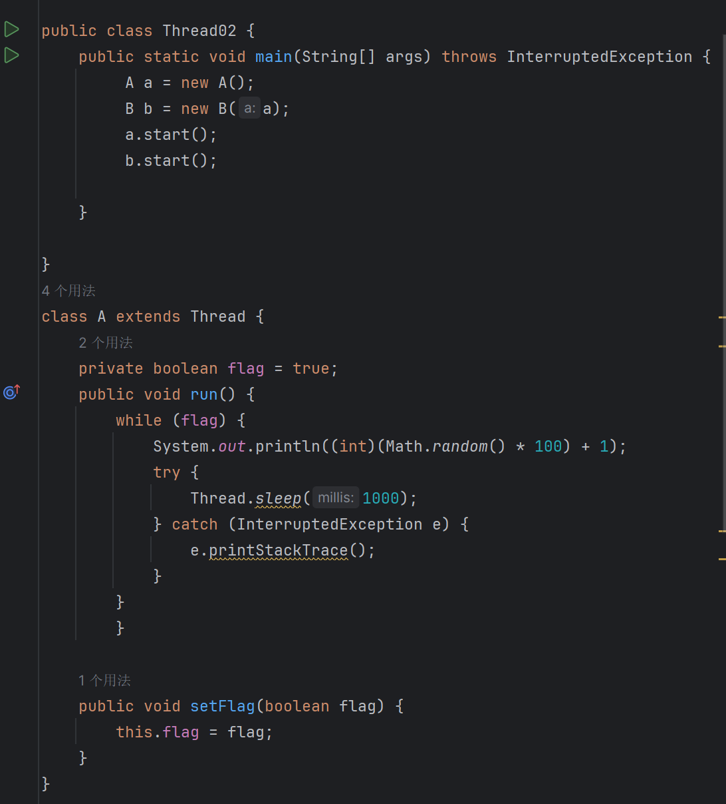
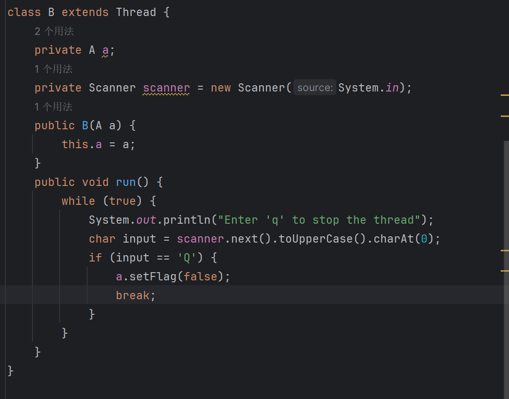