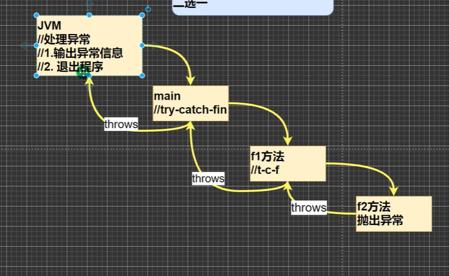

## 基本概念

java语言汇总，将程序执行中发生的不正常情况称为“异常”。（开发过程中的语法错误和逻辑错误不是异常）

## 异常事件的分类

- error：java虚拟机无法解决的严重问题，如jvm内部错误或资源耗尽等，error是严重错误，程序会崩溃
- exception：其他因编程错误或偶然的外在因素导致的一般性问题，可以使用针对性代码进行处理，如空指针访问，exception分为两大类：运行时异常（程序运行时发生的异常）和编译时（编程时，编译器检查出的异常）异常

## 常见的异常
- 运行时异常
	- NullPoniterException空指针异常
	- ArithmeticException数学运算异常
	- ArrayIndexOutOfBoundException数组下标越界异常
	- ClassCastException类型转换异常
	- NumberFormatException数字格式不正确异常

## 异常处理

异常处理就是当异常发生时，对异常处理的方式

异常处理的方式
- try-catch-finally
- throws

## try-catch-finally

### 语法

```
try {
    //可能出现异常的代码
} catch (Exception e) {
    //捕获到异常，执行此块代码
    //没有异常，则不执行此块代码
    e.printStackTrace();
} finally {
    //不管try块是否有异常，finally块都会执行
}
```

### 细节

- 如果try代码块有可能有多个异常，可以使用多个catch分别捕获不同的异常，响应处理，注意子类异常要写在前面
- 可以进行try-finally，本质没有捕获异常程序会崩溃，但是不管会不会崩溃都会执行finally


## throws

### 基本介绍

如果一个方法（中的语句执行时）可能生成某种异常，但是并不确定如何处理这种异常，则此方法应显式地声明抛出异常，表明该方法不对异常进行处理，而有该方法的调用者负责处理

在方法声明中用throws语句可以声明抛出异常的列表，throws后面的异常类型可以是方法中产生的异常类型，也可以是它的父类

**将发生的异常抛出，交给调用者（方法）来处理，不处理就一直往上丢，最顶级的处理者就是jvm**


### 细节

- 对于编译异常，程序中必须处理，比如try-catch或者throws
- 对于运行时异常，如果程序没有处理，默认就是用throws的方式处理
- 子类重写父类的方法时，对抛出异常的规定：子类重写的方法，所抛出的异常类型要么和父类抛出的异常一致，要么为子类抛出的异常的类型的子类型
- 在throws过程中，如果有方法try-catch，就相当于处理异常，就可以不必throws


## 自定义异常

### 概念

当程序中出现了某些“错误”，但该错误信息并没有在Throwable子类中描述处理，这个时候可以自己设计异常类，用于描述该错误信息

### 自定义异常的步骤

1. 定义类：自定义异常类名（程序员自己写）继承Exception或RuntimeException
2. 如果继承Exception，属于编译异常
3. 如果继承RuntimeException，属于运行异常

### throw和throws

- throws是异常处理的一种方式，在方法声明处，后面跟的是异常类型
- throw是手动生成异常对象的关键字，在方法体中，后面跟的是异常对象
