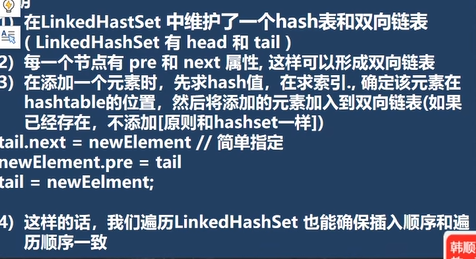
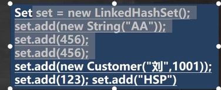
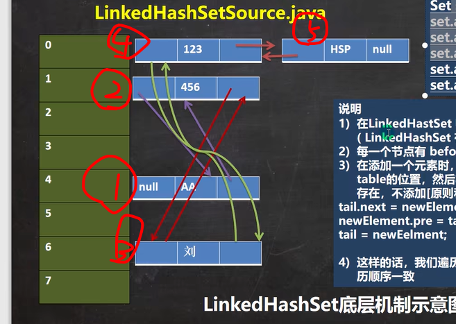
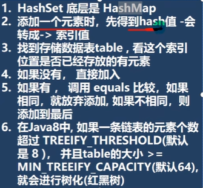
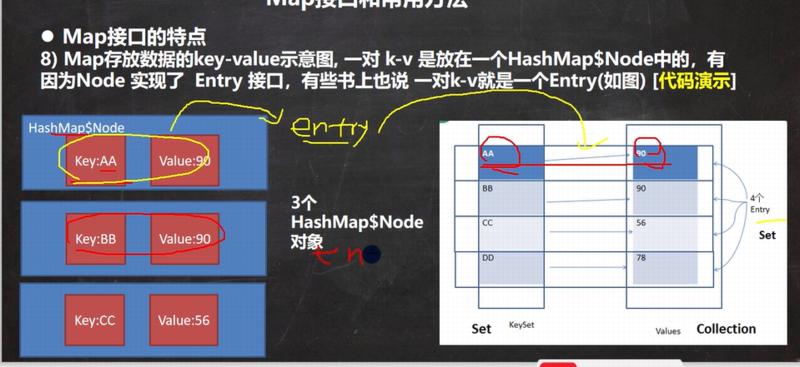

## 体系

集合主要分为两种，单列集合和双列集合

Collection接口有两个重要的子接口，一个是list，一个是set，他们的实现都是单列集合

Map接口的实现子类是双列集合，存放的K-V

## Collection接口

### List接口

#### ArrayList

### 介绍
- 允许所有的元素，包括null，ArrayList可以加入null，而且可以多个
- ArrayList是由数组来实现数据存储的
- ArrayList基本等同于Vector,除了ArrayList是线程不安全的(没有synchronized)（执行效率高），在多线程情况下，不建议使用ArrayList

### 底层

- ArrayList中维护了一个Object类型的数组elementData(transient Object[] elementData;)
- 当创建ArrayList对象时，如果使用的是无参构造器，则初始elementData容量为0，第一次添加，则扩容elementData为10，如需要再次扩容，则扩容elementData为1.5倍
- 如果使用的是指定大小的构造器，则初始elementData容量为指定大小，如果需要扩容，则直接扩容elementData为1.5倍

#### LinkedList

##### 介绍

- LinkedList底层实现了双向链表和双端队列特点
- 可以添加任意元素（元素可以重复），包括null
- 线程不安全，没有实现同步

##### 底层

- LinkedList底层维护了一个双向链表
- LinkedList维护了两个属性first和last分别只想首节点和尾节点
- 每个节点（Node对象）里又维护了prev,next,item三个属性，其中通过prev指向前一个，通过next指向后一个节点，最终实现双向链表

##### 常用方法

- add();链表最后加一个节点
- remove()；删除一个节点，默认是第一个节点

#### Vector

和ArrayList差不多，但是是线程安全的，效率不高

如果是无参，默认10，满后，就按2倍扩容

如果是指定大小，则每次直接按2倍扩容

### Set接口

#### HashSet

##### 介绍

- HashSet实际上是HashMap
- 可以存放null,但是只能有一个null
- HashSet不保证元素使有序的，取决于hash后，再确定索引的结果
- 不能有重复元素/对象，在前面Set接口使用已经讲过

##### 底层机制

HashSet底层是HashMap，HashMap底层是数组+链表+红黑树，具体看HashMap

#### LinkedHashSet

##### 介绍
- LinkedHashSet是HashSet的子类
- LinkedHashSet底层是一个LinkedHashMap,底层维护了一个数组+双向链表
- LinkedHashSet根据元素的hashCode值来决定元素的存储位置，同时使用链表维护元素的次序，这使得元素看起来是以插入顺序保存的（用遍历的方式是有次序的，即加入顺序和取出元素的顺序一致）
- LinkedHashSet不允许添加重复元素

##### 底层机制

1. linkedHashSet加入书序和取出元素/数据的顺序一致
2. LinkedHashSet 底层维护的是一个LinkedHashMap（是HashMap的子类）
3. LinkedHashSet 底层结构是数组table+双向链表
4. 第一次添加时，直接将数组table扩容到16，存放的结点类型是LInkedHashMap$Entry
5. 数组是 HashMao$Node[] 存放的元素/数据是LinkedHashMap￥Entry类型

#### TreeSet

当我们使用无参构造器创建TreeSet时，仍然是无序的

有参构造器：传入一个比较器，指定排序规则，构造器把传入的比较器对象，赋给了一个TreeSet底层的TreeMap的属性`this.comparator`

## Map接口

### HashMap

#### 介绍

- HashMao是以key-val的方式来存储数据
- key不能重复，value可以，允许使用null键和null值
- 如果添加相同的key，会覆盖之前原来的key-val，等同于修改
- 和HashSet一样不保存映射的顺序，因为底层是以hash 表的方式来存储的（jdk8的hashMap底层 数组+链表j+红黑树）
- HashMap没有实现同步，因此是线程不安全的

#### 底层

数据结构是数组+链表，数组里的每一个元素都是一个链表，在java8中，如果一条链表的元素个数到达TREEIFY_THRESHOLD(默认8)，并且table的大小>=MIN_TREEIFY_CAPACITY(默认64)，就会进行树化（红黑树），否则依然采用数组扩容机制（在扩容过程中会改变原来链表的存放位置）

add添加底层

##### 底层扩容机制

- 往里面加东西的时候，不管是加到数组或者链表，只要加入了一个新的结点，就算大小变大，就可能会触发扩容机制
- HashSet底层是HashMap,第一次添加时，table扩容到16，临界值(threshold)是16*加载因子(loadFactor)0.75 = 12
- 如果table数组使用到了临界值12，就会扩容到16 * 2 = 32,新的临界值就是32 * 0.75 =24，依次类推
- 在java8中，如果一条链表的元素个数到达TREEIFY_THRESHOLD(默认8)，并且table的大小>=MIN_TREEIFY_CAPACITY(默认64)，就会进行树化（红黑树），否则依然采用数组扩容机制（在扩容过程中会改变原来链表的存放位置）

##### k-v

- k-v最后是HashMap$Node node = newNode(hash,key,value,null)
- k-v为了方便程序员的遍历，还会创建EntrySet集合，该集合存放的元素类型Entry,而一个Entry对象就有k,v EntrySet<Entry<k,v>> 即transient Set<Map.Entry<K,V>> entrySet;
- EntrySet里存放的只是k-v的引用,并没有新建一个值存储
- entrySet中，定义的类型是Map.Entry,但是实际上存放的还是HashMap$Node,这时因为HashMap$Node implements Map.Entry<K,V>
- 当把HashMap$Node对象存放到entrySet就方便我们的遍历，因为Map.Entry提供了重要方法K getKey()和V getValue( );

### HashTable

#### 介绍

- 存放的元素是键值对，即k-v
- hashtable的键和值都不能为null
- hashtable使用方法基本上和hashmap一样
- hashTable是线程安全的（synchronized），hashMap是线程不安全的

#### 底层

底层有数组`Hashtable$Entry[] `初始化大小为11，临界值`threshold 8 = 11 * 0.75`

**扩容**：按照自己的扩容机制来进行,执行方法addEntry(hash,key,value,index)；

1. 添加K-V封装到Entry

2. 当if(count >= threshold)满足时，就进行扩容

3. 按照int newCapacity = (oldCapacity << 1) + 1的大小进行扩容（大小为原来x2 +1）

### Properties

#### 基本介绍
- Properties类继承自HashTable类并且实现了Map接口，使用键值对的形式来保存数据
- 使用特点和HashTable类似
- 专门用于读写配置文件的集合类

#### 常见方法

- load:加载配置文件的键值对到Properties对象
- list:将数据显示到指定设备
- getProperty(key):根据键获取值
- setProperty(key,Value):设置键值对到Properties对象
- store：将Properties中的键值对存储到配置文件，在idea中，保存信息到配置文件，如果含有中文，会存储为unicode吗

### TreeMap

构造一颗树
使用默认的构造器来创建，是无序的

有参构造器：传入比较器

## Collections工具类

Collections是一个操作Set，List和Map等集合的工具类

Collections中提供了一系列静态的方法对集合元素进行排序，查询和修改等操作

### 排序操作

- reverse(List):反转List中元素的顺序
- shuffle:对LIst集合元素进行随机排序
- sort(List，Comparator):根据元素的自然顺序对指定LIst集合元素按升序排序
- swap(List,int,int)将指定list集合中的第i处元素和第j处元素进行交换

### 查找，替换

- Object max(Collection)根据元素的自然顺序，返回给定集合中的最大元素
- Object max(Collection Comparator)根据Comparator制定的顺序，返回给定集合中的最大元素
- Object min(Collection)
- Object min(Collectioin Comparator)
- int frequency(Collection Object)返回指定集合中指定元素的出现次数
- void copy(List dest,List src):将src中的内容赋值到dest中
- boolean replaceAll(List list,Object oldVal,Object newVal)使用新值替换List对象的所有旧值