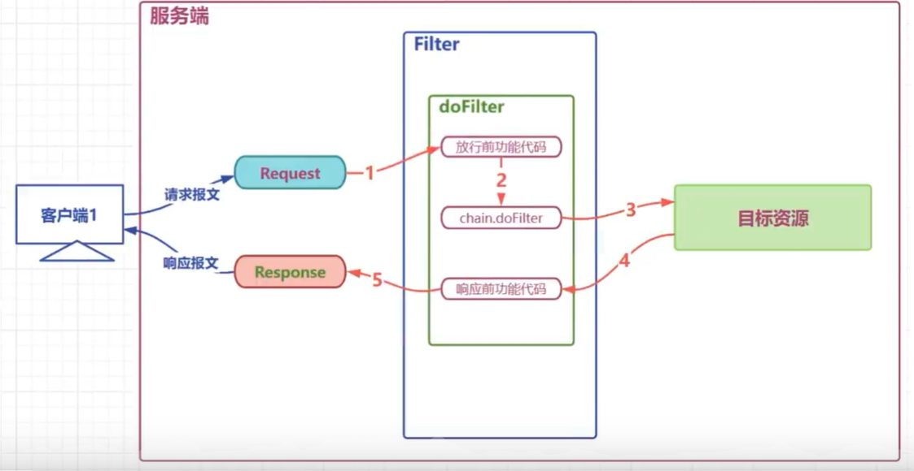
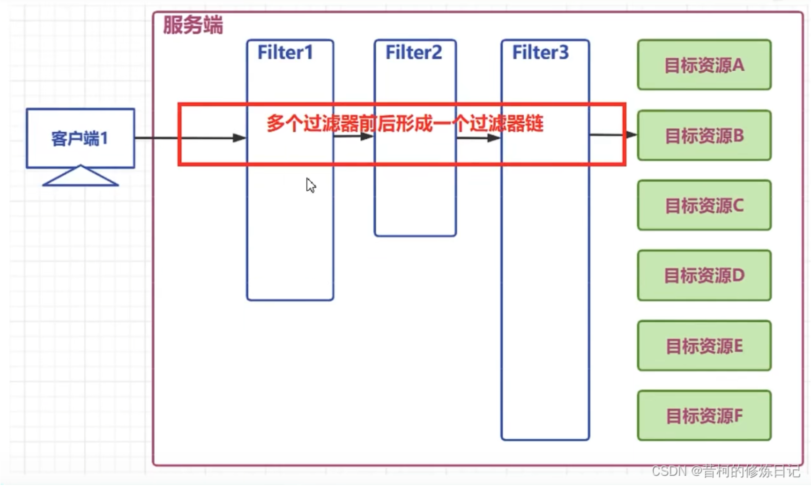

## 概述

Filter,即过滤器,是JAVAEE技术规范之一,作用目标资源的请求进行过滤的一套技术规范,是Java web项目中 最为实用的技术之一

- Filter接口定义了过滤器的开发规范,所有的过滤器都要实现该接口
- Filter的工作位置是项目中所有目标资源之前,容器在创建HtpServletRequest和HttpservletResponse对象后,会先调用Filter的dofilter方法
- Filter的doFilter方法可以控制请求是否继续,如果放行,则请求继续,如果拒绝,则请求到此为止,由过滤器本身做出响应
- Filter不仅可以对请求做出过滤,也可以在目标资源做出响应前,对响应再次进行处理
- Filter是GOF中责任链模式的典型案例
- Filter的常用应用包括但不限于: 登录权限检查,解决网站乱码,过滤敏感字符,日志记录,性能分析.……


应用的场景

- 日志的记录
- 性能的分析
- 乱码的处理
- 事务的控制
- 登录的控制
- 跨域的处理
- .............



API

| API                                                                                         | 目标                                                         |
| ------------------------------------------------------------------------------------------- | ------------------------------------------------------------ |
| default public void init(FilterConfig filterConfig)                                       | 初始化方法,由容器调用并传入初始配置信息 filterConfig 对象    |
| public void doFilter(ServletRequest request, ServletResponse response, FilterChain chain) | 过滤方法,核心方法,过滤请求,决定是否放行,响应之前的其他处理等 |
| default public void destroy()                                                             | 都在该方法中销毁方法,容器在回收过滤器对象之前调用的方法      |

## 过滤器使用

目标：开发一个日志记录过滤器

1. 用户请求到达目标资源之前,记录用户的请求资源路径
2. 响应之前记录本次请求目标资源运算的耗时
3. 可以选择将日志记录进入文件,为了方便测试,这里将日志直接在控制台打印
```java

//日志过滤器
//记录请求的历史 将日志打印到控制台
//  1 实现Filter按口.  jakarta.servlet.下的Filter
//  2 重写过滤方法
//  3  配置过滤器
//          web.xml
//         注解
public class LoggingFilter implements Filter {
    private SimpleDateFormat dateFormat =new SimpleDateFormat( "yyyy-MM-dd HH: mm:ss");
    //    过滤请求的和响应的方法
//    1 请求到达目标资源之前，先经过该方法
//    2 该方法有能力控制请求是否继续向后到达目标资源可以在该方法内直按向客户端做响应处理
//    3 请求剑达目标资源后，响应之前，还会经过该方法
 
    @Override
    public void doFilter(ServletRequest servletRequest, ServletResponse servletResponse, FilterChain filterChain) throws IOException, ServletException {
//        1 请求到达目标资源之前的功能代码
//                判断是否登录
//                  校验权限是否满足
//        2 放行代码
//        3 响应之前  HttpservletResponse 转换为响应报文之前的功能代码
        //请求到达目标资源之前的代码
        //参数父转子
        HttpServletRequest request =(HttpServletRequest)servletRequest;
        HttpServletResponse response =(HttpServletResponse)servletResponse;
// 请求到达目标资源之前打印日志        yyyy-MM-dd HH:mm:ss ***被访问了
        String requestURI= request.getRequestURI();
        String dateTime =dateFormat.format(new Date());
        String beforeLoggin = requestURI+"在"+dateTime+"被访问了";
        System.out.println(beforeLoggin);
 
        long t1= System.currentTimeMillis();
 
        // 放行
        filterChain.doFilter(servletRequest,servletResponse);
        //响应之前的功能代码
        long t2= System.currentTimeMillis();
       //响应之前的功能代码***资源在yyyy-MM-dd HH:mm:ss 的请求 耗时 毫秒
        String afterLogging = requestURI+"资源在"+dateTime+"的请求耗时:"+(t2-t1)+"毫秒";
        System.out.println(afterLogging);
 
    }
 
 
}
```

在xml文件中配置过滤器以及映射

```xml
    <!--
    配置过滤器-->
    <filter>
    <filter-name>loggingFilter</filter-name>  <!--别名-->
    <filter-class>com.atguigu.filters.LoggingFilter</filter-class>
    </filter>
 
    <!--配置过滤器的过港资源规则    路径    servlet-name-->
    <filter-mapping>
        <filter-name>loggingFilter</filter-name>
    <!--
          url-pattern 根据谱求的资源路径 对指定的请求进行过滤
                 /*   过滤全部资源
                 /a/*  过滤以a开头的资源
                 *.html 过滤以html为后级的资源
                 /servlet1      对servlet1请求进行过滤
          servlet-name  根据请求的servlet的别名，最指定的servlet资源进行过滤
    一个filter-mapping中可以同时存在多个url-pattern 和 servlet-name
    -->
<!--        <url-pattern> /* </url-pattern>-->
<!--        <servlet-name>/servlet11</servlet-name>-->
        <url-pattern> /* </url-pattern>
    </filter-mapping>
```

## 过滤器生命周期

| 阶段           | 对应方法                                                        | 执行时机             | 执行次数     |
|--------------|-------------------------------------------------------------|------------------|----------|
| 创建对象     | 构造器                                                        | Web应用启动时       | 1        |
| 初始化方法   | void init(FilterConfig filterConfig)                            | 构造完毕           | 1        |
| 过滤请求     | void doFilter(ServletRequest servletRequest, ServletResponse servletResponse, FilterChain filterChain) | 每次请求           | 多次     |
| 销毁         | default void destroy()                                           | Web应用关闭时       | 1        |

案例演示

```java
public class LifeCycleFilter implements Filter {
//    1 构港  构遽器    项目启动   1
//2 初始化     init    构造完毕   1
//3 过滤      doFilter    每次请求 多次
//4  销毁     destory     服务关闭 1
    public  LifeCycleFilter(){
        System.out.println("构造");
    }
    @Override
    public void init(FilterConfig filterConfig) throws ServletException {
        System.out.println("初始化");
        System.out.println(filterConfig.getInitParameter("dateTimePatter"));
 
    }
 
    @Override
    public void doFilter(ServletRequest servletRequest, ServletResponse servletResponse, FilterChain filterChain) throws IOException, ServletException {
        System.out.println("过滤方法");
        filterChain.doFilter(servletRequest, servletResponse);
    }
 
    @Override
    public void destroy() {
        System.out.println("销毁方法");
 
    }
}
```
//xml配置
```xml
   <filter>
        <filter-name>lifeCycleFilter</filter-name>
        <filter-class>com.atguigu.filters.LifeCycleFilter</filter-class>
        <init-param>
            <param-name>dateTimePattern</param-name>
            <param-value>yyyy-MM-dd HH:mm:ss</param-value>
        </init-param>
    </filter>
    <!--配置过滤器的过港资源规则    路径    servlet-name-->
    <filter-mapping>
        <filter-name>lifeCycleFilter</filter-name>
        <!--
              url-pattern 根据谱求的资源路径 对指定的请求进行过滤
                     /*   过滤全部资源
                     /a/*  过滤以a开头的资源
                     *.html 过滤以html为后级的资源
                     /servlet1      对servlet1请求进行过滤
              servlet-name  根据请求的servlet的别名，最指定的servlet资源进行过滤
        一个filter-mapping中可以同时存在多个url-pattern 和 servlet-name
        -->
        <!--        <url-pattern> /* </url-pattern>-->
        <!--        <servlet-name>/servlet11</servlet-name>-->
        <url-pattern> /* </url-pattern>
    </filter-mapping>

```

## 过滤器链的使用

一个web项目中,可以同时定义多个过滤器,多个过滤器对同一个资源进行过滤时,工作位置有先后,整体形成一个工作链,称之为过滤器链

- 过滤器链中的过滤器的顺序由filter-mapping顺序决定
- 每个过滤器过滤的范围不同,针对同一个资源来说,过滤器链中的过滤器个数可能是不同的
- 如果某个Filter是使用ServletName进行匹配规则的配置，那么这个Filter执行的优先级要更低



## 注解方式配置过滤器

xml配置

```xml
<!--配置filter,并为filter起别名-->
<filter>
    <filter-name>loggingFilter</filter-name>
    <filter-class>com.atguigu.filters.LoggingFilter</filter-class>
    <!--配置filter的初始参数-->
    <init-param>
        <param-name>dateTimePattern</param-name>
        <param-value>yyyy-MM-dd HH:mm:ss</param-value>
    </init-param>
</filter>
<!--为别名对应的filter配置要过滤的目标资源-->
<filter-mapping>
    <filter-name>loggingFilter</filter-name>
    <!--通过映射路径确定过滤资源-->
    <url-pattern>/servletA</url-pattern>
    <!--通过后缀名确定过滤资源-->
    <url-pattern>*.html</url-pattern>
    <!--通过servlet别名确定过滤资源-->
    <servlet-name>servletBName</servlet-name>
</filter-mapping>
```
比较麻烦，也可以通过注解方式来实现


```java
@WebFilter(
filterName = "loggingFilter"
initParams = {@WebInitParam(name="dateTimePattern",value="yyyy-MM-dd HH :mm:ss")},
urlPatterns ={"/servletA","*.html"},
servletNames ={"servletBName"}
)
```


