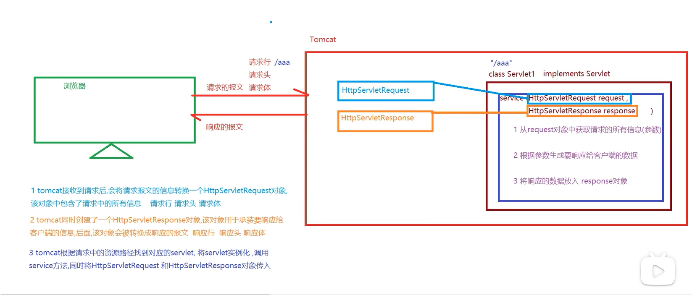
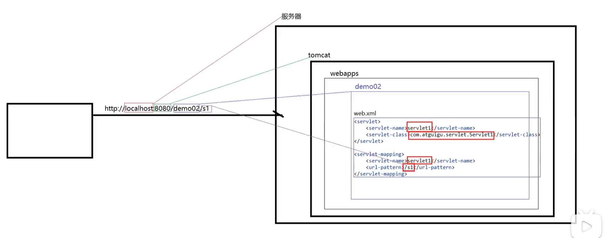
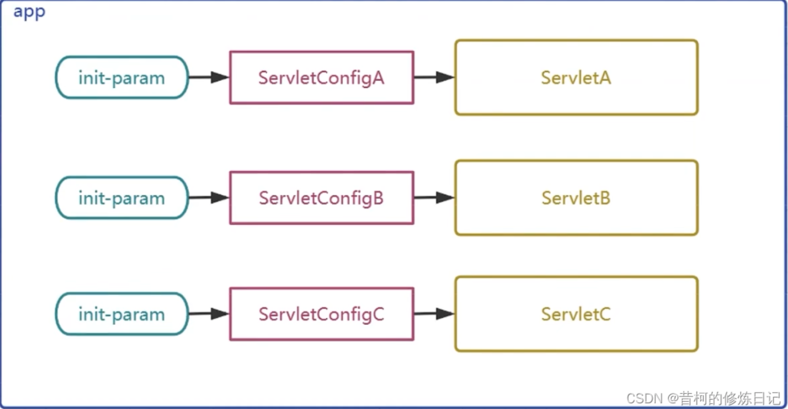
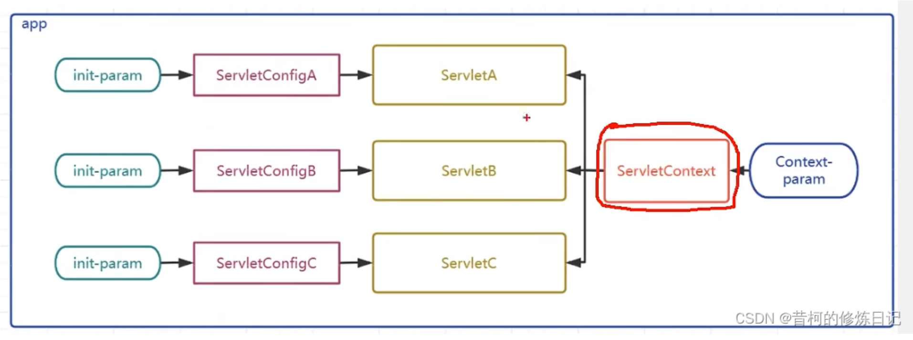
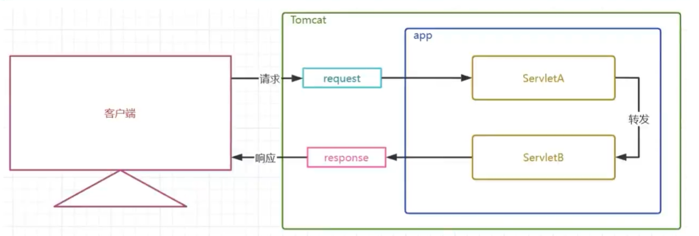
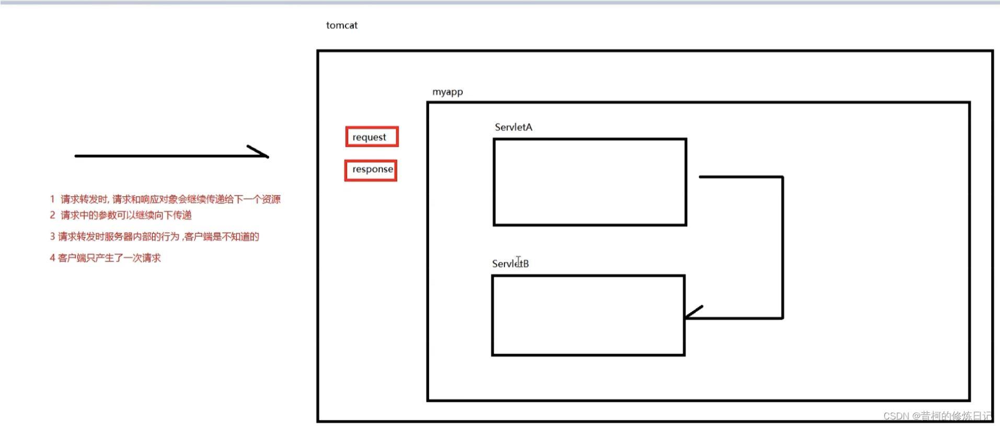
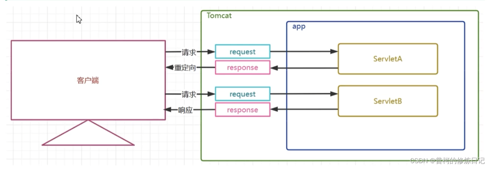
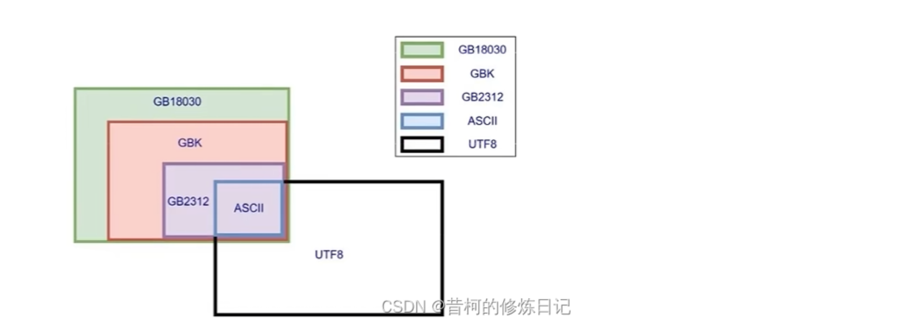
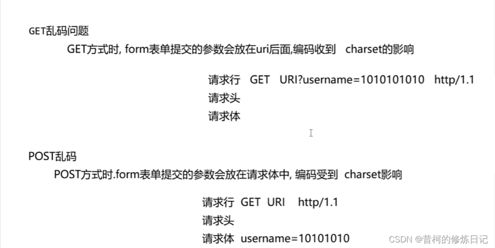

## 简介

用来接收、处理客户端请求、响应给浏览器的动态资源。在整个web应用中，Servlet主要负责接收处理请求、协同调度功能以及响应数据。我们可以把Servlet成为Web应用中的控制器

简单来说，就是一个客户端和Java代码中的一个中间层，专门处理输入输出



## servlet开发

流程：

1. 创建javaWeb项目，同时将tomcat添加为当前项目的依赖
2. 重新给service方法，service(HttpServletRequest req,HttpServletResponse resp)
3. 在service方法中，定义业务处理代码
	1. 从request对象中获取请求中的任何信息
	2. 处理业务的代码
	3. 将要响应的数据放任response//应该设置Content-Type响应头
4. 在web.xml中，配置Servlet对应的请求映射路径




//后面小细节，不重要

servlet-api.jar 导入问题

1. servlet-api编码的时候需要，运行的时候在服务器环境，会有服务器(tomcat)提供
2.因此我们的java项目，在打包/构建的时候，是不需要这个jar包的

Content-Type响应头的问题

1. MiME类型响应头，几乎所有的文件类型都有自己的MIME类型响应头
2. MIME类型响应头在conf/web.xml中
3. 在HTTP的请求头中有一个Content-Type，里面的值就是一个MIME类型响应头
4. 应当手动设置Content-Type告诉浏览器返回了什么，浏览器会根据这个Content-Type处理

配置相关

1. 一个servelet-name可以同时对应多个url-pattern
2. 一个url-pattern只能对应一个servelet-name
3. 一个servelet标签可以同时对应多个servelet-mapping标签

url-pattern

1. 精确匹配——直接写上绝对路径，如/serve
2. 模糊匹配
	- *作为通配符，表示全部
	- /  匹配全部，不包括jsp文件
	- /* 匹配全部，包括jsp文件

## Servlet注解配置

@WebServlet("")

在需要实现servelet接口的类上加上这个注解，可以直接配置Servlet请求路径，用这种方式配置就不要再web.xml中配置了

## Servlet生命周期

### 生命周期简介

| 生命周期           | 对应方法                                                  | 执行时机             | 执行次数 |
| ------------------ | --------------------------------------------------------- | -------------------- | -------- |
| 构造对象（实例化） | 构造器                                                    | 第一次请求或容器启动 | 1        |
| 初始化             | init()                                                    | 构造完成后           | 1        |
| 处理服务           | service(HttpServletRequest req, HttpServletResponse resp) | 每次请求             | 多次     |
| 销毁               | destroy()                                                 | 容器关闭             | 1        |


Tomcat中有一个defaultServlet，当访问静态资源时（对不上其他的servelet时）会交给defaultServlet处理

*SpringMVC中提供的servlet会造成defaultServlet失效，找不到静态资源。需要重新配置defaultServlet*

## Servlet继承结构

### Servlet接口

Servlet在Tomcat中是单例的

Servlet的成员变量在多个线程池中是共享的

不建议在service方法中修改成员变量，在并发请求时，会引发线程安全问题


### 抽象的类GenericServlet

GenericServlet实现了大部分Servlet接口的方法，除了Service方法

### HttpServlet 抽象类

主要是把Service方法的参数进行了父转子(ServletReuqest,Servelet... -> HttpServletReuqest,Http...)，然后调用重载的Service方法

重载的Service方法获取请求的方式，然后调用对应的do...方法

这些do方法故意响应405，请求方式不允许的信息

继承HttpServlet后需要重写service犯法或者doget,dopost这些方法


## ServletConfig和ServletContent

### ServletConfig

ServletConfig是什么

- 为Servlet提供初始配置参数的一种对象,每个Servlet都有自己独立唯-的Servletconfig对象
- 容器会为每个Servlet实例化一个Servletconfig对象,并通过Servlet生命周期的init方法传入给Servlet作为属性 


可以通过xml或者注解方式配置

### ServletContext

ServletContext是什么

- Servletcontext对象有称呼为上下文对象,或者叫应用域对象(后面统一讲解域对象)
- 容器会为每个app创建一个独立的唯-的ServletContext对象
- ServletContext对象为所有的Servlet所共享
- Servletcontext可以为所有的Servlet提供初始配置参数



配置方式：

xml配置示例：
```xml
<?xml version="1.0" encoding="UTF-8"?>
<web-app xmlns="https://jakarta.ee/xml/ns/jakartaee"
         xmlns:xsi="http://www.w3.org/2001/XMLSchema-instance"
         xsi:schemaLocation="https://jakarta.ee/xml/ns/jakartaee https://jakarta.ee/xml/ns/jakartaee/web-app_6_0.xsd"
         version="6.0">
    <context-param>
        <param-name>encoding</param-name>
        <param-value>UTF-8</param-value>
    </context-param>
    <context-param>
        <param-name>username</param-name>
        <param-value>zhangsan</param-value>
    </context-param>
 
</web-app>
```

找到context值

```java
//获取ServletContext三种方式
        ServletContext servletContext1 = servletConfig.getServletContext();
        ServletContext servletContext2 = req.getServletContext();
        ServletContext servletContext3 = getServletContext();
        
        System.out.println(servletContext1== servletContext2);
        System.out.println(servletContext3 == servletContext2);
        //通过key获取context值
        String encoding=servletContext1.getInitParameter( "encoding");
        System.out.println("encoding:"+encoding);
        //获取context全部key,并循环取出对应值
        Enumeration<String> AparameterNames = servletContext1.getInitParameterNames();
        while(AparameterNames.hasMoreElements()){
            String pname =AparameterNames.nextElement();
            System.out.println(pname+"_"+servletContext1.getInitParameter(pname));}

```

### ServletContext其他重要API

**获取资源的真实路径**

        `String realPath= servletContext.getRealPath("资源在web目录中的路径”);`

- 例如我们的目标是需要获取项目中某个静态资源的路径，不是工程日录中的路径，而是部署目录中的路径;我们如果直接拷贝其在我们电脑中的完整路径的话其实是有问题的，因为如果该项目以后部署到公司服务器上的话，路径肯定是会发生改变的，所以我们需要使用代码动态获取资源的真实路径，只要使用了servietcontext动态获取资源的真实路径，那么无论项目的部署路径发生什么变化，都会动态获取项目运行时候的实际路径，所以就不会发生由于写死真实路径而导致项目部署位置改变引发的路径错误问题

**获取项目的上下文路径**

        `String contextPath =servletContext.getContextPath();`

- 项目的部署名称,也叫项目的上下文路径,在部署进入tomcat时所使用的路径,该路径是可能发生变化的,通过该AP|动态获取项目的真实路径,可以帮助我们解决一些后端页面渲染技术或者请求转发和响应重定向中的路径问题

**域对象的相关API**

- 域对象:一些用于存储数据和传递数据的对象,传递数据不同的范围,我们称之为不同的域,不同的域对象代表不同的域,共享数据的范围也不同
- ServletContext代表应用,所以ServletContext域也叫作应用域,是webapp中最大的域,可以在本应用内实现数据的共享和传递
- webapp中的三大域对象,分别是应用域,会话域,请求域
- 后续我们会将三大域对象统一进行讲解和演示,三大域对象都具有的API如下

| API                                        | 功能解释            |
| ------------------------------------------ | ------------------- |
| void setAttribute(String key,Object value) | 向域中存储/修改数据 |
| Object getAttribute(String key)            | 获得域中的数据      |
| void removeAttribute(String key)           | 移除域中的数据      |


## HttpServletRequest

### 简介

HttpServletRequest是什么

- HttpServletkequest是一个接口,其父接口是ServletRequest
- HttpServletRequest是Tomcat将请求报文转换封装而来的对象,在Tomcat调用service方法时传入
- HttpServletRequest代表客户端发来的请求,所有请求中的信息都可以通过该对象获得

### HttpServletRequest常见api

#### 获取请求行信息相关

| API                           | 功能解释                       |
| ----------------------------- | ------------------------------ |
| StringBuffer getRequestURL(); | 获取客户端请求的url            |
| String getRequestURI();       | 获取客户端请求项目中的具体资源 |
| int getServerPort();          | 获取客户端发送请求的端口       |
| int getLocalPort();           | 获取应用所在容器的端口         |
| int getRemotePort();          | 获取客户端程序的端口           |
| String getScheme();           | 获取请求协议                   |
| String getProtocol();         | 获取请求协议及版本号           |
| String getMethod();           | 获取请求方式                   |

#### 获取请求头信息相关


| API                                   | 功能解释               |
| ------------------------------------- | ---------------------- |
| String getHeader(String headerName);  | 根据头名称获取请求头   |
| Enumeration<String> getHeaderNames(); | 获取所有的请求头名字   |
| String getContentType();              | 获取content-type请求头 |

#### 获取请求参数相关

| API                                                     | 功能解释                             |
| ------------------------------------------------------- | ------------------------------------ |
| String getParameter(String parameterName);              | 根据请求参数名获取请求单个参数值     |
| String[] getParameterValues(String parameterName);      | 根据请求参数名获取请求多个参数值数组 |
| Enumeration<String> getParameterNames();                | 获取所有请求参数名                   |
| Map<String, String[]> getParameterMap();                | 获取所有请求参数的键值对集合         |
| BufferedReader getReader() throws IOException;          | 获取请求体请求体的字符输入流         |
| ServletInputStream getInputStream() throws IOException; | 获取请求体请求体的字节输入流         |
| int getContentLength();                                 | 获取请求体长度的字节数               |

#### 其他API

| API                                         | 功能解释                    |
| ------------------------------------------- | --------------------------- |
| String getServletPath();                    | 获取请求的Servlet的映射路径 |
| ServletContext getServletContext();         | 获取ServletContext对象      |
| Cookie[] getCookies();                      | 获取请求中的所有cookie      |
| HttpSession getSession();                   | 获取Session对象             |
| void setCharacterEncoding(String encoding); | 设置请求体字符集            |

  //以上APT专门用于获取key=value形式的参数,无论这些参数是在url后还是在请求体中
    //获得请求体中的非键值对数据?
    //获取一个从请求体中读取字符的字得输入流
    //BufferedReader reader=reg.getReader():ISON申
    //获得一个从请求中读取二进制数据字节的输入流
    //ServletInputStream inputstream=reg.getInputstream();/

## HttpServletResponse

### 简介

- HttpServletResponse是一个接口,其父接口是Servle tResponse
- HttpServletResponse是Tomcat预先创建的,在Tomcat调用service方法时传入
- HttpservietResponse代表对客户端的响应,该对象会被转换成响应的报文发送给客户端,通过该对象我们可以设置响应信息

### API

#### 设置响应行相关

| API                      | 功能解释       |
| ------------------------ | -------------- |
| void setStatus(int code) | 设置响应状态码 |

#### 设置响应头相关

  | API                                                    | 功能解释                                         |
  | ------------------------------------------------------ | ------------------------------------------------ |
  | void setHeader(String headerName, String headerValue); | 设置/修改响应头键值对                            |
  | void setContentType(String contentType);               | 设置content-type响应头及响应字符集(设置MIME类型) |


#### 设置响应体相关

  | API                                                       | 功能解释                                                 |
  | --------------------------------------------------------- | -------------------------------------------------------- |
  | PrintWriter getWriter() throws IOException;               | 获取向响应体放入信息的字符输出流                         |
  | ServletOutputStream getOutputStream() throws IOException; | 获取向响应体放入信息的字节输出流                         |
  | void setContentLength(int length);                        | 设置响应的字节长度，实际上就是在设置content-length响应头 |

#### 其他API

  | API                                                          | 功能解释                                             |
  | ------------------------------------------------------------ | ---------------------------------------------------- |
  | void sendError(int code, String message) throws IOException; | 向客户端响应错误信息的方法，需要指定响应码和响应信息 |
  | void addCookie(Cookie cookie);                               | 向响应中添加cookie                                   |
  | void setCharacterEncoding(String encoding);                  | 设置响应字符集                                       |


MiME类型

- MIME类型,可以理解为文档类型,用户表示传递的数据是属于什么类型的文档
- 浏览器可以根据MIME类型决定该用什么样的方式解析接收到的响应体数据
- 可以这样理解: 前后端交互数据时,告诉对方发给对方的是 html/css/js/图片/声音/视频!/.…
- tomcat/conf/web.xml中配置了常见文件的拓展名和MIMIE类型的对应关系
- 常见的MIME类型举例如下

## 请求转发和响应重定向

### 概述

- 请求转发和响应重定向是web应用中间接访问项目资源的两种手段,也是Servlet控制页面跳转的两种手段
- 请求转发通过HttpServletRequest实现,响应重定向通过HttpServletResponse实现
- 请求转发生活举例: 张三找李四借钱,李四没有,李四找王五,让王五借给张三
- 响应重定向生活举例:张三找李四借钱,李四没有,李四让张三去找王五,张三自己再去找王五借钱

### 请求转发



请求转发特点：

- 请求转发通过HttpServletRequest对象获取请求转发器实现
- 请求转发是服务器内部的行为,对客户端是屏蔽的
- 客户端只发送了一次请求,客户端地址栏不变
- 服务端只产生了一对请求和响应对象,这一对请求和响应对象会继续传递给下一个资源
- 因为全程只有一个HttpServletRequset对象,所以请求参数可以传递,请求域中的数据也可以传递
- 请求转发可以转发给其他Servlet动态资源,也可以转发给一些静态资源以实现页面跳转
- 请求转发可以转发给WEB-INF下受保护的资源



```java
@WebServlet("/ServletA")
public class ServletA extends HttpServlet {
    @Override
    protected void service(HttpServletRequest req, HttpServletResponse resp) throws ServletException, IOException {
        System.out.println("servletA 执行了");
        String money=req.getParameter( "money");
        System.out.println("servletA获得参数:money="+money);
        //请求转发给ServletB
        //获得请求转发器
        //RequestDispatcher requestDispatcher = reg.getRequestDispatcher("servletB");
        //RequestDispatcher requestDispatcher = req.getRequestDispatcher(  "a.html");
        //RequestDispatcher requestDispatcher = req.getRequestDispatcher("WEB-INF/b.html");
        RequestDispatcher requestDispatcher = req.getRequestDispatcher("http://www.atguigu.com");
 
        //让请求转发器做出转发动作
        requestDispatcher.forward(req,resp);
    }
}
```
### 响应重定向



响应重定向特点

- 响应重定向通过HttpServletResponse对象的sendRedirect方法实现
- 响应重定向是服务端通过302响应码和路径,告诉客户端自己去找其他资源,是在服务端提示下的,客户端的行为
- 客户端至少发送了两次请求,客户端地址栏是要变化的
- 服务端产生了多对请求和响应对象,且请求和响应对象不会传递给下一个资源
- 因为全程产生了多个HttpServletRequset对象,所以请求参数不可以传递,请求域中的数据也不可以传递
- 重定向可以是其他Servlet动态资源,也可以是一些静态资源以实现页面跳转
- 重定向不可以到给WEB-INF下受保护的资源

## Web乱码和路径问题总结

### 乱码问题

产生的原因

- 数据的编码和解码使用的不是同一个字符集
- 使用了不支持某个语言文字的字符集

各个字符串的兼容性



#### Get和Post请求乱码

- GET方式提交参数的方式是将参数放到URL后面,如果使用的不是UTF-8,那么会对参数进行URL编码处理
- HTML中的<meta charset='字符集"/>影响了GET方式提交参数的URL编码
- tomcat10.1.7的URI编码默认为 UTF-8
- 当GET方式提交的参数URL编码和tomcat10.1.7认的URI编码不一致时,就会出现乱码

可以通过在html头部设置<meta charset = "UTF-8">解决



#### 响应乱码问题

- 在Tomcat10.1.7中,向响应体中放入的数据默认使用了工程编码 UTF-8
- 浏览器在接收响应信息时,使用了不同的字符集或者是不支持中文的字符集就会出现乱码

可以通过设置content-type告诉浏览器以指定的字符集解析响应体

### 路径问题

#### 相对路径和绝对路径

**相对路径**

 相对路径的规则是: 以当前资源所在的路径为出发点去寻找目标资源

- 相对路径不以 / 开头
- 在file协议下,使用的是磁盘路径
- 在http协议下,使用的是url路径
- 相对路径中可以使用 ,   . /  表示当前资源所在路径,可以省路不写
- 相对路径中可以使用  ../  表示当前资源所在路径的上一层路径,需要时要手动添加
- 缺点:目标资源路径受到当前资源路径的影响不同的位置，相对路径写法不同

**绝对路径**

  绝对路径的规则是: 使用以一个固定的路径做出出发点去寻找目标资源,和当前资源所在的路径没有关系

- 绝对路径要以 / 开头
- 绝对路径的写法中,不以当前资源的所在路径为出发点,所以不会出现 ，和../
- 不同的项目和不同的协议下,绝对路径的基础位置可能不同,要通过测试确定
- 绝对路径的好处就是:无论当前资源位置在哪,寻找目标资源路径的写法都一致
- 缺点:绝对路径要补充项目的上下文，项目上下文是可以改变的

通过 <head>   <base  href = " /D05/" >属性,定义相对路径公共前级,通过公共前级把一个相对路径转换为绝对路径

应用场景

前端代码中,href src action等属性

请求转发和重定向中的路径

#### 重定向和请求转发

重定向

相对路径绝对路径写法和前端一致

请求转发

相对路径写法一致

绝对路径  请求转发的绝对路径是不需要添加项目上下文。请求转发的  /  代表的路径是http:l/localhost:8080/d05/ 即包括项目上下文路径

## MVC架构模式

MVC(ModelView Controller)是软件工程中的一种 软件架构模式 ，它把软件系统分为 模型 、 视图 和 控制器 三个基本部分。用一种业务逻辑、数据、界面显示分离的方法组织代码，将业务逻辑聚集到一个部件里面，在改进和个性化定制界面及用户交互的同时，不需要重新编写业务逻辑。1高内聚低耦合  2 开闭原则

M:Model模型层,具体功能如下

1. 存放和数据库对象的实体类以及一些用于存储非数据库表完整相关的VO对象
2. 存放一些对数据进行逻辑运算操作的的一些业务处理代码

V :View 视图层,具体功能如下

1. 存放一些视图文件相关的代码 html css js等
2. 在前后端分离的项目中,后端已经没有视图文件,该层次已经衍化成独立的前端项目

C:Controller控制层,具体功能如下

1. 接收客户端请求,获得请求数据
2. 将准备好的数据响应给客户端

MVC模式下,项目中的常见包

M:
1. 实体类包(pojo /entity /bean)专门存放和数据库对应的实体类和一些V0对象
2. 数据库访问包(dao/mapper)专门存放对数据库不同表格CURD方法封装的一些类
3. 服务包(service)  专门存放对数据进行业务逻辑预算的一些类

C: 
1. 控制层包(controller)

V:
1. web日录下的视图资源 html . css . js . img等
2. 前端工程化后,在后端项目中已经不存在了
