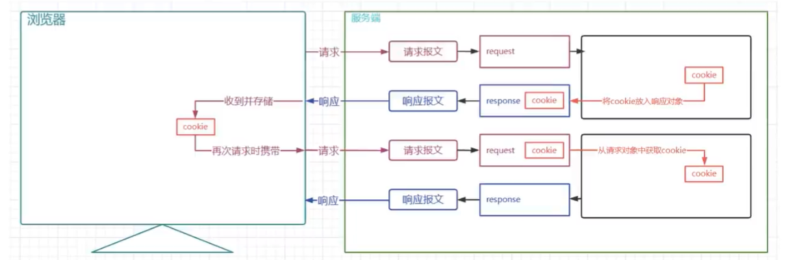
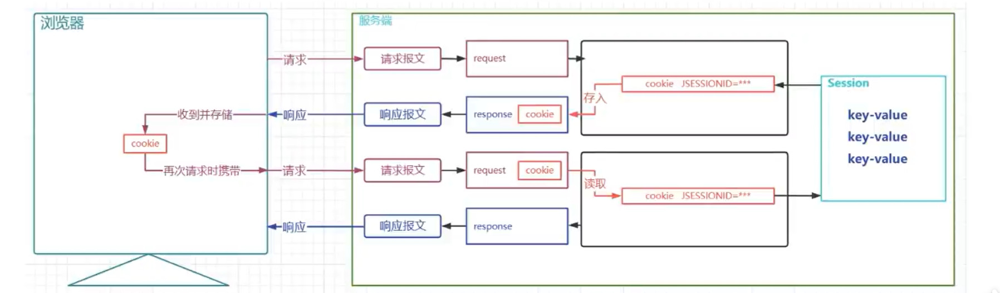
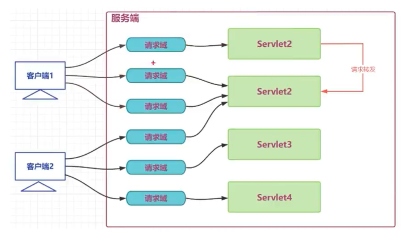
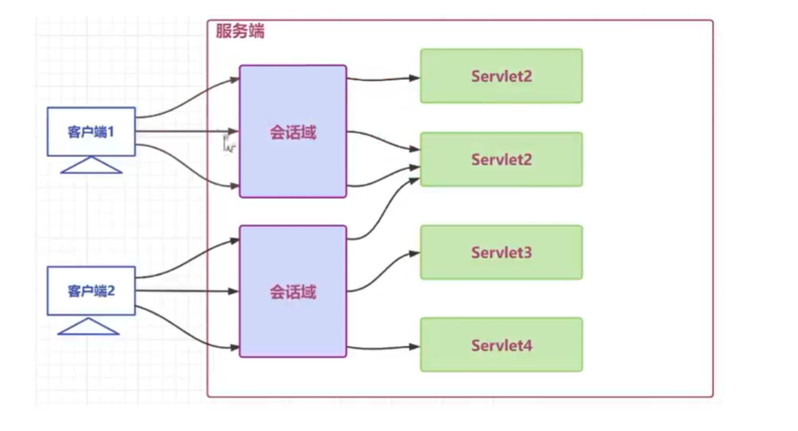
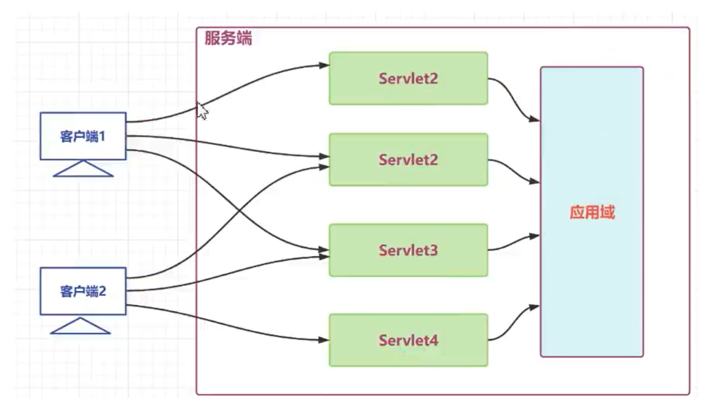

## 概述

### 为什么需要会话管理

Http是无状态协议，无状态就是不保存状态，协议对于发送过的请求或者响应都不做持久化处理

### 会话管理实现的手段

Cooike和Session配合解决

- cookie是在客户端保留少量数据的技术,主要通过响应头向客户端响应一些客户端要保留的信息
- session是在服务端保留更多数据的技术,主要通过HttpSession对象保存一些和客户端相关的信息
- cookie和session配合记录请求状态

## Cookie

### Cookie概述

cookie是一种客户端会话技术,cookie由服务端产生,它是服务器存放在浏览器的一小份数据,浏览器以后每次访问该服务器的时候都会将这小份数据携带到服务器去。

- 服务端创建cookie,将cookie放入响应对象中,Tomcat容器将cookie转化为set-cookie响应头,响应给客户端
- 客户端在收到cookie的响应头时,在下次请求该服务的资源时,会以cookie请求头的形式携带之前收到的cookie
-  cookie是一种键值对格式的数据,从tomcat8.5开始可以保存中文,但是不推荐
- 由于cookie是存储于客户端的数据,比较容易暴露,一般不存储一些敏感或者影响安全的数据




应用场景举例
1. 记录用户名
    - 当我们在用户名的输入框中输入完用户名后,浏览器记录用户名,下一次再访问登录页面时,用户名自动填充到用户名的输入框,

2. 保存电影播放进度
    - 在网页上播放电影的时候,如果中途退出浏览器了,下载再打开浏览器播放同一部电影的时候,会自动跳转到上次退出时候的进度,因为在播放的
时候会将播放进度保存到cookie中

### Cooike使用

添加cooike

```java
@WebServlet("/servletA")
public class ServletA extends HttpServlet{
    @Override
    protected void service(HttpServletRequest req, HttpServletResponse resp)throws ServletException {
// 创建cookie
 
        Cookie cookie1 =new Cookie(  "keya", "valua");
        Cookie cookie2 =new Cookie("keyb", "valueb");
//将cookie放入response对象
        resp.addCookie(cookie1);
        resp.addCookie(cookie2);
    }
    
 
}
```

读取cooike
```java

@WebServlet("/servletB")
public class ServletB extends HttpServlet{
    @Override
    protected void service(HttpServletRequest req, HttpServletResponse resp)throws ServletException {
        Cookie[] cookies =req.getCookies();
        //请求中的多个cookie会进入该数组 请求中如果没有cookie      cookies数组是为null
        if(null != cookies) {
            for(Cookie cookie :cookies)
            System.out.println(cookie.getName()+"="+cookie.getValue());
        }
    }
 
    // 获取请求中携带的cookie
 
}
```

### Cookie的时效性

默认情况下Cookie的有效期是一次会话范围内，我们可以通过cookie的setMaxAge()方法让Cookie持久化保存到浏览器上

会话级Cookie

- 服务器端并没有明确指定Cookie的存在时间
- 在浏览器端，Cookie数据存在于内存中
- 只要浏览器还开着，Cookie数据就一直都在
- 浏览器关闭，内存中的Cookie数据就会被释放

持久化Cookie

- 服务器端明确设置了Cookie的存在时间
- 在浏览器端，Cookie数据会被保存到硬盘上
- Cookie在硬盘上存在的时间根据服务器端限定的时间来管控，不受浏览器关闭的影响
- 持久化Cookie到达了预设的时间会被释放

`cookie.setMaxAgel(int expiry)` 参数单位是秒，表示cookie的持久化时间，如果设置参数为0，表示将浏览器中保存的该cookie删除

### Cookie的提交路径

访问互联网资源时不能每次都需要把所有cookie带上。访问不同的资源时,可以携带不同的cokie,我们可以通过cokie的 `setPath(string path)` 对cookie的路径进行设置 

## Session

### 概述

HttpSession是一种保留更多信息在服务端的一种技术,服务器会为每一个客户端开辟一块内存空间,即sesion对象,客户端在发送请求时,都可以使用自己的session.这样服务端就可以通过session来记录某个客户端的状态了

- 服务端在为客户端创建session时,会同时将session对象的id,即JSESSIONID以cookie的形式放入响应对象
- 后端创建完session后,客户端会收到一个特殊的cookie,叫做JSESSIONID
- 客户端下一次请求时携带JSESSIONID,后端收到后,根据JSESSIONID找到对应的session对象
- 通过该机制,服务端通过session就可以存储一些专门针对某个客户端的信息了
- session也是域对象(后续详细讲解) 


### 应用场景

1. 记录用户的登录状态，用户登录后,将用户的账号等敏感信息存入session
2. 记录用户操作的历史，例如记录用户的访问痕迹,用户的购物车信息等临时性的信息

### 使用

```java
@WebServlet("/servlet1")
public class Servlet1 extends HttpServlet {
    @Override
    protected void service(HttpServletRequest req, HttpServletResponse resp) throws ServletException, IOException {
        //按收消求中username参数
        String username =req.getParameter("username");
			//获得session对象
        HttpSession session=req.getSession();
 
		// getSession()方法干了什么，判断请求中有没有一个特殊的cookie JSESSIONID 值
 
        //1 有
            //根据JSESSIONID找对应session对象
                 //1 找到了
                        //返回之前的session
                // 2 没找到
                        // 创建一个新的session返国,并且向response对象中存放一个JSESSIONID的cookie
        //2 没有
                // 创建一个新的session返回,并且向response对象中存放一个JSESSIONID 的cookie
        System.out.println(session.getId());
        System.out.println(session.isNew());
		//指usernamefsession
        session.setAttribute("username",username);
		// 客户端响应信息
        resp.setContentType("text/html;charset=UTF-8");
        resp.getWriter().write( "成功");
    }
}
```

### Httpsession时效性

为什么要设置session的时效

- 用户量很大之后，Session对象相应的也要创建很多。如果一味创建不释放，那么服务器端的内存迟早要被耗尽。
- 客户端关闭行为无法被服务端直接侦测,或者客户端较长时间不操作也经常出现,类似这些的情况,就需要对session的时限进行设置了

默认的session最大闲置时间(两次使用同一个session中的间隔时间)在tomcat/conf/web.xml配置为30分钟，

1. 可以自己在当前项目的web,xml对最大闲置时间进行重新设定
2. 也可以通过HttpSession的API对最大闲置时间进行设定
```java
//设置最大闲置时间 
session.setMaxInactiveInterval(60)

//直接让session失效
session.invalidate
```

## 三大域对象

### 域对象概述

域对象:一些用于存储数据和传递数据的对象,传递数据不同的范围,我们称之为不同的域,不同的域对象代表不同的域,共享数据的范围也不同

web项目中,我们一定要熟练使用的域对象分别是 请求域,会话域,应用域

- 请求域对象是HttpServletRequest,传递数据的范围是一次请求之内及请求转发
- 会话域对象是Httpsession,传递数据的范围是一次会话之内,可以跨多个请求
- 应用域对象是Servletcontext,传递数据的范围是本应用之内,可以跨多个会话

生活举例: 热水器摆放位置不同,使用的范围就不同

1. 摆在张三工位下,就只有张三一个人能用
2. 摆在办公室的公共区,办公室内的所有人都可以用
3. 摆在楼层的走廊区,该楼层的所有人都可以用





- 请求转发时,请求域可以传递数据 请求域内一般放本次请求业务有关的数据,如:查询到的所有的部门信息
- 同一个会话内,不用请求转发,会话域可以传递数据 会话域内一般放本次会话的客户端有关的数据,如:当前客户端登录的用户
- 同一个APP内,不同的客户端,应用域可以传递数据`应用域内一般放本程序应用有关的数据 如:Spring框架的IOC容器

| API                                        | 功能解释            |
| ------------------------------------------ | ------------------- |
| void setAttribute(String key,Object value) | 向域中存储/修改数据 |
| Object getAttribute(String key)            | 获得域中的数据      |
| void removeAttribute(String key)           | 移除域中的数据      |


