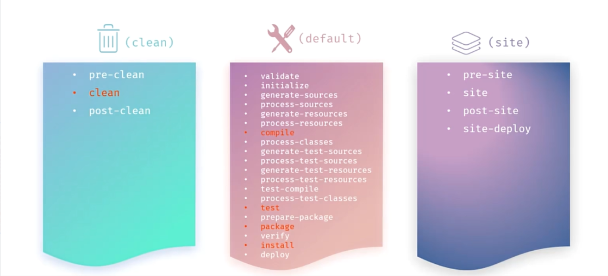
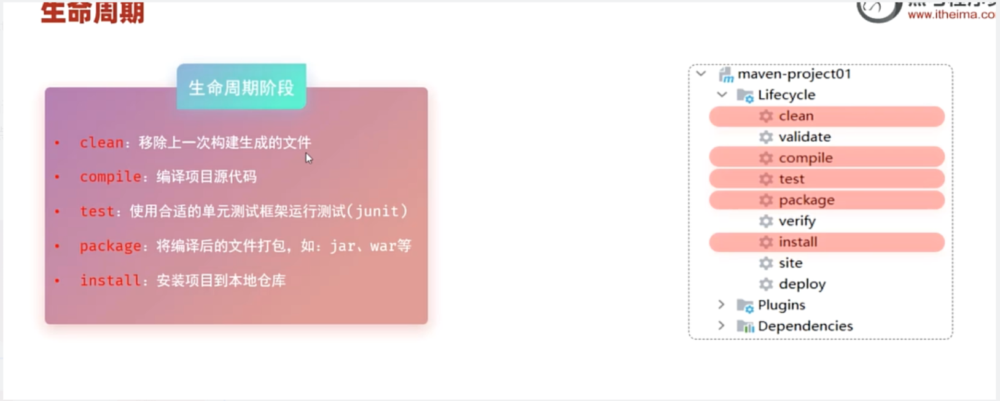

> 这个是黑马JavaWeb中我自己的笔记
## 简介

- 方便快捷的管理项目依赖的资源(jar包)
- 标准的跨平台（Linux，Windows,MacOS）的自动化项目构建方式
- 提供标准，同一的项目结构

## Maven坐标

### 说明

Maven中的坐标是自愿jar的唯一标识，通过该坐标可以唯一定位资源位置

使用坐标来定义项目或引入项目中需要的依赖

### 主要组成

groupId:定义当前maven项目隶属组织名称（通常是域名反写）

artifactId:定义当前Maven项目名称（通常是模块名称）

version:定义当前项目版本号

- SNAPSHOT:功能不稳定，处于开发中的版本
- RELEASE:功能区域稳定，

## 依赖配置

在pom.xml使用<dependencies>标签

在<dependencies>标签汇总，使用<dependency>引入坐标

定义坐标的groupId,artifactId,version（官网可以搜索，mvnrepository.com）

点击刷新按钮，引入最新加入的坐标

## 排除依赖

<exclusions>

<exclusion>

只需要groupId和artifactId，不需要version

## 生命周期

主要分为三个阶段：

clean清理工作

default核心工作：如编译，打包等

site生成报告，发布站点等

## 依赖范围

默认范围是main，test，以及打包时

通过<scope></scope>来控制

| scope值         | 主程序 | 测试程序 | 打包（运行） | 范例        |
| --------------- | ------ | -------- | ------------ | ----------- |
| compile（默认） | Y      | Y        | Y            | log4j       |
| test            | -      | Y        | -            | junit       |
| provided        | Y      | Y        | -            | servlet-api |
| runtime         | -      | Y        | Y            | jdbc驱动    |

## 常见问题

报红，可能是下载时网络不好没下完，需要手动把这个包里的全lastUpdated删掉,然后更新完关了重启

cmd命令：`del /s *.lastUpdated`
