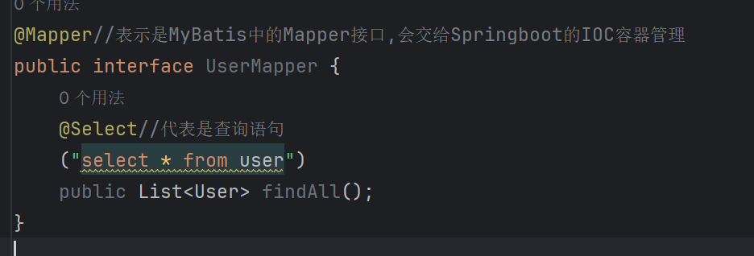
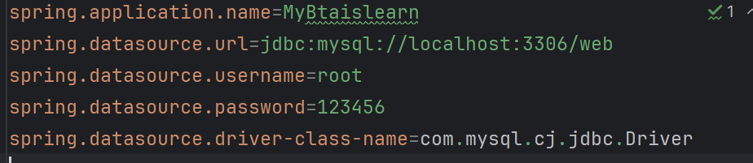
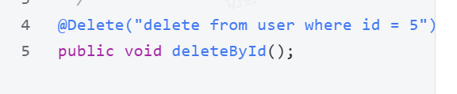
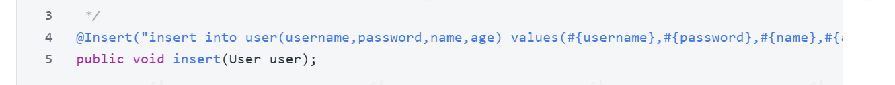
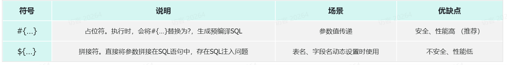
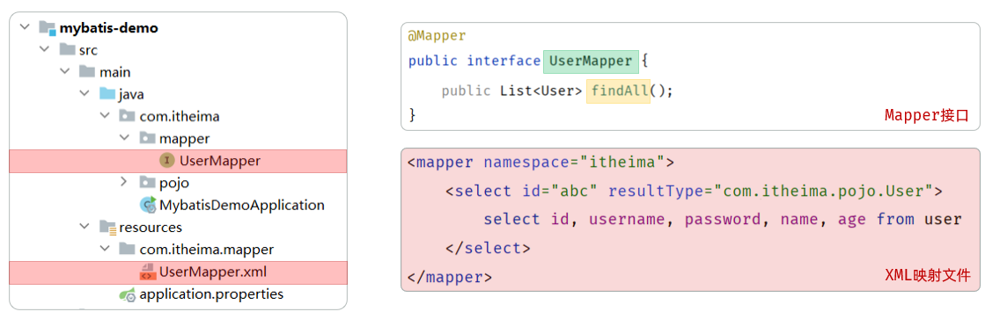

> 这个是黑马JavaWeb中我自己的笔记

## 介绍
MyBatis是一款优秀的持久层（dao）框架，用于简化JDBC的开发

## 使用
Spring会自动实现方法



在properties中配置



额外配置：输出SQL执行日志
`mybatis.configuration.log-impl=org.apache.ibatis.logging.stdout.StdOutImpl`

## 数据库连接池

数据库连接池是个容器，负责分配，管理数据库连接,它允许应用程序重复使用一个现有的数据库连接，而不是重新建立一个

释放空闲时间超过最大空闲时间的连接，避免因为没有释放连接而引起的数据库连接遗漏

### 优势
资源重用

提升系统响应速度

避免数据库连接遗漏

### 可用的数据库连接池
#### 介绍
要怎么样实现数据库连接池呢？

官方(sun)提供了数据库连接池标准（javax.sql.DataSource接口）

功能：获取连接 

public Connection getConnection() throws SQLException;

第三方组织必须按照DataSource接口实现

常见的数据库连接池：C3P0 、DBCP 、Druid 、Hikari (springboot默认)现在使用更多的是：Hikari、Druid  （性能更优越）

HIkari:springboot底层默认使用

Druid:阿里巴巴的
> 使用两步，第一步在pom.xml中引入依赖,第二步在application.properties中引入数据库连接配置spring.datasource.type=com.alibaba.druid.pool.DruidDataSource

    


## 增删改查操作
### 删除
SQL原语句delete from user where id = 5;

第一种方式：不推荐，写死了

第二种方式：推荐，使用占位符

### 新增
SQL语句：insert into user(username,password,name,age) values('zhouyu','123456','周瑜',20);
如果在SQL语句中，我们需要传递多个参数，我们可以把多个参数封装到一个对象中。然后在SQL语句中，我们可以通过#{对象属性名}的方式，获取到对象中封装的属性值。



### 修改
与新增差不多，只不过换成了Update,别的没区别
SQL：update user set username = 'zhouyu', password = '123456', name = '周瑜', age = 20 where id = 1；

### 查询
可以写一个Interger类型的返回值，表示影响的记录数

### 占位符

占位符可以是对象的属性名

占位符有多个的时候，需要@param注解，给接口的方法形参起名字

基于官方骨架创建的springboot项目中，接口编译时会保留方法形参名，@Param注解可以省略 (#{形参名})。
```java
@Select("select * from user where username = #{username} and password = #{password}") 
public User findByUsernameAndPassword(@Param("username") String username, @Param("password") String password);
```


## xml配置文件规范
使用注解主要是来完成一些简单的增删改查操作，复杂的语句应该配置映射语句，也就是将SQL语句写在XML配置文件中

### 规范

XML映射文件的名称与Mapper接口名称一致，并且将XML映射文件和Mapper接口放置在相同包下（同包同名）

> 在resource目录下新建文件夹，使用/而不是.

另一种方法：通过配置指定xml映射配置文件的位置

`mybatis.mapper-locations = classpath:mapper/*.xml`

> 因为编译完后java下的和resources下的都放在class目录，后面指定哪个目录下的哪个xml文件

XML映射文件的namespace属性为Mapper接口全限定名一致

XML映射文件中sql语句的id与Mapper接口中的方法名一致，并保持返回类型一致。

有XML就不能用注解来写方法了

示例




## 结果封装（当sql字段名与java属性名不一样时）
### 手动结果映射
#### 用@Results方法
```java
@Select("SELECT id, name, email FROM user WHERE id = #{id}")
@Results({
    @Result(property = "ID", column = "id"),
    @Result(property = "Name", column = "name"),
    @Result(property = "Email", column = "email")
})
User getUserById(int id);
```

property：java属性名

column：数据库字段名

#### 在xml中用resultMap标签
```xml
<!-- UserMapper.xml -->
<mapper namespace="com.example.mapper.UserMapper">

    <!-- 基础结果映射 -->
    <resultMap id="SimpleUserMap" type="User">
        <id     property="id"       column="id" />
        <result property="username" column="user_name" />
        <result property="age"      column="age" />
    </resultMap>

    <!-- 简单查询 -->
    <select id="getUserById" resultMap="SimpleUserMap">
        SELECT 
            id, 
            user_name,  <!-- 数据库字段名 -->
            age
        FROM 
            user
        WHERE 
            id = #{userId}
    </select>

</mapper>
```

#### xml中使用resultType
```xml
<select id="getUserById" resultType="com.example.entity.User">
    SELECT 
        id,
        user_name,  <!-- 自动映射到 User 类的 userName 属性 -->
        age
    FROM 
        user
    WHERE 
        id = #{userId}
</select>
```
#### 起别名
```java
    @Select("SELECT id, user_name AS userName, age FROM user WHERE id = #{userId}")
    User getUserById(Long userId);
```
### 开启驼峰命名
如果字段名与属性名符合驼峰命名规则，mybatis会自动通过驼峰命名规则映射。驼峰命名规则：   abc_xyz    =>   abcXyz

表中字段名：abc_xyz

类中属性名：abcXyz

在application.yml中配置：
```yml
# application.yml
mybatis:
  configuration:
    map-underscore-to-camel-case: true  # 开启驼峰命名
```
## 说明

此文档源于黑马javaweb，当时还不怎么懂，这个文档存在一些问题，以后也许会改吧，不一定了


