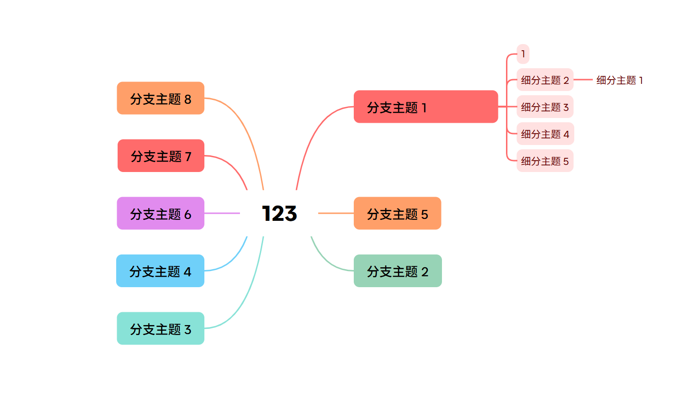
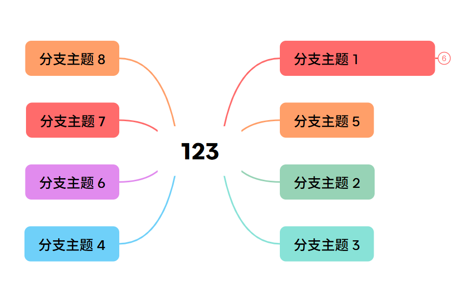
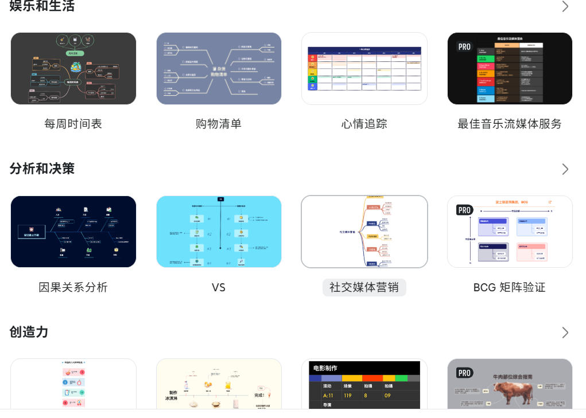
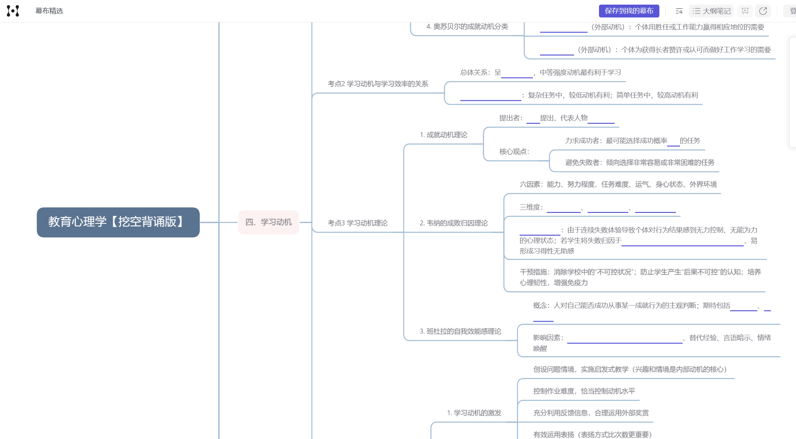
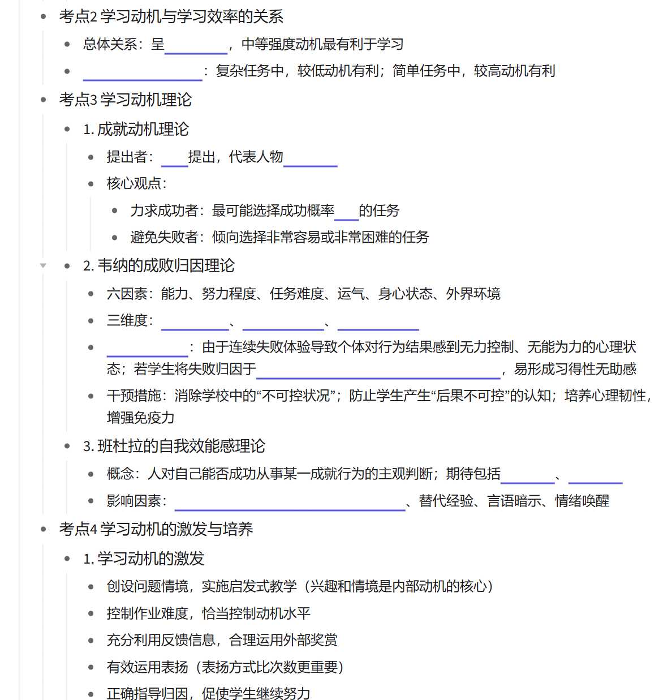

做笔记这个事情是我个人一直在坚持的，做笔记本身也是很有乐趣的，这里简单讲一下我个人是怎么做笔记的

## 开始

开头的话，肯定是和高中一样，买了一堆笔记本纸笔做笔记，但是我很快我就发现一方面太累了，一方面课堂笔记基本是不可能的，还是课后慢慢做的，而且后面你就会知道了，有个电脑就够完成学习的了（当然，前提是你会用），连教材都几乎完全不需要买，就算要买也可以找二手的，也就个别类似实验报告这样的需要买全新的，还有个别国外的书是绑定ID的，有在线服务，我倒霉拿到没这个的还得多掏钱自己想办法买一本正版

## 入门

后来我就开始想办法进行更好的记笔记，我当时经过探索，大概发现了以下这几种方案

> 方案1: 直接画画

此方案很快被我否决了，原因也很简单，一我没有平板，不方便画画。二图片做笔记本身就不靠谱，存在无用的信息太多，占用的空间太大，不方便看，难以整理等等问题

> 方案2: xmind

xmind是一种特殊的格式，其主要是拿来做思维导图的，这种模式也很快直接被我否决了，没有尝试过，第一是Xmind本身确实是更偏向做思维导图而不是笔记的，图的形式也很不好，可以拿来做个辅助但无法拿来当主力用，而且不开vip的话一些功能会受到限制

> 方案3: 幕布

幕布是我尝试的第一个主力笔记软件，有点像是一个文字版的xmind，事实上幕布本身就支持笔记和思维导图两种模式。这个软件我用了相当长的一段时间，最后因为诸多原因最后决定放弃了这个软件，主要是在做笔记过程中我意识到这种形式记笔记本身就是个错误的，笔记或者文章有大块大块的内容才是更加合理的，这种大纲形式的，碎片的笔记不够深入。不过当时我退出的主要原因是我再用下去必须要开vip了

## 进阶

随着越来越深入，我发现我对笔记有着以下的要求
1. 完全本地化：免费且拥有绝对的自主权
2. 高度的可迁移性：不依赖于某个特定的软件，不必担心被软件绑架
3. 云端存储：仅仅是本地存储有可能丢失数据，云端存储是必要的
4. 版本控制：可以查看之前版本写了什么避免出现一些问题
5. 电脑笔记双端支持：总有时候我用电脑不方便

对于记录笔记这件事本身我有以下要求
1. 简洁、高效、易读、易写、文本优先
2. **优雅地沉浸式记录，专注内容而不是纠结排版**
3. 虽然我不想纠结排版，但是要支持我排版

这么多的要求，想要实现这个方案，不花一分钱，不费大把大把的时间经历是可以实现的吗？

有的兄弟有的，你只需要看看这期视频，顺带一提这up教程质量很高

[Obsidian 最强邪修教程](https://www.bilibili.com/video/BV1fZCyBYEuT/?spm_id_from=333.337.search-card.all.click&vd_source=fce20a7980943cad5911621e5a40e01a
)

其中的markdown笔记我愿意称之为最具性价比的学习，你只需要花10分钟就能学会一种最强的记录笔记方式，这个东西太好用了，而且AI和你交流也肯定和你用这个

以上的所有全部都可以实现，并且因为obsidian本身就很强大，所以其实支持更多的功能，顺带一提，他那个git设置不是很好，双端使用可能会出问题（不是大问题，撑死丢失最近一次改动），不过单端完全没问题

## 客制化

是的，以上这些依然没有满足我，我又走了另一条有些许不同的路，但因为各有好坏也称不上谁更强，这条路麻烦很多，懒得写了，感兴趣的同学可以自己折腾看一下，有问题一起研究

[obsidian-wiki](https://github.com/Ar9av/obsidian-wiki)

