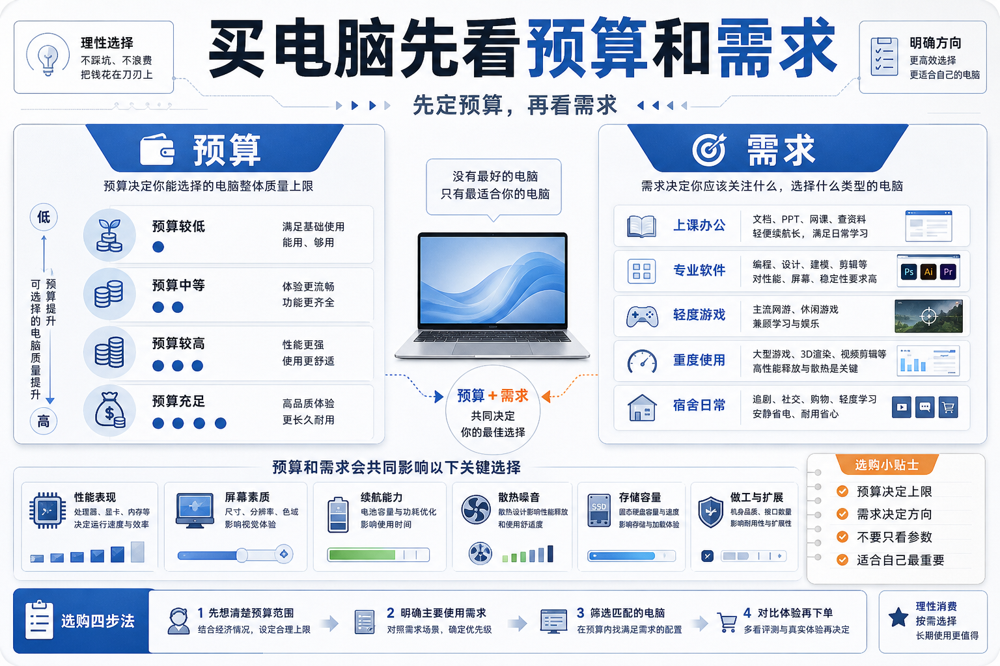
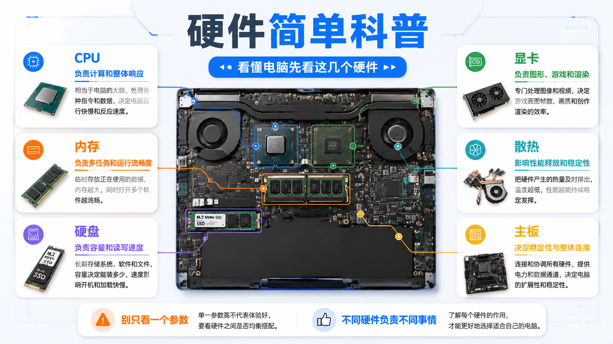
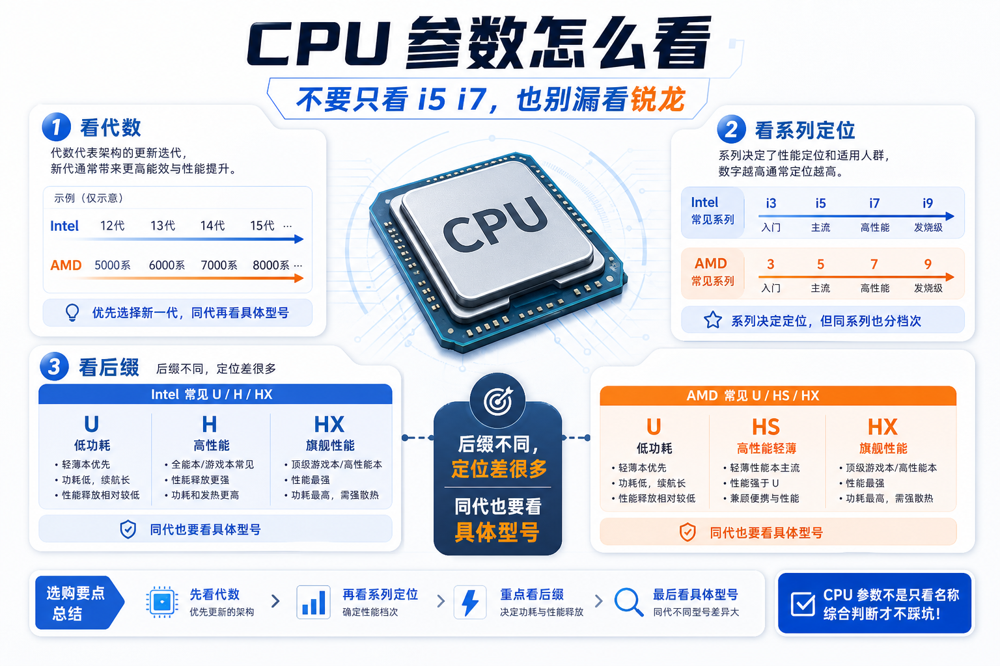
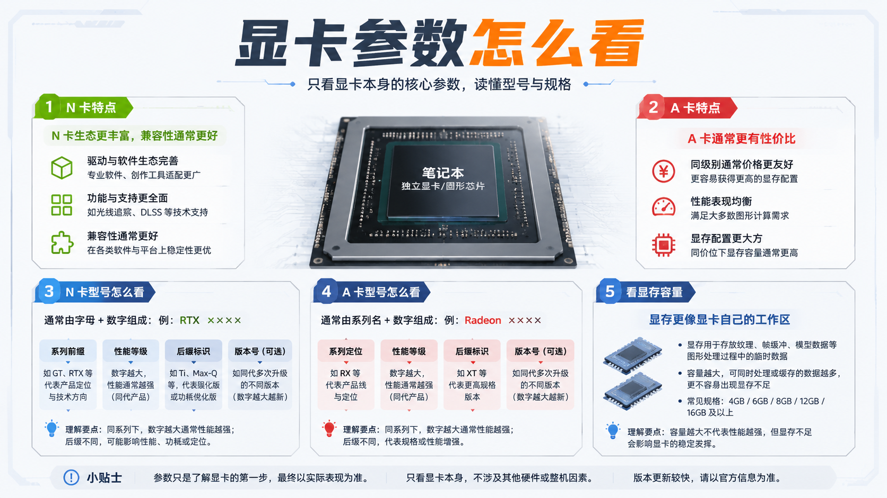
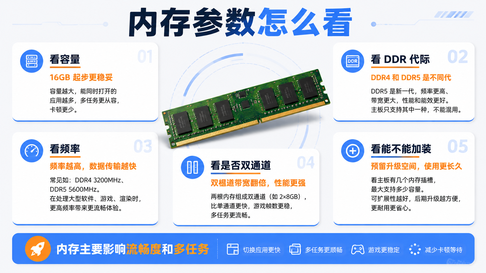
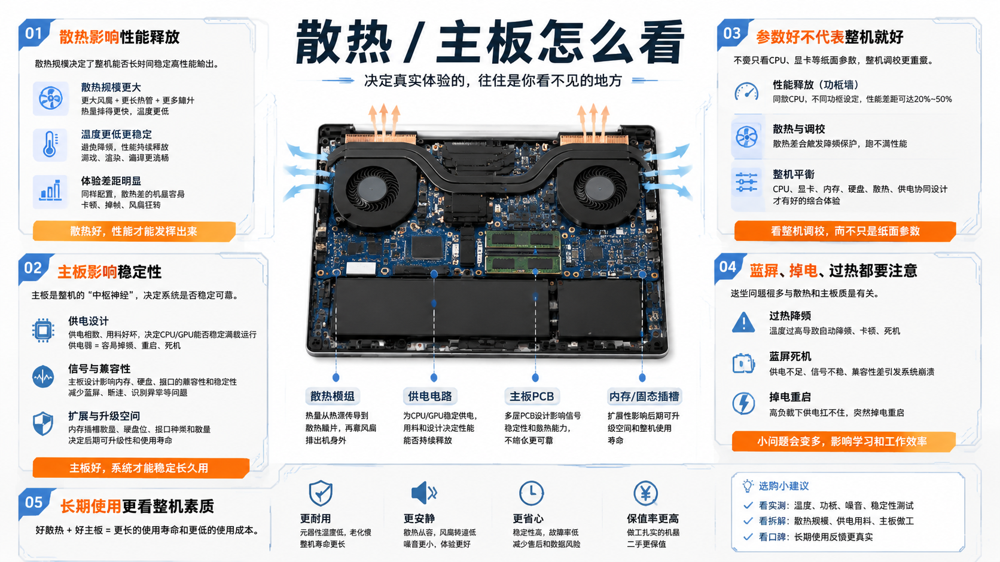
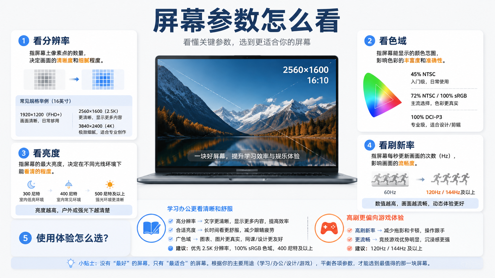
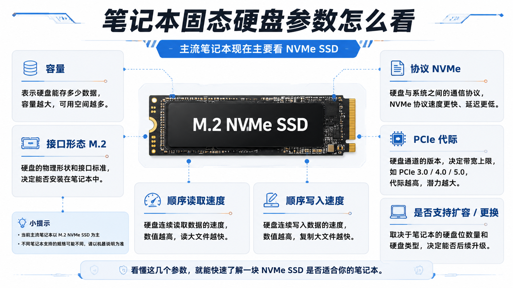
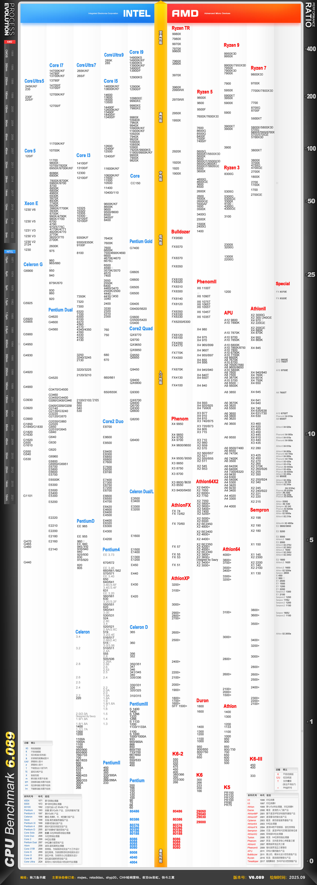
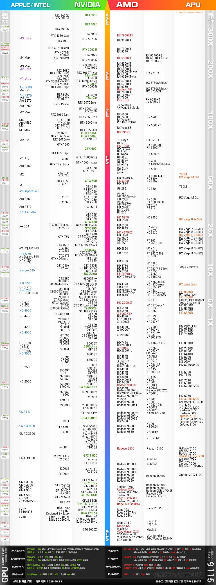

话先放前头，不要等，尽可能快买电脑，电脑价格近期看不到希望，只会涨价。这篇的目的在于帮你们确认自己的需求，具体什么价位选择什么笔记本看[笔吧测评的视频即可](https://www.bilibili.com/video/BV1DaGy6GEQK/?spm_id_from=333.337.search-card.all.click&vd_source=fce20a7980943cad5911621e5a40e01a)。

买什么东西都基于这两个根本

1. 预算：预算是一切的根基，再好的东西没钱买也没有意义，此篇全部是基于你只能购置一台笔记本并且四年不打算换的情况下，不然买台win台式+mac笔记本说实话也可以
2. 需求：买东西是拿来用的，电脑是工具，没用的工具没有价值
> 如果你真的打算买台式的话，一定要问学校里的学长学姐限不限功率，别买块大号砖头

在这两个基础上出发，才能买真正适合自己的电脑

## 需求篇

系统需求：当前笔记本系统主要有三种，windows，mac，鸿蒙。网上天天吵windows和mac哪个更好，其实也没有好坏，只是mac是绝对不符合理工科学生的需求的，你要用的专业课软件很多压根没有mac版，那你做不做作业是吧。至于鸿蒙，现阶段对学生来说我只能说查无此人

然后选类型，类型分为：轻薄本，全能本，游戏本。一般来说，越往后性能越强，续航越差，笔记本越重，也更贵。在单大学生活而言，轻便省事实际上是很大的优势，这点轻薄本会更有优势一些

性能方面，实际上大部分使用场景下你拿个轻薄本和游戏本都没什么区别，区区办公写写代码什么的根本没压力，高压力场景主要来自于：第一：个别专业要有建模，渲染等负载极高的场景，对显卡压力大，第二：游戏，游戏说实话不挑的话现在主流都是随便你玩1080p 60帧的，2k应该问题也不大，别开光追就行，而且说实话别听网上什么游戏没120帧玩不了，3a能稳个40帧我都挺舒服的，要是lol帧数低于130我都感觉眼睛疼，第三：上班，对，个别中小公司实习不发电脑的，公司项目不是你学校里的玩具，会更加吃性能，具体肯定看你专业项目需要什么性能，比如我就不得不掏了1k升级内存

一个简单的结论是，一般大学生活其实确实用不太到电脑，但是未来基本总有用到的时候。我大学前三年基本没怎么正经用电脑，后面去找工作使用强度很快变的极高

然后简单讲下最基本的性能需求什么的，省流就是大部分情况今年出的主流笔记本都是够用的

硬件方面cpu不用考虑，几年前的i5都够用的，显卡单纯办公靠核显没有都行，现在核显玩点小游戏都无压力的

散热，常见的坑，散热很重要，散热直接影响硬件的性能释放，散热差5090也得变1060

内存，内存至少16g，如果你觉得自己真的用不来电脑而且总觉得电脑很卡可以拓展到32g

硬盘现在最低也是512gb，也还可以，我还是建议分盘，c盘最好至少分配200g，然后软件和数据资料放d盘。如果直接加装硬盘了可以不分，软件就装c盘，所有文件资料等放新的硬盘上去。这么做是为了预防重装时成本太高，理论上你一块盘也可以不分，但是第一要求你文件管理很好，第二要求你有别的什么东西存资料

内存和硬盘都要看一眼槽位是否适合加装

主板，主板其实非常重要，但这个主要得去网上搜一下评价，看看有没有很多蓝屏之类的评价，和别的横向对比一样，过多就是主板稳定性有问题，这个会很麻烦，主板要是废了相当于整个电脑报废，而且主板很贵，电脑买来要是有频繁蓝屏最好立刻要求售后换主板

扩展口自己看着够用就行，usb这种有扩展坞的，除了个别奇葩设计以外都能凑活着用

然后硅脂清灰不用自己换，多久换看使用强度，正常大概两年就差不多了，液金不管

**那有的人可能就要问了，叽里咕噜说半天了，到底买什么笔记本？**

答案还是游戏本，尽管游戏本是亏的，但是还是要买，游戏本是一个可方便移动的高性能工作站，只要有或者未来有这种场景，就不得不为此付费。另外还有就是未来的各种东西是一定越来越吃性能的，买一个更高性能的笔记本相对来说淘汰速度是更慢的

大概就这样吧，我讲这些都是有惨痛教训的，我当年花了1w（我买电脑那年比你们还贵）买了个i7+3060，结果各种问题不断，性能也很差，我瞎琢磨给电脑整报废了保修也没了去官方售后花了4k还7k来着，不过至少修了一次后确实没有问题了，然后又花700买了2t硬盘，这个可以，这个现在1500，又花了1000买了个16g内存升级内存，而去年买只要一半，亏麻了，已经花了快2w，多看看别人的评价怎么样，如果特别多的话参数好也不要买，没有是不会没有的，品控没有稳定到都没问题的。一台电脑对你大学四年的生活是极其重要的，不好又费钱又费力，当然，重买解决100%的问题

电脑是非常重要的工具，学习，娱乐，生活，办公，专业都无法脱离电脑，很可惜的是，至少大概一年内电脑的价格是没什么盼头了，更可惜的是，我当时为什么不熬大半年再买，我有盼头啊

下面是一点简单的科普，都是ai生成的，不要太当真，里面严重错误我会指出一下，更多是给你们一个大概印象，之后自己多了解，最近事情比较多，大概过得去算了
## 硬件简单科普

这个布局是完全扯淡的，看一下大概什么用有个概念

## 硬件性能参数

内存方面ddr5就不存在双通道的说法了（双通道即两根一样容量，频率的内存。速度会比单根快很多，和硬件设计有关）

中间那个主板图也是完全错的，不要管

其实能亮就行，不搞设计的差不多能看得了

下面是cpu和显卡的天梯图，不过主要是面向电脑主机的，可以参考一下，笔记本的很多东西实际上是特制的，比如我的3060 其实是3060 laptop

