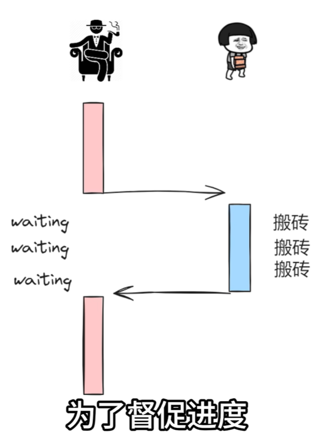
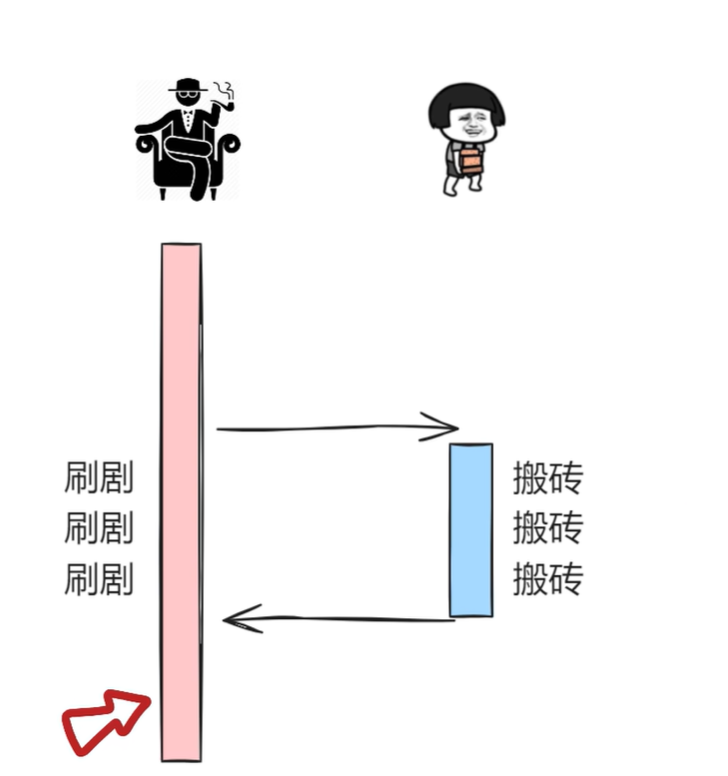

---
## 回调函数

### 介绍

回调 (callback) 是作为参数传递给另一个函数的函数，这种技术允许函数调用另一个函数回调函数，可以在另一个函数完成后运行

### 示例

```js
function myDisplayer(some) {
  document.getElementById("demo").innerHTML = some;
}

function myCalculator(num1, num2) {
  let sum = num1 + num2;
  myDisplayer(sum);
}

myCalculator(5, 5);
```

### 个人解读

很像c中的一些概念，简单来说，把函数本身看成x->y的那个->,这个箭头和x以及y一样都只是一个“变量”，把这个->作为当成参数传递并调用

## JS异步

### 介绍

与其他函数并行运行的函数称为异步（asynchronous）

### 同步和异步

简单来说，我们需要向后端发起请求，发请求后一直等着后端处理完，等到后端处理完才进行操作。而异步就是我先干别的要干的事，等处理完了你告诉我，我才来处理这件事。有点像是同步是单线程的，而异步是多线程的，同步只能干一件事所以要一直等，异步可以先干别的




### 代码示例

```js
setTimeout(function() { myFunction("I love You !!!"); }, 3000);

function myFunction(value) {
  document.getElementById("demo").innerHTML = value;
}
```

## promise对象（重点）

### 介绍

"Producing code（生产代码）" 是需要一些时间的代码，"Consuming code（消费代码）" 是必须等待结果的代码，Promise 是一个 JavaScript 对象，它链接生成代码和消费代码（生产代码就是发请求，消费代码就是请求响应了要干什么）

### 语法

```js
let myPromise = new Promise(function(myResolve, myReject) {
// "Producing Code"（可能需要一些时间）

  myResolve(); // 成功时
  myReject();  // 出错时
});

// "Consuming Code" （必须等待一个兑现的承诺）
myPromise.then(
  function(value) { /* 成功时的代码 */ },
  function(error) { /* 出错时的代码 */ }
);
```
