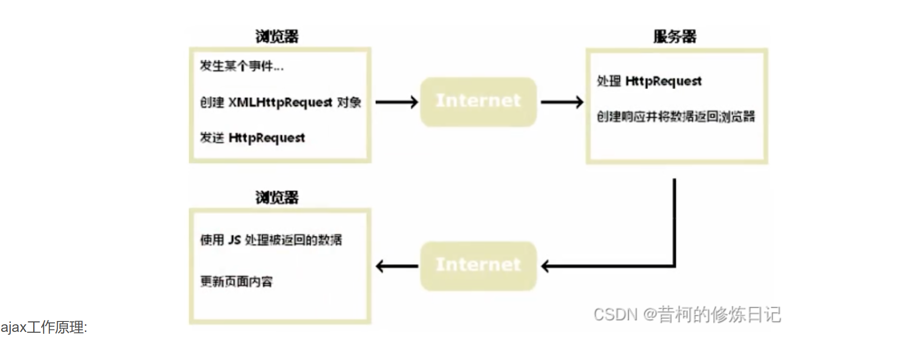
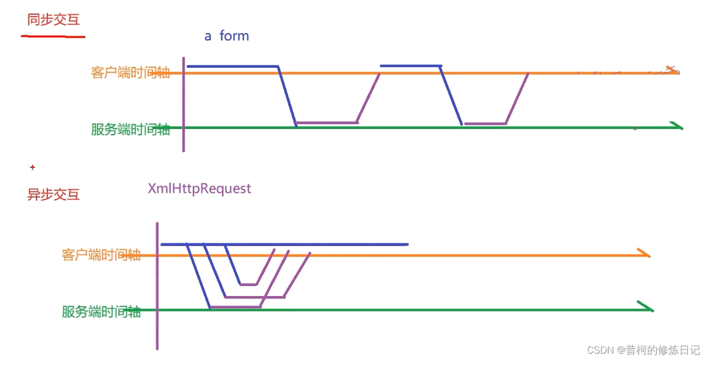

[详细ajax](https://www.w3school.com.cn/js/js_ajax_http.asp)

## 什么是ajax

- AJAX=Asynchronous JavaScript and XML(异步的JavaScript和XML)。
- AJAX不是新的编程语言，而是一种使用现有标准的新方法。
- AJAX 最大的优点是在不重新加载整个页面的情况下，可以与服务器交换数据并更新部分网页内容。
- AJAX不需要任何浏览器插件，但需要用户允许 JavaScript 在浏览器上执行。
- XMLHttpRequest 只是实现 Ajax的一种方式

## ajax工作原理

- 简单来说,我们之前发的请求通过类似 form表单标签,a标签 这种方式,现在通过 运行js代码动态决定什么时候发送什么样的请求
- 通过运行JS代码发送的请求浏览器可以不用跳转而面，我们可以在,JS代码中决定是否要跳转而面
- 通过运行JS代码发送的请求,接收到返回结果后,我们可以将结果通过dom编程渲染到页面的某些元素上,实现局部更新

## 同步交互与异步交互

## 实现方式

1. 原生js，很麻烦，					jdbc
2. 第三方封装好的工具，jquery		baseDAO
3. 框架 VUE axios					Mybatis
