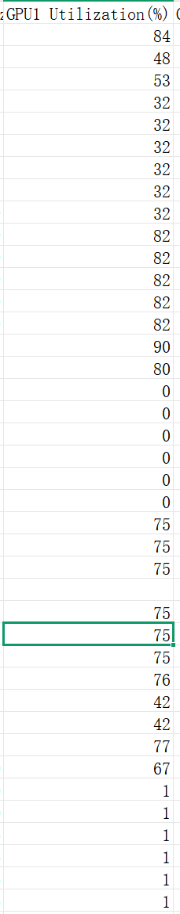
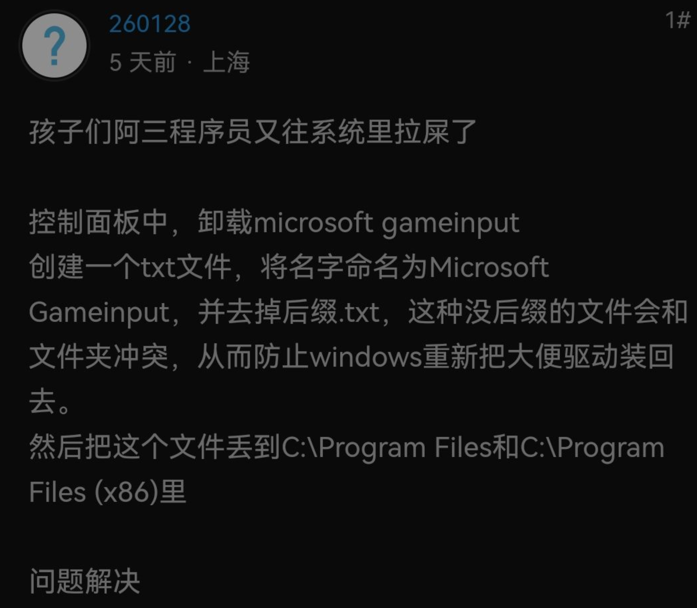
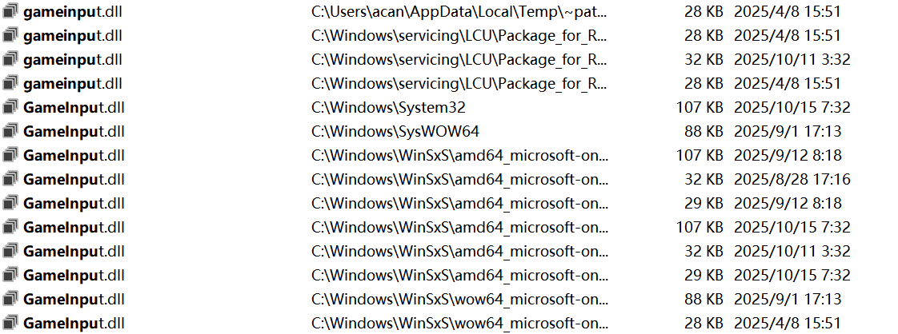
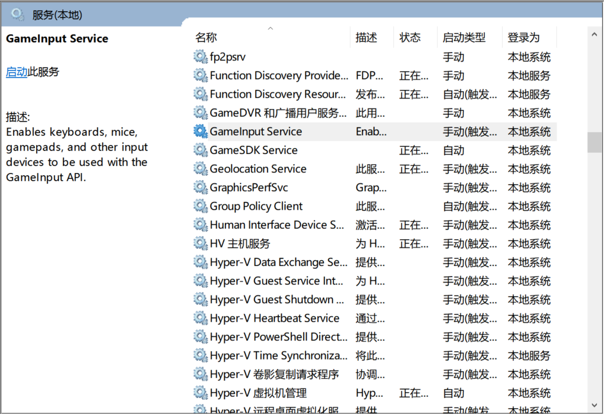

## 第一次遇到问题

在今年大概九月份初的时候，我遇到了一个非常奇怪的问题，玩游戏的时候整个电脑会完全的卡住，卡到性能监测数字都不会动的程度。遇到问题，首先要搞清楚问题有什么现象，有多大的作用范围，在测试的时候也应该尽可能关闭应用以防有什么影响，经过一番测试，我发现只要显卡占用达到大概40%以上的时候就会出现这个问题，但是出现概率似乎是随机的，没有找到什么规律。

随后，我尝试发现为什么会出现这个问题，很快我就发现了显卡的占用会莫名奇妙的掉到0,**显卡不工作了！** 很显然这就是问题的本质，显卡不工作了当然整个电脑都会完全卡住，包括性能监测数字的输出是依赖于显卡的渲染的，所以性能监测数字也会跟着一起卡住。

随后我开始尝试解决这个问题，分析这个问题可能出现的原因，第一个可能是驱动问题，第二个可能是硬件问题，第三个可能是bios出了问题，第四个可能是系统问题。事实上大部分电脑问题都是这几个可能，不过对于大部分人来说实际上电脑问题都是操作问题。首先最有可能性的就是掉驱动，因此我首先用了**DDU**去卸载并安装老版本显卡驱动，换了几个版本问题依然存在，说明不是显卡的问题。随后我尝试看看是不是硬件出问题了，在网上查询资源可以得到这种问题可能是**内存**出问题了，因此我下了个**图吧工具箱**去测试了一下内存，不过因为图吧工具箱里面的工具版本实在太老了，我自己去下了个新的拿来测试。测试结果出来内存不存在任何问题，秉持着测都测了。我把显卡和cpu也进行了烤机测试，结果惊讶地发现我的问题在烤机测试中**完全不存在！**，测试到这里基本可以断定我的硬件没有任何的毛病了。接下来的bios是不可能出现问题的，一是因为bios出问题的概率几乎不可能，二是因为我也根本没有对bios进行过任何操作或是更新，完全没有道理出现问题。所以基本上可以断定了，这是一个系统问题

遇到系统问题，首先就需要看看系统日志，右键win图标有个**事件查看器**，点击里面的windows日志，然后看下问题发生的时间点附近有没有出现什么警告或者异常，经过一番检查后我发现没有任何可以值得注意的日志，虽然有个别的警告和报错，但是这些警告和报错早在问题出现之前就天天报了，因此应该没有任何的影响。

接下来我真的有些不知道怎么去解决这个问题了，实际上是有个很简单也很快的解决方案，那就是重装系统。既然已经确定了是系统问题，很显然重装一遍就可以解决了，然而系统用到现在，c盘里的文件不谈，配置的一堆系统变量和nodejs之类的下载配置不谈，我还改了不少系统设置。这些东西连我自己都早就忘了干过什么了，重装系统带来的代价实在太大了，我没法下定决心去解决这个问题

然后接下来我企图求助于ai，然而这种偏门的问题ai实际上也没有头绪，ai几乎一直坚定的认为是撞了温度墙之类的什么玩意导致我的显卡发生了重启，然后弄的一系列操作没有生效，实际上冷静下来可以很清楚地知道这完全扯淡，这些东西要出问题也早就出问题了，而这电脑我用了都快三年了，没道理这种问题会现在才出来

我实在找不掉怎么解决问题，于是我决定退回第一步，去更精准的定位问题，为此我下了个叫**HWiNFO**的工具，你可以把它当成一个更强大的**微星小飞机**，也是用来监测性能的（性能监测实际上只是微星小飞机其中的一部分功能，不过我很确信很多人只用这个功能）。然后神奇的事情发生了，当我打开HWiNfo的时候，问题莫名其妙不见了！我完全不理解为什么，但是既然问题解决了，我既没时间也没能力去继续深究，也就暂时算了。至此花了我大概三四天的时间去尝试解决这个问题

## 第二次遇到问题

随后的一段时间里，我因为各种事情非常忙碌，也没有去玩游戏，直到大概10.28的时候，我想打开HD2（HellDiver2）去玩玩欧邵恩，我发现非常奇怪的问题，游戏非常卡顿就不说了，音效会在卡顿的时候会被吞掉或者出现撕裂的效果，我第一时间怀疑是HD2的问题。首先是因为这次问题和上次问题不太一样，我没有第一时间联系到一起，第一次的问题是偶发的，而且只是卡顿很小一会，音效的感觉也是正常的，而第二次问题出现非常的频繁，而且持续时间也长的多，音效也有很大的异常。其次是因为作用范围也不太一样，上次问题只要在显卡占用达到40%的时候就会触发，不管我在看视频还是在玩lol或者是干什么，而这次暂时来讲只有HD2出现了这个问题。最后一个原因则是箭头，游戏的开发商，是公认的一坨屎。同一份游戏在ps只有30g大小，pc却有130g，所以这游戏出点什么优化问题或者是bug我觉得毫不稀奇。

因为这次我认为是HD2的问题，所以首先我重装了一遍游戏，然后我又尝试使用dx11去启动游戏，因为现在游戏一般是用dx12去启动游戏的，但是dx12可能会出现问题，然后看了一下网上的视频，把着色器缓存也给删了，但是在做了这些事情后，问题依然存在。我不想折腾了索性暂时不玩HD2,而是决定找个新游戏玩玩

我找的这个新游戏叫Ghost Tricks,一个解谜游戏，很显然这种小游戏根本就不占用什么资源，然而在玩的时候我发现出现了同样的问题，因为解谜游戏本来就比较“静态”，实际上卡顿我并没有感觉出来，这个游戏卡顿的时间也非常短，我是从游戏的bgm中听出来不对劲的。从此我意识到了不是HD2的问题，因为HD2比较好触发，也容易确定问题的发生，所以我又打开了HD2和性能监测去看看到底出了什么问题。结果我发现显卡的占用又莫名其妙掉到0了。虽然表象不同，但实际上这**很可能**和之前是同个问题

测试完了HD2,我决定去打会Ghost Tricks，然后偶然的情况下，我决定什么都不干歇一会，然后我发现居然问题没有出现，我尝试动了一下手柄，**问题又出现了！**这个现象非常地令人振奋，我马上进行测试，然后我惊讶的发现他妈的是手柄的问题，只要我用手柄操作了一段时间之后问题就会出现，如果我不用手柄而是用键鼠，问题就不会出现。我百思不得其解，我显卡占用跌倒0和手柄有什么关系吗。但是吸取了上次的教训，我决定不听ai胡言乱语而是先更精准的定位问题，然后发现只有在手柄用蓝牙连接的时候才会出现问题，有线连接就不存在问题了，由于我没有第二个手柄，我没有测试是不是只有这个手柄有问题

接下来就很简单了，于是我把蓝牙以及其他的什么驱动全部更新一遍，这里推荐下**Ghelper**,这个比rog自带的那玩意好用很多，更简洁占用更低也更好使，我就是在这找到的要更新的驱动的，如果用windows自带的驱动更新或者是360的驱动大师什么的是查不到可以更新的，另外华硕官网这方面也挺烂的，要我找自己电脑型号不谈，驱动也不能直接下载，而是要你下一个软件然后更新所有驱动，不知道什么原因反正我的这个软件并没有正常工作。因此我最后还是用的Ghelper，更新完驱动后，问题解决了。

## 复盘

很显然，这个问题还没有得到真正的原因，我的蓝牙驱动这些东西**根本就没有动过**，本质上就不可能真的是这些东西的问题，那么问题到底出在哪里呢？

在网上一番搜索后，我得出了一个很可能的答案

我去检查了一下这个gameinput，虽然我并没有这个应用，但是我确实有这个服务，并且也有对应的文件，此外时间上完全对得上，两次的表现不同可能是因为在不同的日期中更新过文件

检查完服务，我发现这个服务已经被自动关掉了，而我清晰地记得之前这个服务是开着的，很可能是在更新驱动的时候，系统自己把这个服务停掉了

然后我尝试重新把这个任务打开，不出意外的，**问题成功复现了**！ 至此，可以100%确定就是这个服务导致的问题了，然而我有件事情还是始终不明白，那就是微软到底怎么做到的，一个只是管理手柄，键盘等外设输入的服务，是怎么导致显卡会莫名其妙突然不工作的，他妈的，**Why?**

## 用到的一些软件和网站

- [DDU](https://www.wagnardsoft.com/display-driver-uninstaller-ddu)
- [英伟达显卡驱动下载网站](https://www.nvidia.cn/geforce/drivers/)
- [图吧工具箱](https://www.tubatool.com/)
- [TM5内存测试工具](http://testmem5.com/)
- [HWiNFO](https://www.hwinfo.com/)
- [微星小飞机](https://www.msi.cn/Landing/afterburner/graphics-cards)
- [Ghelper](https://g-helper.com/)
- [华硕官网驱动更新](https://www.asus.com.cn/support/download-center/)